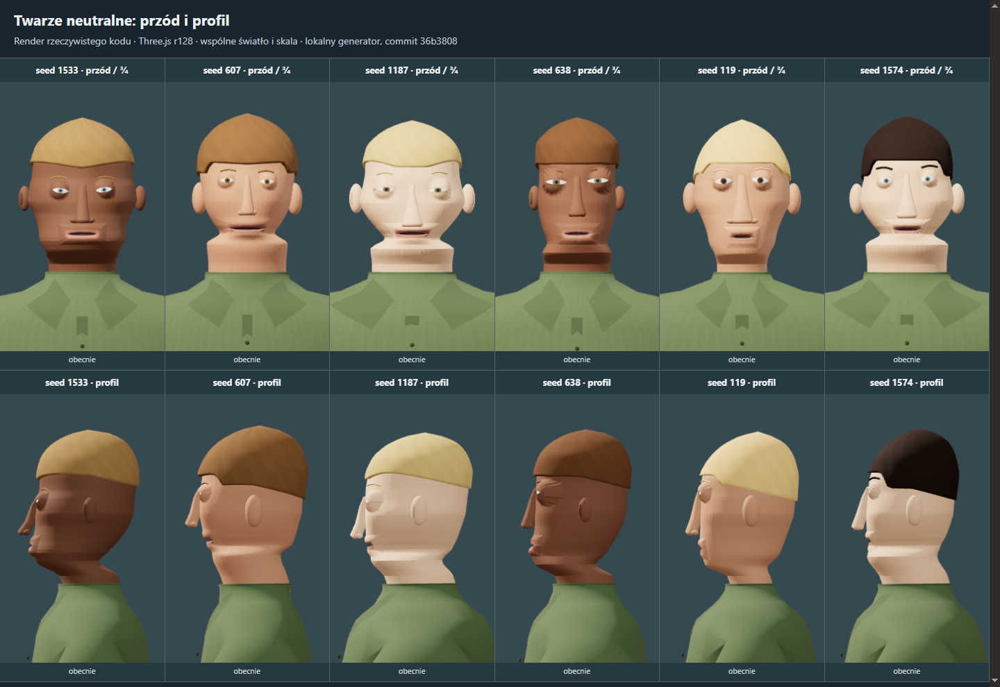

# Audyt wyglądu proceduralnej piechoty

Data: **24 września 2026**. Audyt bazowy: commit **36b3808**, generator **infantry-5.0.0**, Three.js **r128**. Wdrożenie poprawek: `main` po integracji zdalnego v13, aplikacja **0.14.0**, generator **infantry-7.0.0**.

**Rekomendacja: zachować proceduralny generator, ale poprawić jego bazową anatomię i sposób łączenia cech.** Największy efekt dadzą kolejno: bryła głowy i przyczep szyi, spójne proporcje genomów, okolica oczu i ust, współpraca kontrolek mimiki, a następnie dłonie, barki i detale ubioru. Obecny problem ma źródło przede wszystkim w kształcie oraz deformacji powierzchni. Większa liczba wielokątów i drobnych ozdób nie rozwiązuje tych przyczyn.

Sekcje 1–13 zachowują historyczne pomiary i obserwacje kodu z commita `36b3808`; nie należy ich odczytywać jako pomiarów generatora 0.14.0. Sekcja 14 opisuje zrealizowane zmiany, aktualny rig i rendery kontrolne. Galeria rozdziela obrazy bazowe od kadrów po wdrożeniu.

[Otwórz galerię porównań](research/index.html) · [Twarz i mimika — szczegóły](research/face_expression_audit.md) · [Anatomia i szkielet — szczegóły](research/anatomy_rig_audit.md) · [Genomy — pomiary](research/genome_distribution_audit.md)

## 1. Co sprawdzono

Prześledzono generator genomu, rozstrzyganie anatomii, budowę powierzchni, kości, wagi skinningu, kontrolki mimiki, dopasowanie wyposażenia i kontakty IK. CodeGraph posłużył do wyszukania modułów; ze względu na ograniczone rozpoznawanie klas przypisywanych do `window.RTS` zależności uzupełniono odczytem kodu.

Badanie liczbowe obejmuje **2000 seedów, 0–1999**, każdy przy pięciu wartościach `variation`: 0, 0.5, 1, 1.25 i 1.75. To 10 000 konfiguracji tych samych 2000 tożsamości. Sonda sprawdza parametry i przekroje, bez pełnej siatki WebGL. Wyniki i SHA-256 plików wejściowych są w [danych badania](research/data/genome_distribution_summary.json).

Na bazie audytu wykonano **9 plansz, 108 kadrów WebGL** generatora `36b3808`. Zachowano wspólne oświetlenie, kamerę ortograficzną oraz skalę kadru względem wzrostu. Zwykły zestaw to seedy 0, 63, 1001, 1003, 2002, 2003. Zestaw wybrany z pomiarów to 1533, 607, 1187, 638, 119, 1574. Odsłonięto twarz i szyję; plansza sylwetek porównuje brak oporządzenia z zestawem RIFLEMAN, bez hełmu, plecaka i broni. Po wdrożeniu wykonano dodatkowe cztery plansze na seedach wybranych z tej samej próby.

To ocena historycznego kodu bazowego i statycznych kadrów, bez badania percepcji na grupie użytkowników. Bazowa plansza szyi narzuca rotacje po `seek`, bez ponownego przeliczenia `neckFlex`; nie mierzy pełnej animacji patrzenia. Użyty renderer programowy służy do porównania obrazu, a nie do prognozy FPS. Pełne przejścia animacji, chwyty broni i ruch z kamery gry pozostają kryteriami przyszłego wdrożenia.

## 2. Co widać w porównaniach

| Porównanie | Obserwacja | Wniosek dla zmian |
| --- | --- | --- |
| [Twarze: przód i profil](research/images/faces.png) | Poziome półki policzków i żuchwy, wyraźnie wypukłe okolice oczu, stale rozchylone usta. | Najpierw neutralna bryła i połączenia powierzchni. |
| [Przypadki wybrane z próby](research/images/faces-selected.png) | Seedy 607, 1187 i 1574 mają szczególnie wyraźne poszerzenie pod ustami; profil pokazuje niespójne przejście do szyi. | Usunąć przymus poszerzania całej dolnej głowy do promienia szyi. |
| [Sześć ekspresji](research/images/expressions.png) | FEAR i PAIN różnicuje głównie otwarcie ust; ANGER zachowuje neutralną szczelinę. | Rozdzielić działania powiek, brwi, policzków i warg. |
| [Intensywność 1.0 / 0.45](research/images/intensity.png) | Mniejsza intensywność łagodzi rozwarcie ust, ale pozostawia problemy neutralnej twarzy. | Samo osłabienie wszystkich presetów nie wystarczy. |
| [Szyja w pozach diagnostycznych](research/images/necks.png) | Już profil neutralny ujawnia problem przyczepu; obroty pokazują sposób ciągnięcia powierzchni. | Wspólne punkty anatomii dla geometrii, kości i wag. |
| [Sylwetki z oporządzeniem i bez](research/images/bodies.png) | Wyposażenie porządkuje tułów; widoczne są podobne profile barków, rurkowate kończyny i ciężkie obrysy butów. | Poprawić duże płaszczyzny i krój, potem drobne szczegóły. |
| [Łagodniejsze zakresy](research/images/experiment.png), [przypadki wybrane](research/images/experiment-selected.png) | Zawężenie cech zmienia proporcje, ale utrzymuje półki twarzy i sztuczną okolicę oczu. | Przebudowa reguł kształtu ma wyższy priorytet niż sam tuning liczb. |
| [High / world](research/images/lod.png) | Oba poziomy zachowują te same zasadnicze problemy bryły. | Przeznaczać geometrię na właściwe kształty i krawędzie deformacji. |

Eksperyment parametrów zmniejsza odchylenia wybranych cech głowy i twarzy oraz zmienia kilka punktów środkowych. Zachowuje ciało, paletę i tożsamość fryzury. To ręcznie dobrana próba diagnostyczna, **nie wyuczony model proporcji, docelowy wygląd ani wdrożona poprawka**.



## 3. Priorytet P0: poprawić podstawową bryłę głowy

**Przyczyna.** W `FaceAnatomy` geny policzków, szczęki i podbródka zmieniają promienie całych eliptycznych przekrojów. `section(y)` interpoluje te poziomy, a `point(y,theta)` rozprowadza wynik po obwodzie. Cecha, która powinna zmieniać niewielki obszar policzka, może więc tworzyć pierścień dookoła głowy. Stąd widoczne poziome półki także w profilu i z tyłu.

**Zmiana.** Zachować generowanie siatki z kodu, lecz oprzeć głowę na spójnej powierzchni bazowej z lokalnymi obszarami wpływu. Oddzielnie kontrolować czoło, skroń, kość policzkową, policzek, kąt żuchwy, brodę i potylicę. Maska policzka powinna zanikać ku skroni, tyłowi głowy i podbródkowi, z łagodną zmianą nachylenia. Nie powinna poszerzać całego poziomu czaszki.

W pierwszym wariancie można zachować obecną konstrukcję przekrojową, poprawić profil bazowy i dodać lokalne maski kątowo-wysokościowe. Jeżeli okolice oczu i ust nadal będą trudne do deformowania, następnym krokiem jest stała topologia głowy dla każdego LOD, również generowana proceduralnie, z uporządkowanymi pętlami wokół otworów. Genom zmieniałby pozycje punktów i ich lokalne proporcje.

Trzeba również uporządkować przejścia między policzkiem, nosem i wargami. Normalne mogą dodatkowo ujawniać nierówną triangulację: poziomy i kąty potrzebne dla patchy oczu/ust są obecnie dodawane globalnie. To osobna rzecz do sprawdzenia; obserwowanej zmiany obrysu nie można przypisać wyłącznie cieniowaniu.

**Efekt i odbiór.** Głowa zachowuje proste płaszczyzny i różnorodność, ale lokalna zmiana policzka nie tworzy obwodowej obręczy. Ocena z przodu, z profilu i pod kątem ¾, w neutralnej mimice oraz przy otwarciu szczęki. Próbka 1533 jest ważna, bo mimo braku zarejestrowanych korekt proporcji nadal pokazuje ograniczenia wspólnej bryły.

Zakres: **duży, najwyższy wpływ wizualny**. Główne pliki: [faceAnatomy.js](../js/rendering/faceAnatomy.js), [infantryFace.js](../js/rendering/infantryFace.js).

## 4. Priorytet P0: osadzenie szyi i wspólna anatomia rigu

**Kość szyi już istnieje:** hierarchia zawiera `chest → neck → head`. Kości `hand.L` i `hand.R` również istnieją. Szkielet ma 39 kości: 22 ciała i 17 kontrolek twarzy. Brakuje osobnych łańcuchów palców.

Punkty `neck=.84H` i `head=.90H`, oś szczęki oraz progi wag są zasadniczo stałe, podczas gdy zmieniają się czaszka, podbródek i grubość szyi. Dodatkowo dolny przekrój głowy zostaje poszerzony, kiedy szyja nie mieści się pod małą szczęką. W części genomów tworzy to szeroką podstawę zamiast wiarygodnego przyczepu. Przednia szyja dostaje też wpływ kości szczęki, co wymaga dokładniejszego ograniczenia do obszaru pod brodą.

**Zmiana w jednym spójnym kroku:**

1. Wyznaczyć z rozstrzygniętej anatomii punkty podstawy szyi, podstawy czaszki, osi szczęki i podbródka. Udostępnić je geometrii, rigowi, wagom i wyposażeniu.
2. Rozdzielić profil przedniej szyi, zagłębienie pod brodą, boki pod żuchwą i tylny przyczep pod potylicą. Pełna elipsa nie powinna wymuszać jednakowego przejścia we wszystkich kierunkach.
3. Dopasować grubość szyi miękką zależnością od budowy tułowia i lokalnej geometrii przyczepu. Ochronę przed szczeliną zachować, lecz nie realizować jej przez rozpychanie całej brody.
4. Zbudować wagi względem tych punktów. Oddzielić gardło od żuchwy i stopniowo rozłożyć wpływ `chest`, `neck`, `head` oraz `jaw`.
5. Przeliczyć kołnierz i socket szyi z tej samej anatomii. Sprawdzić patrzenie, sprint, crouch i prone.

Drugą kość szyi warto dodać dopiero wtedy, gdy po tych zmianach skłon nadal nadmiernie zapada powierzchnię. Ewentualny `neckUpper` dostaje część istniejącej rotacji, z jasno określonym sterowaniem. Skopiowanie na niego pełnej rotacji zwiększyłoby łączny kąt zamiast poprawić rozkład zgięcia.

**Odbiór.** Ciągłe przejście szyi w czaszkę i kołnierz; brak pierścienia pod ustami w seedach 607/1187/1574; otwarcie szczęki nie ciągnie całego gardła. Oceniać także skłon i skręt równocześnie. Zakres: **średni–duży**, razem z pracami nad bryłą głowy.

## 5. Priorytet P0: spójne genomy zamiast niezależnych skrajności

Większość genów kształtu jest losowana niezależnie, prawie jednostajnie, z obcięciem do 0–1. Dla pojedynczego takiego genu sam wzór daje około 7,41% masy na dokładnych krańcach. Przy wielu cechach skrajne kombinacje stają się częste.

| Wynik dla variation=1 | Próbka 2000 seedów |
| --- | ---: |
| Co najmniej jeden dokładnie skrajny gen z 41 cech geometrii twarzy | 95,6% |
| Korekta wysokości ust | 54,0% |
| Korekta podstawy nosa | 35,8% |
| Korekta wysokości brwi L / R | 41,15% / 41,5% |
| Poszerzenie dolnej czaszki do szyi | 31,45% |
| Korekta linii włosów | 95,5% |

To częstość działania ograniczeń, **nie odsetek źle wyglądających twarzy**. Ograniczenia często zapobiegają kolizjom. Jednak częste, duże korekty wskazują, że wejściowe parametry nie opisują spójnego układu. Nawet `variation=0` wymaga przesunięcia ust i linii włosów, więc nie wystarczy usunąć skrajnych seedów.

**Zmiana.** Najpierw uzgodnić neutralną bazę i lokalne współrzędne głowy. Następnie wprowadzić kilka wspólnych czynników: szerokość czaszki, długość dolnej twarzy, projekcję środkowej twarzy, masywność żuchwy i budowę szyi. Z nich wyprowadzać główne relacje, dodając niewielkie niezależne odchylenia. Rozstaw oczu, szerokość nosa i ust oraz ich wysokości powinny odnosić się do właściwego obszaru głowy, a nie do niezależnych wysokości całego ciała.

Współczynniki można na początek dostroić artystycznie na sprawdzonych bazach. Nie należy przedstawiać takich ręcznych zależności jako statystyk biologicznych. Różnorodność szerokich i wąskich twarzy, dużych nosów czy asymetrii pozostaje pożądana; poprawiamy zgodność części i sposób deformacji.

Oddzielić zakres wariacji geometrii od koloru skóry, fryzury i parametrów ruchu. Obecny ogólny `variation` zmienia również te cechy. Nowe grupy losować ze stabilnych podseedów, żeby dodanie detalu nie przelosowało wszystkich kolejnych cech. Geny asymetrii już mają łagodniejszy rozkład; nie wymagają automatycznie tej samej zmiany co szerokości.

**Odbiór.** Powtórzyć pomiary na tych samych seedach, analizując wielkość korekt i obrazy. Zachować wyraźną różnorodność, deterministyczność oraz poprawną bazę przy variation=0. Nowy generator otrzymuje własną wersję: ten sam seed może zmienić wygląd, więc dla zapisanych jednostek potrzebna jest decyzja o migracji lub odtwarzaniu starszej wersji.

Zakres: **średni–duży**. Główne pliki: [infantryGenome.js](../js/units/infantryGenome.js), [faceAnatomy.js](../js/rendering/faceAnatomy.js), [infantryRig.js](../js/rendering/infantryRig.js).

## 6. Priorytet P0/P1: oczy, usta i mimika

### Oczy i powieki

Na porównaniach oczy wyglądają na mocno wystające, z wyraźną białą powierzchnią i małą tęczówką. Konstrukcja używa osobnych gałek i powiek nakładanych na ich powierzchnię. Proporcje gałki, apertury, tęczówki oraz głębokość osadzenia trzeba stroić wspólnie z bryłą oczodołu.

**Konkretne poprawki:** cofnięcie i osadzenie gałki względem otaczającej skóry; łagodniejsze przejście dolnej powieki w policzek; stabilne kąciki; różny udział górnej i dolnej powieki w zamknięciu. Tęczówkę oceniać jako część całego otworu oka, również przy patrzeniu w bok, zamiast globalnie powiększać wszystkie oczy.

Obecne otwarcie, mrugnięcie i zmęczenie korzystają z tego samego stopnia zamknięcia. Potrzebne są osobne działania: mrugnięcie, uniesienie górnej powieki, napięcie dolnej i mrużenie. Dodać umiarkowane śledzenie pionowego spojrzenia przez powieki. Przy pełnym mrugnięciu spojrzenie nie może ponownie otwierać szczeliny.

### Usta i szczęka

Neutralna anatomia ma otwór o nominalnej wysokości `.0023H`, około **4 mm przy wzroście 175 cm**, jeszcze przed deformacją animacji. Zamykanie ust nie jest zdefiniowane jako kontakt warg. `lipPress` przesuwa wargi, a ANGER jednocześnie otwiera szczękę; działania mogą się wzajemnie osłabiać.

**Konkretne poprawki:** neutralna linia styku z miękkimi kącikami; oddzielenie otwarcia szczęki od rozwarcia i docisku warg; kontakt liczony względem aktualnej pozycji szczęki; kontrola przenikania; łagodniejszy wpływ jaw na dolną wargę, kąciki i podbródek. Oś szczęki powinna wynikać z anatomii konkretnej głowy. Wnętrze ust może pozostać prostą ciemną bryłą, widoczną dopiero przy otwarciu.

Kolor warg wyprowadzić z koloru skóry z kontrolowaną różnicą. Obecny stały kolor daje niespójny efekt między paletami. Gen asymetrii ust powinien zmieniać spoczynkowe punkty powierzchni: sama zmiana pivotu kości w bind pose nie nadaje siatce neutralnej asymetrii.

### Brwi i współpraca skóry

Brwi mają kontrolki, ale skóra czoła nie ma ich wag. Ruch rurek brwiowych nie daje odpowiadającej mu pracy czoła i oczodołu.

**Konkretne poprawki:** spłaszczyć profil brwi, dopasować je do skóry i dodać lokalne, łagodne wpływy brwi na czoło oraz górny oczodół. Zachować cztery wpływy na wierzchołek; sprawdzić, czy automatyczne odcięcie najsłabszej wagi nie usuwa potrzebnego wpływu przy policzku lub szczęce. Linia włosów powinna zachować prześwit również podczas ekspresji.

### Presety jako zestawy działań

Poniższa tabela opisuje **docelowy kierunek artystyczny**, nie ukończone presety ani uniwersalną definicję ludzkich emocji.

| Preset | Proponowany charakter |
| --- | --- |
| NEUTRAL | Rozluźnione oczy i brwi, naturalny kontakt warg; niewielka stabilna asymetria. |
| ALERT | Skupione spojrzenie i umiarkowane uniesienie górnych powiek, niewielka praca brwi; szczęka zwykle blisko spoczynku. |
| FEAR | Współpraca brwi i powiek; otwarcie ust zależne od intensywności, bez równomiernego rozsuwania całej twarzy. |
| ANGER | Zbliżenie i obniżenie przyśrodkowych brwi, napięcie powiek, świadomy docisk warg. |
| PAIN | Mocniejsze mrużenie i praca policzków, napięcie brwi oraz warg; wyraźna różnica względem FEAR również przy podobnym otwarciu szczęki. |
| FATIGUE | Ociężała górna powieka, łagodniejsze spojrzenie i timing mrugania; bez trwałej przesadnej miny. |

Mieszanki presetów sumują kanały, następnie wzmacniają je mnożnikami genomu. Większość kanałów nie ma końcowych ograniczeń. Zwykłe `setExpression` zeruje pozostałe cele, więc nie jest to przyczyna każdej dziwnej twarzy; problem dotyczy przede wszystkim API mieszanek.

Wprowadzić zakresy odpowiednie dla każdego kanału oraz korekty konkretnych kombinacji, szczególnie `jawOpen + lipPress`, `jawOpen + mouthStretch` i `blink + squint + gaze`. Nie normalizować wszystkich emocji jednym wspólnym mnożnikiem. Przy przejściach rozdzielić stabilną tożsamość twarzy od ruchu, ograniczyć nadmierny szum i sprawdzić płynne osiąganie oraz wygaszanie ekspresji.

**Odbiór.** Każdy preset przy 0, 0.25, 0.5 i 1; mieszanki ANGER+PAIN i FEAR+FATIGUE; mrugnięcie i pionowe spojrzenie podczas ekspresji. Brwi pozostają przy skórze, powieki zakrywają gałkę, wargi nie przenikają się, a PAIN/FEAR/ANGER różnią się czymś więcej niż samą wysokością ust. Ocena w zbliżeniu i przy rozmiarze twarzy z gry.

Zakres: **średni–duży**, zależny od neutralnej anatomii i budżetu morphów. Główne pliki: [infantryFace.js](../js/rendering/infantryFace.js), [faceAnimator.js](../js/animation/faceAnimator.js), [infantryRig.js](../js/rendering/infantryRig.js).

## 7. Priorytet P1: dłonie i palce

Obecna dłoń ma kość nadgarstka. Cała powierzchnia wraz z palcami jest ważona do `hand`; palce zgina wspólny morph `handsRelax`. To ogranicza naturalne rozluźnienie, różne pozy obu dłoni i chwyt przedmiotów. Sama powierzchnia przypomina płaski korpus z osobnymi rurkami palców.

Najpierw poprawić łuk kostek, zwężanie palców, nasadę i przestrzenne ustawienie kciuka, przejścia między palcami oraz połączenie nadgarstka z mankietem. Dłoń, nadgarstek i rękaw powinny mieć wspólny punkt odniesienia rozmiaru, z niewielką lokalną wariacją.

| Wariant rigu | Łączna liczba kości | Zastosowanie / kompromis |
| --- | ---: | --- |
| Obecna dłoń + lepsza powierzchnia | 39 | Poprawia wygląd spoczynku, zachowuje ograniczenie wspólnego zgięcia. |
| Kciuk 2, wskazujący 2, wspólna para dla trzech pozostałych; na każdą rękę | 51 | Oszczędny wariant do porównania z kamery gry; wspólna oś trzech palców może być widoczna z bliska. |
| Każdy palec po 2 segmenty, na obu rękach | **59** | Zalecany prototyp: niezależne osie i pozy, uproszczone dalsze zgięcie. |
| Cztery palce po 3 segmenty, kciuk 2; na każdą rękę | 67 | Precyzyjniejsze chwyty i bliskie ujęcia, więcej animowanych kości. |

Zacząć od wariantu 59 i porównać z 51. Przygotować niezależne pozy lewej/prawej dłoni: rozluźnienie, sprint, chwyt broni, chwyt podtrzymujący i podparcie. Mocowanie broni i IK nadal kończą się na `hand`; ruch palców nie powinien zmieniać długości ramienia.

**Konieczna zależność:** obecne punkty kontaktu dłoni z podłożem zakładają, że również palce są sztywne względem nadgarstka. Po dodaniu kości trzeba oprzeć kontakt na stabilnym obszarze dłoni albo wyznaczać go po deformacji. W przeciwnym razie podparcie w prone może wpychać palce w grunt lub unosić nadgarstek.

Zakres: **średni–duży**. Główne pliki: [infantrySurface.js](../js/rendering/infantrySurface.js), [infantryRig.js](../js/rendering/infantryRig.js), [infantryAnimator.js](../js/animation/infantryAnimator.js).

## 8. Priorytet P1/P2: sylwetka, ubranie i niedrogie detale

| Obszar | Konkretna poprawa | Warunek zachowania prostoty |
| --- | --- | --- |
| Barki | Przejście wag `chest → clavicle → upperArm`, osobny kształt góry barku i pachy, łagodniejszy spadek barków. Obojczyki już są w rigu, ale nie mają bezpośrednich wag tej powierzchni. | Zacząć od istniejących kości i lepszego profilu. |
| Tułów | Spójniejszy łuk klatki, położenie talii i przejście do bioder; skorelowane różnice budowy. | Kilka dużych płaszczyzn, bez modelowania drobnych mięśni pod mundurem. |
| Ramiona i nogi | Lepsze zwężenie odcinków oraz kształt łokcia, kolana i mankietów. | Dodatkowe przekroje tylko tam, gdzie poprawiają obrys lub zgięcie. |
| Mundur | Kilka szerokich fałd przy pachach, łokciach, pasie i kolanach; zgodne wagi kieszeni i szwów. | Obecne guziki, kieszenie, kołnierz i bump splotu już istnieją. |
| Buty | Rozróżnić stronę wewnętrzną i zewnętrzną, zwęzić piętę, ukształtować podbicie oraz nosek; ocenić proporcje cholewki do łydki. | Zachować wiarygodną podeszwę i działający kontakt z podłożem. |
| Nos | Łagodniejsze połączenie nasady i skrzydeł z twarzą, wyraźny ale prosty profil czubka. | Unikać efektu nałożonych oddzielnych brył; nie zwiększać gęstości całej głowy. |
| Uszy | Prostszy, lepiej ustawiony obrys, skromne zagłębienie małżowiny i zaznaczony brzeg. | Kilka czytelnych elementów zamiast drobnych fałd. |
| Włosy i zarost | Lepszy obrys przy skroni/potylicy, mniej jednolity efekt czapki; delikatny zarost przez kolor lub tanią maskę. | Bez geometrii pojedynczych włosów. |
| Materiały | Spójna paleta skóry/warg/uszu, umiarkowane różnice szorstkości tkaniny, skóry i obuwia. | Detal musi być widoczny z rzeczywistej kamery; bez obowiązkowych dużych tekstur i ciężkiego shaderu skóry. |

Proponowany styl to czytelna, uproszczona anatomia z kontrolowanym detalem. Jego wiarygodność powinna wynikać z proporcji, obrysu i pracy stawów. Zachować zróżnicowanie jednostek oraz zgodność z obecnym wyposażeniem.

## 9. Ograniczenia techniczne, które wpływają na plan

**Budżet morphów jest już zajęty.** Materiały używają `morphNormals:true`; shader Three.js r128 obsługuje wtedy cztery sloty pozycji. Obecne cele to `eyelidsClose`, `eyelidsArc`, `neckFlex`, `handsRelax`. Dodanie piątego celu bez zmiany architektury grozi różnicą między obliczeniami CPU i obrazem GPU. Nie można liczyć na automatyczne wybranie czterech właściwych wpływów. [Kod morphów r128](https://github.com/mrdoob/three.js/blob/r128/src/renderers/shaders/ShaderChunk/morphtarget_vertex.glsl.js), [wybór wpływów r128](https://github.com/mrdoob/three.js/blob/r128/src/renderers/webgl/WebGLMorphtargets.js).

Przeniesienie palców na kości zwalnia jeden slot. To dobry pierwszy krok, ale nie wystarczy na dowolnie rozbudowaną mimikę. Dalszy wybór wymaga osobnego prototypu: wykorzystanie istniejących kości i małej liczby korekt, wydzielenie powierzchni twarzy z własnym budżetem albo migracja renderera. Podział powierzchni musi zachować szew szyi, normalne, tagi diagnostyczne i zgodność kontaktów. Migracja renderera jest odrębną zmianą o szerszym zakresie.

W obecnych sześciu zwykłych seedach powierzchnia bazowa ma:

| Miara | High | World |
| --- | ---: | ---: |
| Wierzchołki | 14 472–15 487 | 8 959–9 437 |
| Trójkąty | 26 810–28 786 | 16 740–17 648 |
| Kości | 39 | 39 |
| Wywołania rysowania bez oporządzenia, w scenie audytu | 3 | 3 |

To policzone zasoby tej próbki, nie budżet docelowej gry. Geometria dodatkowego wyposażenia nie jest zawarta w liczbie wierzchołków głównej powierzchni. Pełny pomiar powinien uwzględniać docelową liczbę jednostek, cienie, kamerę, animację i sprzęt.

Jeden gęsty morph pozycji i normalnych kosztuje 24 bajty danych na wierzchołek, czyli około 0,33–0,35 MiB dla obecnego high, przed dodatkowymi kopiami i narzutem. Dlatego dokładanie wielu pełnych targetów dla niewielkiego ruchu warg jest nieefektywne. Dodatkowe kości zwiększają koszt hierarchii i macierzy; sam shader nadal obsługuje najwyżej cztery wpływy na wierzchołek. Limity kości zależą również od ścieżki GPU.

LOD powinien upraszczać mikrodetal i częstotliwość aktualizacji mimiki, zachowując poprawną głowę, przyczep szyi, obrys ciała i podstawowe pozy dłoni. Zwiększenie liczby wielokątów nie jest kryterium jakości tej poprawki.

## 10. Porównanie kierunków rozwiązania

| Podejście | Efekt | Koszt i ograniczenia | Decyzja |
| --- | --- | --- | --- |
| Zwężenie zakresów i osłabienie presetów | Szybko łagodzi niektóre skrajności. | Utrzymuje niewłaściwą bazę, półki, osadzenie oczu i stałą szczelinę ust. | Pomocnicze strojenie. |
| Własna poprawiona baza + wspólne punkty anatomii + skorelowane parametry + kości i niewielkie korekty | Poprawia neutralny wygląd i deformację; zachowuje generator w runtime. | Wymaga pracy nad powierzchnią, porównań i rozwiązania limitu morphów. | **Zalecany kierunek.** |
| Kilka własnych zgodnych baz o tej samej topologii, mieszanych proceduralnie | Ułatwia kontrolę różnorodności i zakresu ekspresji. | Wszystkie bazy i kombinacje wymagają spójnych punktów i oceny; nieograniczona ekstrapolacja może przywrócić problem. | Możliwe rozszerzenie zalecanego kierunku. |
| Import modelu statystycznego, np. FLAME | Gotowe współzależności kształtu i rozdzielenie tożsamości, pozy, ekspresji. | Konwersja, uproszczenie, retargeting, dopasowanie stylu, sprawdzenie konkretnego artefaktu i licencji. | Referencja lub osobny prototyp offline. |
| Pełna symulacja mięśni, rozbudowany shader skóry, DQS całego ciała | Pomaga w wybranych zaawansowanych efektach. | Duży zakres integracji; nie usuwa błędnej anatomii i umiejscowienia kości. | Odłożyć do czasu wykazania konkretnej potrzeby. |

## 11. Zalecana kolejność wdrożenia

| Etap | Zakres | Gotowy rezultat do oceny |
| --- | --- | --- |
| **A — fundament** | Wspólne punkty anatomii; neutralna bryła głowy, lokalne policzki/żuchwa, profil i wagi szyi, kołnierz. | Te same twarze z przodu/profilu/¾, w neutralnej pozie i obrotach. Brak obecnych obwodowych półek. |
| **B — proporcje** | Spójna baza variation=0, zależności cech i stabilne podseedy, wersjonowanie generatora. | Naturalniejszy przekrój populacji z zachowaną różnorodnością; porównanie korekt na tych samych 2000 seedach. |
| **C — neutralna twarz** | Osadzenie oczu, apertury, kontakt warg, oś szczęki, brwi powiązane ze skórą, paleta warg. | Neutralna twarz nie wygląda na stale zdziwioną; poprawne otwieranie i zamykanie ust. |
| **D — dłonie i budżet deformacji** | Poprawiona dłoń, prototyp 59/51 kości, pozy i kontakt podporowy; zastąpienie handsRelax. | Sprint, chwyt i prone z poprawnymi palcami; zwolniony slot morpha. |
| **E — ekspresje** | Rozdzielone działania powiek/warg, ograniczenia kanałów, korekty mieszanek i timing. | Sześć presetów, mieszanki, mruganie oraz spojrzenie bez odklejania i przenikania. |
| **F — cała sylwetka** | Barki i kończyny, krój munduru, buty, uszy, włosy i drobne materiały; strojenie LOD. | Poprawa widoczna także z kamery gry, sprawdzony koszt na docelowym sprzęcie. |

Każdy etap kończyć tym samym zestawem porównań. Zakresy są względne; audyt nie wyznacza wiarygodnej liczby godzin bez prototypu etapów A–C. Zmiany twarzy i dłoni mogą być przygotowywane niezależnie, ale dodatkowe morphy twarzy zależą od rozstrzygnięcia etapu D lub innego sposobu zwiększenia budżetu.

### Kryteria końcowe

- Wygląd: prosta sylwetka, spójna czaszka i szyja, osadzone oczy, neutralne usta w kontakcie, brwi związane ze skórą, czytelne różnice ekspresji, przestrzenne dłonie i wiarygodne buty.
- Ruch: IDLE, maksymalny RUN ze schowaną bronią, RUN z bronią, CROUCH i PRONE; obrót/skłon głowy, ekspresja i mrugnięcie także równocześnie. Bez pogorszenia istniejącego sprintu i kontaktów.
- Próbka: obecne plansze, seedy graniczne z raportu genomów, dodatkowe seedy 593/1816 dla relacji dłoń–mankiet; hełm i docelowe wyposażenie w osobnym porównaniu. Przypadki centralne i skrajne oceniać razem.
- Geometria: brak widocznych szczelin i przenikania w badanych pozach, poprawne normalne, skończone współrzędne, znormalizowane wagi do czterech wpływów. Sprawdzić zgodność deformacji CPU i GPU.
- Powtarzalność: ten sam seed i wersja odtwarzają ten sam wynik; dodanie grupy detali nie przelosowuje innych grup. Opisana migracja zapisanych modeli.
- Wydajność: pomiar czasu klatki, animacji, draw calli i pamięci przy tej samej scenie i liczbie jednostek. Sprawdzenie high/world; zaakceptowany koszt dopiero po pomiarze.

Walidator finitości i poprawności wag nie ocenia naturalności postaci. Automatyczne kryteria techniczne muszą towarzyszyć oglądaniu tych samych ujęć przed i po zmianie.

## 12. Co wnosi research zewnętrzny

Źródła poniżej uzasadniają wybór technik. Konkretne priorytety dla projektu wynikają z jego kodu i wykonanych renderów.

- **Model kształtu i anatomii.** FLAME łączy przestrzeń tożsamości z artykulacją szyi, szczęki i oczu oraz korektami pozy. Wniosek dla nas: rozdzielić tożsamość, pozę i ekspresję, utrzymując wspólne punkty anatomii. Import całego modelu nie jest wymagany. [Li i in., FLAME, 2017](https://flame.is.tue.mpg.de/).
- **Współzależność proporcji.** Statystyczne modele kształtu opisują wspólną zmienność przez bazę i współczynniki. NASA zwraca uwagę na wielowymiarowość antropometrii; wymiary jednej osoby nie mają automatycznie jednakowego percentyla. Wniosek: spójne czynniki zamiast niezależnego składania krańców. Ręcznie dobrane czynniki naszego generatora pozostają modelem artystycznym. [Posterior Shape Models, 2013](https://shapemodelling.cs.unibas.ch/gravis-literature/publications/2013/2013-posterior-shape-models.pdf), [NASA OCHMO-HB-004](https://www.nasa.gov/wp-content/uploads/2025/09/ochmo-hb-004.pdf).
- **Mimika.** FACS opisuje działania twarzy, a API ARKit rozdziela m.in. zamknięcie ust, ruch szczęki, mrugnięcie i mrużenie. Wniosek: wystarczy świadomie dobrany podzbiór niezależnych działań, składanych w proste presety. [FACS](https://www.paulekman.com/facial-action-coding-system/), [Apple ARFaceAnchor.BlendShapeLocation](https://developer.apple.com/documentation/arkit/arfaceanchor/blendshapelocation/).
- **Powieki.** Badania Disney opisują toczenie i składanie skóry w czasie ruchu powiek. Dla naszej skali potrzebne jest przede wszystkim poprawne zakrywanie gałki, asymetryczny udział powiek i stabilne kąciki. [Bermano i in., 2015](https://studios.disneyresearch.com/2015/07/27/detailed-spatio-temporal-reconstruction-of-eyelids/).
- **Łączenie deformacji.** Korekty kombinacji rozwiązują sytuacje, gdy dwa poprawne osobno kształty dają niepoprawne połączenie. Wniosek: jaw+lipPress wymaga własnej reguły zamiast samego sumowania. [Autodesk — combination target shapes](https://help.autodesk.com/cloudhelp/2026/ENU/Maya-CharacterAnimation/files/GUID-7B04F045-71F2-491D-8C2A-18B3DB1AA1F4.htm).
- **Deformacja stawów.** Dual quaternion skinning ogranicza część artefaktów skręcania liniowego skinningu. Jest możliwą późniejszą techniką, ale nie zastąpi poprawy wag i punktów kości. [Kavan i in. — materiały autorów](https://users.cs.utah.edu/~ladislav/dq/index.html).
- **Spójność stylu i ruchu.** Badanie McDonnell i współautorów porównywało style renderowania przy tej samej geometrii i ruchu; reakcje zależały od stylu oraz obecności artefaktów animacji. To argument za oceną gotowego połączenia kształtu, materiału i ruchu, a nie za założeniem, że więcej realizmu lub więcej uproszczenia zawsze daje lepszy efekt. [Render me Real?, 2012](https://www.scss.tcd.ie/rachel.mcdonnell/papers/Siggraph2012a.pdf).

Dane ANSUR II mogą posłużyć do późniejszej kalibracji relacji wymiarów ciała, z uwzględnieniem badanej populacji i różnicy między pomiarem ciała a obrysem munduru/buta. Szczegóły i źródła: [audyt anatomii](research/anatomy_rig_audit.md). Warianty licencji zewnętrznych modeli i zasobów opisano w [audycie genomów](research/genome_distribution_audit.md); podczas tego badania nie importowano ich do aplikacji.

## 13. Odtworzenie porównań

Galeria [research/index.html](research/index.html) otwiera się lokalnie i nie potrzebuje sieci. PNG oraz odpowiadające im metadane znajdują się w `docs/research/images/`.

Sonda genomów działa w Node i odczytuje istniejący kod repozytorium:

```powershell
rtk proxy node docs/research/tools/genome_distribution_probe.cjs
```

Ponowne renderowanie plansz wymaga Node z globalnym `WebSocket` (np. Node 22), Chrome pod ścieżką wskazaną w skrypcie oraz dostępu do CDN Three.js r128. Skrypt uruchamia lokalny serwer i przeglądarkę headless. Zapisuje PNG i JSON, zastępując plansze o tych samych nazwach:

```powershell
rtk proxy node docs/research/tools/infantry_capture.cjs
rtk proxy node docs/research/tools/infantry_capture.cjs faces,experiment 1533,607,1187,638,119,1574
```

Eksperyment działa wyłącznie w stronie badawczej i przywraca funkcję generatora po utworzeniu jednostki. Te narzędzia nie są wczytywane przez aplikację. Obrazy bez sufiksu `v14-final` dokumentują stan bazowy lub eksperyment ograniczonych parametrów. Kadry po zmianach mają nazwę `*-selected-v14-final.png`; dokładnie te same seedy i ujęcia są dostępne w galerii.

## 14. Wdrożenie poprawek i stan po zmianach

Wdrożenie bazuje na zaktualizowanym `main` oraz zdalnym `v13-weapons`. Integracja v13 wnosi kości palców i obsługę broni; połączony rig ma teraz **69 kości**. Rekomendacja eksperymentu z 51/59 kośćmi z sekcji 7 jest więc nieaktualna jako plan dodawania palców; nie dodawaliśmy drugiego zestawu. Oryginalne tabele w audycie rigu pozostają pomiarami sprzed v13.

W aplikacji zmieniono:

- **Szyja i żuchwa:** rig bierze wysokości z rozstrzygniętych punktów anatomii; profil przejścia gardła w dolną czaszkę rozciąga się od górnej szyi i płynnie łączy z podbródkiem. Wagi gardła, szyi i głowy przechodzą stopniowo. Render w przód/profil i przy dwóch kątach pokazuje mniej półkową podstawę; skłon dalej wymaga sprawdzenia w pełnym przebiegu animacji.
- **Bryła i proporcje twarzy:** szerokość żuchwy, brody i policzków wpływa lokalnie zamiast skalować całe przekroje; część parametrów ust, oczu, nosa i żuchwy jest miękko powiązana. Losowanie cech używa gładniejszego rozkładu centralnego przy zachowaniu jednego odczytu RNG na gen. Ten sam seed może teraz zbudować inną twarz, dlatego wersja generatora wzrosła.
- **Oczy, brwi i usta:** gałki są mniejsze i osadzone głębiej; powierzchnia powiek włącza się w sterowanie gaze. Neutralne usta mają prawie zerową szczelinę. Brwi otrzymały niewielkie wagi skóry czoła, a ich kontur wykorzystuje asymetrię genomu. Usta i szczęka mają osobne, ograniczone kanały; nacisk warg rozluźnia się przy otwieraniu ust.
- **Presety mimiki:** ALERT, FEAR, ANGER i PAIN otrzymały bardziej rozróżnione kombinacje ruchów przy limitach per-kanał. Sonda renderująca pozwala teraz dojść ekspresji do celu przed zrzutem obrazu, więc widoki w galerii rzeczywiście pokazują zadaną pozę.
- **Sylwetka i detale:** rękaw oraz bark mają strefę wag przez istniejący obojczyk; nosek buta jest lekko zwężony i przesunięty przyśrodkowo, podeszwa zachowuje płaski kontakt.

Galeria po zmianie używa seedów 1533, 607, 1187, 638, 119 i 1574 dla twarzy, szyi i sylwetek; plansza mimiki używa seedów 607 i 1574. Jest to kontrola obrazu przy wspólnym kadrze, nie test użytkowników ani analiza rozkładu populacji po zmianie. Obecny styl pozostaje celowo uproszczony; render nadal pokazuje płaskie, geometryczne twarze. Następnym krokiem o największym potencjale jest przebudowa topologii wokół oczodołów, policzka i warg, a nie dokładanie kolejnych niezależnych ozdób. Przed wydaniem należy obejrzeć pełne animacje szyi i ekspresji w kamerze gry.
