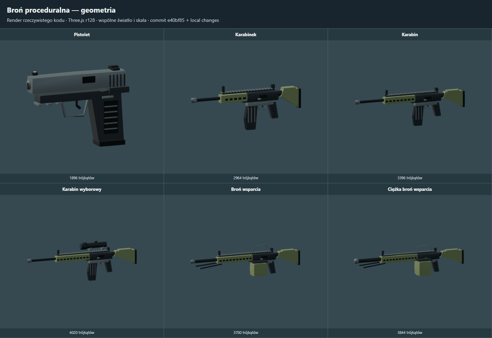

# Modele broni i pistolet — 0.16.0

Proceduralne modele broni dostały wyraźniejsze sylwetki i osobne materiały metalu, tworzywa oraz gumy. Zachowano istniejące identyfikatory wyposażenia i profile chwytów z 0.15.0.

## Co zmieniono

- Karabin i karabinek: profilowana kolba z poduszką, pochylony chwyt, kabłąk i spust, profilowany magazynek, szyna, przyrządy celownicze, panele łoża i otwór wylotowy.
- Karabin wyborowy: optyka z soczewką i mocowaniami; warianty wsparcia: skrzynka amunicyjna, uchwyt transportowy i złożony dwójnóg. Ciężki wariant ma szerszy korpus, łoże i grubszą lufę.
- Pistolet `sidearm`: nowy korpus, panele rękojeści, kabłąk, spust, muszka/szczerbinka, port wyrzutowy i rowki zamka. Zamek jest osobną bryłą, cofa się przy strzale i wraca do pozycji neutralnej także przy przewijaniu akcji w pauzie.
- Punkty chwytu i podparcia są dopasowane do nowej geometrii. Rozmiar wariantu skaluje wszystkie wierzchołki, oba kontakty dłoni, punkt kolby i wylot; wysokość żołnierza nie rozciąga broni.
- Podgląd siatki obejmuje wszystkie trzy materiały oraz zamek pistoletu. Materiały są współdzielone przez korpus i zamek, zwalniane razem z modelem.

Pistolet znajdował się już w katalogu; w tej wersji otrzymał pełniejszą oprawę i bezpośrednią ścieżkę dodawania. W generatorze otwórz **Broń → Dodaj pistolet do wyposażenia**, wybierz jedną lub dwie ręce i naciśnij **Wyjmij**. Dodawanie zachowuje genom, fazę ruchu i dotychczasową broń główną; wybór jest zapisany w ustawieniach edytora wyposażenia.

## Podglądy z rzeczywistego renderera

[Modele wszystkich sześciu broni palnych](research/images/weapons.png) · [Chwyty i podparcie dłoni](research/images/weaponhands.png) · [Pistolet w interfejsie](research/images/weaponui.png)

## Sprawdzenie

- `rtk proxy node tests/weapons_smoke.cjs`: cały katalog, dobywanie/chowanie, kontakty IK, skalowanie wszystkich komponentów, cykl zamka i przewijanie bez emitowania dodatkowych strzałów. To izolowany test numeryczny.
- `rtk proxy node tests/weapon_profiles_smoke.cjs`: istniejące profile 1H, przejścia 1H/2H, lokomocja i odrzut.
- `rtk proxy node docs/research/tools/infantry_capture.cjs weapons,weaponhands,weaponui`: renderowanie Three.js r128 oraz rzeczywisty interfejs. Kontrola przycisku dodawania, zachowania genomu/fazy/broni głównej, zapisu ustawienia, chwytu 2H, strzału, zamka i chowania. Plansze są statycznym materiałem do oceny wyglądu, nie pomiarem wydajności.

Modele pozostają uproszczonymi obiektami proceduralnymi bez zewnętrznych tekstur. Pistolet używa dodatkowej siatki dla zamka; nie dodaje kości do żołnierza. Bazowa anatomia i wyposażenie zachowują lineage `infantry-7.0.0`; runtime generator `infantry-7.1.0` pomija subpikselowe morph kanały twarzy w dalekim LOD. Geometria broni jest oznaczona `procedural-arms-2.0.0`.
