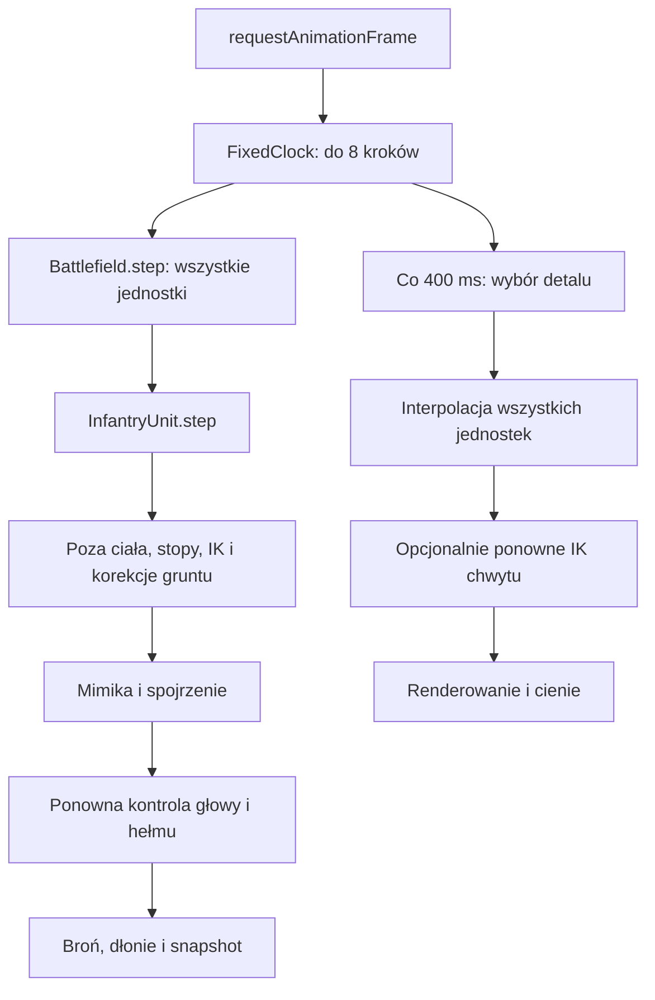

# Audyt statyczny wydajności — pełna ścieżka gry proceduralnej

Stan: robocza wersja 0.22.0, 25.09.2026, z aktualizacjami generowania, LOD i cache. Zakres: 49 plików aplikacji w `js/`, uruchamianie świata, generatory, renderer, animacje, broń, wyposażenie, oba laboratoria i zarządzanie zasobami. Dodatkowo sprawdzono punkty wejścia HTML. CodeGraph posłużył do lokalizacji modułów; ponieważ nie odtworzył wywołań metod w części modułów IIFE, zależności sprawdzono bezpośrednio w kodzie.

**Nie uruchamiano gry, benchmarków ani testów wydajności w ramach tego audytu.** Poniższe 54 pozycje to wszystkie zidentyfikowane w tym przeglądzie miejsca nadmiarowej pracy i ryzyka skalowania. Wskazują mechanizm kosztu w kodzie, a nie zmierzony udział w czasie klatki. Nie wykorzystuję wcześniejszego mikrobenchmarku cache do szeregowania problemów całej gry.

Priorytety oznaczają kolejność prac wynikającą z częstotliwości i zakresu operacji:

- **P1:** pierwsza kolejność — powtarzane szerokie operacje w ścieżce gry lub oczywista utrata możliwości ograniczenia pracy.
- **P2:** druga kolejność — generowanie, pamięć, przypadki warunkowe lub większa zmiana architektury.
- **P3:** lokalne oszczędności i przygotowanie do większej skali.

P1 nie oznacza udowodnionego największego kosztu CPU/GPU. Część punktów opisuje ten sam łańcuch na różnych poziomach — nie wolno dodawać ich potencjalnych korzyści jak niezależnych procentów.

## 1. Co dzieje się podczas jednej klatki

Kod ustawia krok 1/60 s. Dla 50 jednostek oznacza to **3000 wywołań kroku jednostki na sekundę czasu symulacji**, jeżeli symulacja utrzymuje zakładany krok. Po opóźnieniu jedna klatka może wykonać do **400 kroków jednostek**, zanim narysuje wynik. To wyliczenie z pętli, nie pomiar rzeczywistej prędkości.

W zwykłej ścieżce stojącej/chodzącej poza REST:

- `placeFeet` wywołuje rozwiązanie nogi raz na stopę, następnie `solveFeet` po dwa razy na stopę;
- `correctGround` ponownie wywołuje `solveFeet` po dwa razy na stopę;
- daje to **10 rozwiązań dwukościowego IK nóg na krok**, jeszcze przed ewentualnymi poprawkami penetracji buta/głowy;
- CPU skinning dla kontaktu przygotowuje własną paletę w skanach clearance, a Three.js r128 spłaszcza paletę GPU raz na szkielet i render. Wcześniejsze ręczne `skeleton.update()` po interpolacji, chwycie i korekcie głowy były redundantne i zostały usunięte; aktualizacje macierzy rig potrzebne zapytaniom IK/socketów pozostają.

Nie wszystkie te wywołania są zbędne. Pomiędzy nimi faktycznie zmienia się poza. Brakuje jednak rozdzielenia etapów, jawnego oznaczania zmienionych kości oraz ponownego użycia obliczeń w obrębie niezmienionej pozy.

## 2. CPU — symulacja, animacja, kontakt i broń

| ID / priorytet | Miejsce i dowód | Mechanizm kosztu | Optymalizacja zachowująca genomy |
|---|---|---|---|
| **01 · P1** | [game.js:92](../js/game.js#L92), [battlefield.js:34](../js/world/battlefield.js#L34), [fixedClock.js:12](../js/core/fixedClock.js#L12) | Każdy krok symulacji wykonywał pełną prezentację wszystkich jednostek. | Ruch, pozycja korzenia, patrol i zegary broni nadal używają stałego kroku; kosztowna poza ciała, kontakt i broń są aktualizowane w kadencji 60/30/15 Hz w kadrze zależnie od odległości i 5 Hz poza frustum. Czas i dystans są akumulowane między aktualizacjami. Pierwsza aktualizacja po wejściu w rzadszą kadencję dostaje stabilny, deterministyczny offset z seeda jednostki, żeby 50 jednostek nie wykonywało synchronizowanej pracy w jednej klatce; zmiana poziomu zachowuje ułamek czasu do następnej aktualizacji. Po dotarciu jednostki do celu battlefield pomija dalsze wyliczanie dystansu marszu i walidację niezmiennej prędkości, nadal wywołując `unit.step` dla animacji, mimiki i zegarów broni. W trakcie marszu ponownie waliduje wejście lokomocji tylko wtedy, gdy żądana prędkość faktycznie się zmieniła; prędkość ograniczona limitem 1.55 m/s nie jest ponownie ustawiana co tick. Animacja może numerycznie różnić się między poziomami LOD. |
| **02 · P1** | [game.js:97](../js/game.js#L97), [game.js:103](../js/game.js#L103) | Jednostki poza kadrem nadal muszą aktualizować logikę; wcześniej zawsze wykonywały też pełną pozę. | Test sfery jednostki względem frustum wybiera 5 Hz dla jednostek poza frustum, 15 Hz daleko w kadrze, 30 Hz w średnim zasięgu i pełną częstotliwość blisko. Culling renderera korzysta z osobnych konserwatywnych obwiedni. Logika jednostek nie jest pomijana. Wybór najbliższej przebudowy geometrii LOD korzysta teraz z tego samego cyklu odświeżania widoczności co 100 ms; odległości do jednostek są porównywane na kwadratach, bez pierwiastka na każdy oddziałowy pomiar, a kolejka nie skanuje ponownie armii w każdej renderowanej klatce. |
| **03 · P1** | [infantryRig.js:89](../js/rendering/infantryRig.js#L89), [infantryAnimator.js:569](../js/animation/infantryAnimator.js#L569), [weaponController.js:264](../js/weapons/weaponController.js#L264) | Wiele warstw wymuszało `updateMatrixWorld(true)`, czasem dla całego korzenia, i powtarzało `skeleton.update()` przed renderem. Kolejne konwersje model/world i ustawianie kości także powtarzały pobieranie transformacji rodziców. | Zmiana kwaternionu kości odświeża teraz jej przodków (`updateWorldMatrix(true,false)`), z zachowaniem pełnego fallbacku dla starszego API. `placeFeet` odświeża kwaternion i ścieżkę przodków zamiast wymuszać pełne `rig.root.updateMatrixWorld(true)`, a stan REST nie przebudowuje macierzy przed ich użyciem przez broń lub renderer. Test kadencji obserwuje brak obu pełnych traversali. Aplikacja pozy nie wykonuje bezwarunkowego pełnego przebiegu; reset pozy ciała odtwarza wyłącznie translację bioder i pomija stałe rotacje oraz translacje mimiki, które pozostają pod kontrolą `FaceAnimator` między jego własnymi krokami. Rotacje ciała zapisuje po jawnej, rzadkiej liście zmiennych kanałów. Skany clearance przygotowują macierze wtedy, gdy są potrzebne, a korekty bioder odświeżają potomny rig. Solver chwytu pomija pełne przebiegi po każdej ręce i na końcu kroku; IK/modelPoint aktualizują ścieżki, a interpolacja odświeża poddrzewa ramion. Ręczne `skeleton.update()` po interpolacji i po korekcie chwytu usunięto: Three.js r128 aktualizuje paletę raz na render dla skinned meshów, przed testem frustum. `prepareSkinPalette` pomija przebudowę macierzy i mnożenie palety CPU, gdy dokładny podpis lokalnych transformacji wszystkich kości oraz aktualnego łańcucha przodków modelu się nie zmienił. Pełne fazowanie animacji pozostaje otwarte. |
| **04 · P1** | [infantryAnimator.js:657](../js/animation/infantryAnimator.js#L657), [faceAnimator.js:390](../js/animation/faceAnimator.js#L390), [weaponController.js:310](../js/weapons/weaponController.js#L310), [infantryUnit.js:349](../js/units/infantryUnit.js#L349) | Wielokrotne przeliczanie palety szkieletu w warstwach i podczas interpolacji. | Kontrola gruntu współdzieli przygotowaną paletę między skanami body/gear/butów, gdy poza się nie zmienia; po korekcji stóp odświeża ją przed kolejnym skanem. Końcowy skan głowy i hełmu po mimice także przygotowuje paletę raz na oba zestawy próbek. Paleta CPU przechowuje 12 wartości affine na kość w Float64 zamiast pełnych 16. `prepareSkinPalette` cache'uje wynik względem lokalnych transformacji kości i przodków; zmiana transformacji go unieważnia. Face-only tick odejmuje już zastosowany headLift od zmierzonego clearance i stosuje tylko różnicę do bioder. Gdy korekta się nie zmienia, pomija ponowne IK stóp i dłoni. Kanały kwaternionów mimiki zachowują stan między własnymi krokami; krok ciała omija ich przepisywanie i składa tylko cached head-layer z nową pozą szyi/głowy zamiast ponownie aplikować wszystkie kontrole twarzy. Test `infantry_face_cadence.cjs` potwierdza brak dryfu, brak powtórnego IK przy stałej korekcie i rozdzielenie mimiki od kadencji ciała. Test skinningu body/gear nadal porównuje wynik z pełnym mnożeniem macierzy. Dalsze scalenie wszystkich faz animacji pozostaje otwarte. |
| **05 · P1** | [infantryFactory.js:85](../js/rendering/infantryFactory.js#L85), [infantryFactory.js:96](../js/rendering/infantryFactory.js#L96), [infantryAnimator.js:1010](../js/animation/infantryAnimator.js#L1010) | Przed zmianą CPU skinning mnożył `bone.matrixWorld × boneInverse` dla każdej wagi każdego sprawdzanego wierzchołka. | Paleta affine jest współdzielona przez skany, a jej budowa jest pomijana przy niezmienionych transformacjach wszystkich kości i przodków modelu. Pełnego cache'u wszystkich vertex nie ma; próbki kontaktu mają teraz ograniczony cache rewizji geometrii, transformacji rigu i dokładnych wpływów morphów. Zmiana samych morphów unieważnia próbki bez przebudowy palety kości, a zmiana bone/ancestor unieważnia próbki wraz z paletą. Rzadkie diagnostyczne skany całej siatki pozostają bez cache, więc pamięć jest ograniczona do wierzchołków faktycznie próbkowanych przez kontakty. |
| **06 · P1** | [infantryAnimator.js:1010](../js/animation/infantryAnimator.js#L1010) | Clearance rozdziela próbki o pojedynczym wpływie kości od próbek morphowanych lub mieszanych. Dla grup sztywno związanych z jedną kością cache'owane są bryły bind-space; ich przetransformowane AABB oraz górna granica wysokości terenu wyznaczają konserwatywną dolną granicę clearance. Grupy są sprawdzane od najniższej granicy, a dokładny skan pomija grupę tylko wtedy, gdy nie może zmienić aktualnego minimum (z marginesem 2 mm). | Wierzchołki z wieloma wagami pozostają w dokładnym skanie. Jednowagowe wierzchołki z relative morphami należą do grupy kości; jej dynamiczny AABB obejmuje pozycje dla aktualnych wpływów morphów. Geometrie z morphami absolutnymi trafiają do dokładnej ścieżki. Na stromym terenie i przy niskich postawach zakres bryły/terenu zwykle wymusza dokładne próbkowanie; nie ma osobnej ścieżki stoku ani prone. Numeryczny test porównuje wynik broad phase z pełnym skanem na płaskim, łagodnym i stromym polu, przy kontakcie oraz dla kilku dodatnich i ujemnych kombinacji wag morpha. |
| **07 · P1** | [infantryAnimator.js:659](../js/animation/infantryAnimator.js#L659), [infantryAnimator.js:697](../js/animation/infantryAnimator.js#L697), [infantryAnimator.js:702](../js/animation/infantryAnimator.js#L702) | Po korekcjach ponownie skanowane były próbki dla metryk `minBody`/`minBoot`. Przy braku korekcji ten sam pomiar bywał powtórzony bez zmiany pozy. | Wynik skanu body jest ponownie używany dla diagnostyki, gdy hips/feet się nie przesunęły. Po rzeczywistej zmianie pozy pomiar jest odświeżany, więc dokładność kontaktu pozostaje. Inne metryki diagnostyczne nadal liczą się w pełnym kroku animacji. |
| **08 · P1** | [infantryAnimator.js:761](../js/animation/infantryAnimator.js#L761), [infantryAnimator.js:792](../js/animation/infantryAnimator.js#L792), [infantryAnimator.js:692](../js/animation/infantryAnimator.js#L692) | Wielokrotne IK nóg wykonywało drugi przebieg nawet wtedy, gdy pierwszy nie zmienił docelowego punktu stopy. | Drugi przebieg stopy kończy się, gdy po obrocie kontaktu obliczony cel różni się od poprzedniego o nie więcej niż 1 µm; pozostaje aktywny przy istotnej zmianie. Zachowane są ograniczenia zasięgu i kotwiczenie stóp. Wysokość bioder nadal koryguje pozycję przed solveFeet. |
| **09 · P2** | [twoBoneIK.js:33](../js/animation/twoBoneIK.js#L33), [twoBoneIK.js:47](../js/animation/twoBoneIK.js#L47), [infantryAnimator.js:820](../js/animation/infantryAnimator.js#L820) | Solver wielokrotnie pyta o stale wymiary kończyn i ramy bazowe. | Długości odcinków są cache’owane według kości, a kierunki i odwrotne ramy bazowe według nazwy kości w instancji solvera. Znormalizowane kierunki spoczynkowe są przechowywane bezpośrednio w cache długości łańcucha i współdzielone z cache orientacji; iteracje IK nie kopiują ani nie normalizują tych samych kierunków ponownie. Pozostają kierunki właściwe dla łańcucha rig, liczone przy pierwszym użyciu. |
| **10 · P1** | [locomotionController.js:55](../js/animation/locomotionController.js#L55), [postureProfile.js:37](../js/animation/postureProfile.js#L37) | Odwracanie profilu przysiadu wymaga do 14 iteracji; limit prędkości jest potrzebny przy zmianie pozycji. | depthAtSpeed uruchamia się tylko przy zwiększaniu przysiadu. speedLimit nie tworzy tablicy progów; hamowanie przed obniżeniem sylwetki pozostaje zachowane. |
| **11 · P1** | [faceAnimator.js:257](../js/animation/faceAnimator.js#L257), [faceAnimator.js:302](../js/animation/faceAnimator.js#L302), [infantryUnit.js:313](../js/units/infantryUnit.js#L313) | Blend, sprężyny, mruganie i spojrzenie mają różny koszt i nie muszą pracować w jednej częstotliwości. | Mimika dalekich jednostek odświeża się maksymalnie co 100 ms, średnich 30 razy/s, bliskich w pełnym kroku. Cele ekspresji i listę nazw przechowuje animator; blend przechodzi tylko po kanałach zdefiniowanych w niezmiennych presetach i pomija dokładnie zerowe wagi. Gdy wagi i kanały dotrą do celu (tolerancja 1e-6), springi nie są przeliczane do zmiany ekspresji; mruganie, spojrzenie i nakładanie głowy nadal działają w swojej kadencji. Na kroku bez kadencji twarzy `InfantryUnit` nie wywołuje już `FaceAnimator.apply()` ani nie odtwarza snapshotów; niezmienione renderowane kanały pozostają na miejscu, a `render()` składa zapisaną mimikę i interpolowaną uwagę. Powtarzana ocena niezmienionego profilu odległościowego omija normalizację i remapowanie fazy. Sprężyny uwagi, sakkady i oczu śpią do następnego zdarzenia lub nowego celu wzroku po osiągnięciu stabilności z tolerancją 1e-8 radiana; pełny scheduler mimiki pozostaje otwarty; testy `tests/visual_cadence_scheduler.cjs` oraz `tests/infantry_face_cadence.cjs` sprawdzają fazy, zachowanie ekspresji i pominięcie pełnego nakładania na tickach pośrednich. |
| **12 · P2** | [infantryRig.js:87](../js/rendering/infantryRig.js#L87), [infantryAnimator.js:562](../js/animation/infantryAnimator.js#L562), [infantryUnit.js:16](../js/units/infantryUnit.js#L16), [infantryUnit.js:326](../js/units/infantryUnit.js#L326) | Wszystkie kości były resetowane, kopiowane do snapshotów i interpolowane; część kanałów twarzy jest własnością warstwy mimiki, nie ciała. | Snapshoty i interpolacja obejmują tylko jawne kanały ciała/twarzy oraz zmienne rotacje. Aplikacja pozy ciała zapisuje tylko zmienne kanały kwaternionów; nie nadpisuje mimicznych ani stałych rotacji. Reset translacji animacji ciała obejmuje tylko biodra, dzięki czemu ekspresyjne przesunięcia twarzy nie znikają pomiędzy niezależnymi krokami. Render pomija zapisy kanałów, których poprzedni/bieżący snapshot jest identyczny; kanały `upperArm`/`foreArm`/`hand` zachowują per-frame bazową interpolację przed IK chwytu. Zrzut twarzy kopiuje pozycje, rotacje i morph tylko wtedy, gdy snapshot rzeczywiście się zmienił. Nowe animowane translacje trzeba dopisać do jawnej listy kanałów. Test `infantry_face_cadence.cjs` sprawdza zachowanie translacji/rotacji mimiki i brak kopii przy stabilnym snapshotcie. |
| **13 · P3** | [infantryAnimator.js:514](../js/animation/infantryAnimator.js#L514), [infantryAnimator.js:541](../js/animation/infantryAnimator.js#L541) | Klasyfikacja odpowiedzi kości i współczynniki tłumienia mogą być wspólne dla wielu kroków. | Typ odpowiedzi kości jest przygotowywany raz przy tworzeniu animatora, a współczynniki tłumienia cache’owane do zmiany dt. |
| **14 · P1** | [weaponController.js:385](../js/weapons/weaponController.js#L385), [weaponController.js:389](../js/weapons/weaponController.js#L389) | Snapshot broni tworzy nowe słowniki, obiekty, wektory i kwaterniony przy kopiowaniu i przechwytywaniu. Dzieje się to również dla broni schowanej. | Stałe struktury snapshotów przygotowane w `reconcile`; aktualizacja przez `copy`. Przebudowa slotów wyłącznie po zmianie wyposażenia. |
| **15 · P2** | [weaponController.js:317](../js/weapons/weaponController.js#L317), [handRig.js:48](../js/weapons/handRig.js#L48), [faceAnimator.js:262](../js/animation/faceAnimator.js#L262), [infantryUnit.js:361](../js/units/infantryUnit.js#L361), [battlefield.js:38](../js/world/battlefield.js#L38) | Inne krótkotrwałe obiekty powstawały w krokach animacji i generowania. | Obiekt marszu, kąty palców, kwaterniony ramion IK, Euler/kwaternion celowania i tablica celów mimiki są ponownie używane; `prepareBody` kontrolera broni korzysta z jednego Euler scratch i stałej listy kości zamiast dwóch nowych Eulerów oraz tymczasowej tablicy par na aktualizację. Zatrzymane sprężyny broni i nieruchome celowanie pomijają wykładniki oraz mieszanie identycznych wartości. Render broni pomija kopiowanie właścicieli dłoni. Zamek i błysk pomijają zapisy transformacji/materiałów, gdy ich wynik nie zmienił się; nieaktywny błysk nie wykonuje sinusów. Ścieżki `capture`, `render`, `dampPose`, `applyPose` i aplikowanie twarzy używają pętli indeksowych lub stałych list zamiast callbacków i tablic tymczasowych w aktualizacji. Zliczanie awaryjnych kotwic stóp używa pętli indeksowej zamiast `reduce`. Część lokalnych funkcji pozostaje. |
| **16 · P2** | [weaponController.js:141](../js/weapons/weaponController.js#L141), [weaponController.js:263](../js/weapons/weaponController.js#L263), [weaponController.js:357](../js/weapons/weaponController.js#L357) | Schowana broń nadal wyliczała ramy obu dłoni i kończyła aktualizacją całego szkieletu. | Gdy żadna broń nie jest aktywna, kontroler nadal aktualizuje stowed sockety, zegary i efekty, lecz pomija ramy dłoni i końcowe odświeżanie rigu; świeże ramy są pobierane przy wyciąganiu/seek. Nie zmienia to montażu broni ani interpolacji jej socketów. |
| **17 · P2, warunkowe** | [weaponController.js:399](../js/weapons/weaponController.js#L399) | Dla broni aktywnej ręce rozwiązują się w kroku animacji i po interpolacji. | Broń nadal aktualizuje zegary w każdym logicznym kroku; po interpolacji dokładne IK chwytu działa blisko, a dla dalszych jednostek pozostają interpolowane transformacje bez powtarzania solvera w każdej klatce. |
| **18 · P2** | [terrain.js:88](../js/terrain.js#L88), [terrain.js:99](../js/terrain.js#L99) | Zapytanie o wysokość potrzebuje interpolacji, nie normalnej. | getHeightAt używa osobnej interpolacji na tej samej przekątnej komórki. step i half są cache’owane podczas budowy i współdzielone przez getHeightAt oraz sample; zachowano dzielenie zamiast odwrotności, by nie zmieniać zaokrągleń granic komórek. Ruch jednostki, clearance, planowanie kroków stóp i prześwit broni przekazują własny cache jednej komórki do getHeightAtCached; stare powierzchnie zachowują fallback getHeightAt. Test instrumentuje wywołania stóp i każdą rodzinę uzbrojenia. |

## 3. Renderowanie, geometria i cienie

| ID / priorytet | Miejsce i dowód | Mechanizm kosztu | Optymalizacja |
|---|---|---|---|
| **19 · P1** | [infantryFace.js:25](../js/rendering/infantryFace.js#L25), [infantryHair.js:19](../js/rendering/infantryHair.js#L19), [infantrySurface.js:131](../js/rendering/infantrySurface.js#L131), [infantryGear.js:36](../js/equipment/infantryGear.js#L36), [game.js:130](../js/game.js#L130) | `world` pozostaje bez zmian jako poziom średni; dla `far` zmniejszono przekroje tułowia, butów, dłoni, twarzy, włosów i ekwipunku, zachowując ten sam genom i wyposażenie. Wybór następuje powyżej 65 m, a powrót przy zejściu poniżej 55 m ogranicza migotanie na granicy. Armia START NEW buduje się od razu w far LOD, zgodnie z początkowym oddalonym kadrem. | Zmiana `detail` przygotowuje body/gear asynchronicznie wspólnym generatorem kroków, sprawdza anulowanie między porcjami i zatwierdza komplet geometrii dopiero po sukcesie; poprzedni mesh pozostaje widoczny do atomowego commitu. `far` zachowuje kości i morpha dłoni, ale pomija eyelid/neck morph targets, które przy dystansie powyżej 65 m są subpikselowe; bliższe detale nadal mają pełną mimikę. Nie zredukowano liczby kości ani skinningu. Końcowe przydziały dużych tablic typowanych są niepodzielne. Test LOD sprawdza zestaw morph kanałów obu poziomów, a test sprintu zachowuje ugięcie dłoni po zmianie LOD. |
| **20 · P1** | [infantryFactory.js:19](../js/rendering/infantryFactory.js#L19), [infantryFactory.js:45](../js/rendering/infantryFactory.js#L45) | Przed zmianą ciało i wyposażenie miały `frustumCulled=false`, więc renderer nie odrzucał ich zwykłym testem obwiedni. | Meshe otrzymują teraz sfery wokół rzeczywistych granic bind-space rozszerzone o zapas na artykulację i sprzęt. Nie włączać odrzucania na starej obwiedni pozy spoczynkowej, bo znikną kończyny i cienie. |
| **21 · P1** | [battlefield.js:72](../js/world/battlefield.js#L72) | Przed zmianą jedna instancja gatunku obejmowała całą mapę, miała `frustumCulled=false`, a Three.js r128 nie uwzględniał macierzy poszczególnych instancji przy teście obwiedni. | Drzewa są teraz dzielone na cztery obszary 100 × 100 m dla każdego gatunku i części modelu; każda grupa dostaje sferę złożoną z przetransformowanych obwiedni wszystkich swoich instancji. |
| **22 · P1** | [plantGenerator.js:75](../js/environment/plantGenerator.js#L75), [plantGenerator.js:84](../js/environment/plantGenerator.js#L84), [battlefield.js:11](../js/world/battlefield.js#L11) | Drzewa na mapie zawsze używały `world`; wariant pomijał część liści i owoce, ale zachowywał wszystkie segmenty drewna. | Scenariusz tworzy poziomy `world`, `distant` i `far` z tego samego deterministycznego szkieletu. Wraz z odległością usuwa drobne gałęzie i liście, ogranicza boki rur i skaluje korony. Wybór przez `THREE.LOD` dla czterech grup przestrzennych ma 8% histerezy przy przejściu na dalszy i bliższy poziom, ograniczając migotanie na progach. Trzy warianty podnoszą pamięć do zwolnienia z polem bitwy. |
| **23 · P1** | [game.js:11](../js/game.js#L11), [game.js:83](../js/game.js#L83), [battlefield.js:22](../js/world/battlefield.js#L22), [infantryFactory.js:19](../js/rendering/infantryFactory.js#L19) | Gęste modele rzucały cienie; projekcja cienia obejmowała stały obszar, a pixel ratio zależał od DPR. | Obszar kierunkowej mapy cieni dopasowuje się do dystansu kamery i środka widoku (24/55/110 m). Cienie piechoty i statycznego lasu pozostają aktywne, nie zastosowano ryzykownego zamrożenia mapy. |
| **24 · P2** | [surfaceBuilder.js:128](../js/rendering/surfaceBuilder.js#L128), [infantryFactory.js:17](../js/rendering/infantryFactory.js#L17), [infantryMaterials.js](../js/rendering/infantryMaterials.js) | Osobne body i gear mają odrębne grupy roughness/metalness/tekstury; wcześniej każda grupa była osobnym draw callem. | Ciało i gear zachowują osobne SkinnedMesh, morphy, metadane kontaktu, culling i widoczność, ale używają po jednym region-aware `MeshStandardMaterial`. Atrybut `materialRegion` zapisuje dawny indeks grupy w bajcie na wierzchołek; shader odtwarza roughness, metalness, splot i sidedness. Kompozytor gear dzieli tylko wierzchołki współdzielone między grupami (32 w fixture MARKSMAN/SCOUT), bez zmiany trójkątów ani pozycji. Przy konflikcie, którego nie da się rozdzielić, fabryka zachowuje fallback do starych grup. Test wszystkich 10 loadoutów weryfikuje zgodność regionów, a headless Chrome z Three.js r128 renderuje świat 50 jednostek i mierzy 100 wywołań body/gear w kolorowym przebiegu (2 na jednostkę zamiast 5 dla typowego starego podziału); bez benchmarku czasu GPU/CPU. |
| **25 · P2** | [plantGenerator.js:9](../js/environment/plantGenerator.js#L9), [plantGenerator.js:18](../js/environment/plantGenerator.js#L18), [plantGenerator.js:107](../js/environment/plantGenerator.js#L107) | Rośliny zapisują każdy trójkąt bez indeksowania; punkty liści/konarów są powielane. Liście są dwustronne i liczne; nakładające się korony zwiększają koszt pikseli. | Battlefield agreguje korony przez `InstancedMesh` po gatunku, ćwiartce mapy i LOD. Wszystkie części materiałowe i LOD danego skupiska współdzielą jeden niezmienny `instanceMatrix` zamiast alokować i kopiować identyczny bufor na każdy mesh (`tests/battlefield_checks.js`). Atrybuty roślin przechowują pozycje w Float32, ale kolory w znormalizowanym Uint16, a normalne w znormalizowanym Int16: dla 20 gatunków × 3 LOD footprint spadł z 67,171,248 do 44,780,832 B (-33.33%). Test weryfikuje formaty, normalne z błędem długości ≤0.0001 i zgodność sync/async (`plant_buffer_smoke.cjs`, `plant_async_smoke.cjs`, `plant_cache_smoke.cjs`). Dokładne indeksowanie tych spakowanych atrybutów łączy 130,364 z 1,865,868 wierzchołków, lecz indeks 16/32-bit zwiększa footprint do 46,186,392 B (+3.14%); test odrzuca tę zmianę pamięci. Far-tier liście mają `shadowSide=FrontSide`; liście są nieprzezroczyste, więc sortowanie kart nie ma tu zastosowania. |
| **26 · P2** | [game.js:8](../js/game.js#L8), [unitPreview.js:9](../js/ui/unitPreview.js#L9), [environmentLab.js:11](../js/environment/environmentLab.js#L11), [config.js:23](../js/config.js#L23) | Antyaliasing, PBR, cienie i pixel ratio wpływają na koszt pikseli niezależnie od proceduralności geometrii. | Dodano wspólny, zapamiętywany wybór Oszczędny / Zrównoważony / Wysoka jakość. Profile ograniczają pixel ratio i rozmiar bufora na mapie (od 3 do 12 MP) i w podglądach (od 2 do 6 MP), przeliczają limit przy resize i aktualizują aktywne renderery po zmianie profilu. Nie zmieniają losowości, geometrii, LOD ani cieni. Test `tests/render_quality_smoke.cjs` sprawdza granice, zapis oraz użycie wspólnego limitera w trzech rendererach. |
| **27 · P2** | [terrain.js:59](../js/terrain.js#L59), [terrain.js:73](../js/terrain.js#L73) | Jedna pełna siatka terenu bez chunków i LOD. Włączona siatka diagnostyczna dodaje drugi przebieg całej geometrii z shaderem linii. | Teren i siatka diagnostyczna są podzielone na chunki 50×50 segmentów (główna mapa) lub 40×40 (pole bitwy), z dokładnymi granicami i odrzucaniem poza kamerą. Wysokość, topologia i normalne pozostają bez zmian. Indeksy plane są alokowane od razu w typowanej tablicy o dokładnym rozmiarze i typie wynikającym z liczby wierzchołków; nie powstaje pośrednia zwykła tablica ani druga kopia indeksów. Nie dodano LOD rozdzielczości — próbkowanie kontaktu nadal odpowiada tej samej siatce. |

## 4. Generowanie proceduralne i praca na żądanie

| ID / priorytet | Miejsce i dowód | Mechanizm kosztu | Optymalizacja |
|---|---|---|---|
| **28 · P1 dla responsywności** | [battlefield.js:9](../js/world/battlefield.js#L9), [terrain.js:95](../js/terrain.js#L95), [plantGenerator.js:126](../js/environment/plantGenerator.js#L126) | Koszt terenu i pojedynczego prototypu rośliny jest zależny od siatki/genomu i nie da się go ograniczyć samym oddawaniem sterowania między obiektami. | Battlefield `buildAsync` przekazuje teraz do workera cały kosztowny przebieg bazowej siatki: pozycje i UV plane, szumowe wysokości, indeksy, normalne i kolory; worker zwraca typowane bufory transferem. Wyniki są bitowo zgodne ze ścieżką synchroniczną, a brak Worker lub błąd uruchomienia zachowuje pociętą ścieżkę głównego wątku. Budowanie geometrii Three.js, dokładnych bounds i chunków nadal oddaje klatkę porcjami, sprawdza anulowanie i współdzieli atrybuty źródłowe między chunkami. `Battlefield.build` używa teraz `InfantryUnit.createAsync`, więc synchroniczne generowanie powierzchni i wyposażenia pojedynczego żołnierza nie blokuje budowy całego oddziału; po trafieniu dokładnego AppearanceCache model jest składany natychmiast. Generator rośliny oddaje sterowanie co 12 segmentów drewna i co 4 końcówki szkieletu; pętle korony robią checkpoint po 32 liściach/owocach, bez zmiany RNG lub kolejności emisji. Konwersja Float32, normalne, granice i macierze instancji pracują porcjami, a zapis instancji sprawdza anulowanie. Laboratorium otoczenia korzysta teraz z `createAsync` zamiast blokującego `create`: zachowuje poprzedni model do zatwierdzenia wyniku i anuluje nieaktualny build po kolejnej zmianie albo dispose. Pojedyncza emisja liścia/owocu, montaż rig/model po geometrii i utworzenie geometrii jednego chunka instancji pozostają atomowe. Testy async porównują dokładne bufory z trybem sync i potwierdzają anulowanie. |
| **29 · P2** | [surfaceBuilder.js:93](../js/rendering/surfaceBuilder.js#L93) | Każde `finish` buduje graf krawędzi, tablice sąsiedztwa i BFS orientacji trójkątów, również dla znanych prymitywów. | Walidacja grafem nadal jest używana dla sylwetki, wyposażenia oraz broni palnej, ale etapy grafu/BFS mogą teraz oddawać klatkę w ścieżce asynchronicznej. Pominięcie BFS w całym `GearGeometry` odrzucono: siatki wszystkich 10 loadoutów miały niespójne współdzielone krawędzie przy samym lokalnym ustawianiu normalnymi; karabiny i pistolet również wymagają korekty. Opt-in w `SurfaceBuilder` wykorzystuje na razie tylko zamknięte prymitywy noża i granatu w `WeaponGeometry`, których współdzielone krawędzie przeszły kontrolę windingu. |
| **30 · P2** | [surfaceBuilder.js:132](../js/rendering/surfaceBuilder.js#L132) | Każdy morph dostaje tablice rozmiaru całej powierzchni. Dla każdego powstaje pełna geometria tymczasowa do liczenia normalnych, nawet gdy deformowane są tylko powieki lub szyja. | Pozycje morpha nadal mają pełny bufor wymagany przez Three.js, ale normalne są liczone tylko dla wierzchołków w sąsiedztwie zmienionych trójkątów. Usunięto tymczasową geometrię i pełne przeliczanie normalnych dla każdego morpha; ścieżka asynchroniczna dzieli kopiowanie zmian, adjacency i normals na porcje. |
| **31 · P2** | [surfaceBuilder.js:15](../js/rendering/surfaceBuilder.js#L15), [surfaceBuilder.js:37](../js/rendering/surfaceBuilder.js#L37), [surfaceBuilder.js:122](../js/rendering/surfaceBuilder.js#L122), [gearGeometry.js:9](../js/equipment/gearGeometry.js#L9) | Przed zmianą wagi każdego wierzchołka przechodziły `entries/filter/sort/slice/reduce`; prymitywy produkują wiele wektorów. Duże zwykłe tablice są na końcu konwertowane do tablic typowanych. | Wybór czterech wag odbywa się bez tymczasowych tablic sortowania; geometrie bez morphów pomijają graf sąsiedztwa. Końcowy indeks jest składany do tablicy o dokładnym rozmiarze zamiast wielokrotnie powiększać ją przez `push(...t)` dla każdej grupy materiału. Listy wierzchołków i trójkątów używane przy wyliczaniu morph normalnych są teraz współdzielone pomiędzy kanałami; walidacja orientacji wykorzystuje ponownie cztery scratch-wektory zamiast tworzyć cztery obiekty wektorowe na każdy trójkąt. W sortowaniu kandydatów i kolejności akumulacji nic się nie zmienia. Próbki pozycji trójkąta są współdzielone z filtrem zakrytych włosów, zamiast filtrować przez tymczasową tablicę, callback i wektory, a widoczny trójkąt nie liczy tych samych punktów ponownie. `ring`, `ellipsoid` i `cap` używają teraz scratch-wektorów należących do buildera; `ring` korzysta też z buforów UV i kształtu zamiast tworzyć małe tablice na wierzchołek. Zachowują się małe listy indeksów pętli, dynamiczne mapy wag/kolorów i bufory wyjściowe geometrii. |
| **32 · P2** | [faceAnatomy.js:82](../js/rendering/faceAnatomy.js#L82), [faceAnatomy.js:121](../js/rendering/faceAnatomy.js#L121), [faceAnatomy.js:125](../js/rendering/faceAnatomy.js#L125) | `section` wyszukuje segment i ponownie liczy nachylenia interpolacji. `frontZ` wywołuje `section`, następnie `point` robi to ponownie. `normal` woła cztery razy `frontZ`. | Nachylenia są buforowane, wyszukiwanie poziomu profilu jest binarne, `frontZ` korzysta z gotowego przekroju, a `normal` współdzieli przekrój środkowy i używa punktu roboczego. Każda anatomia ma ograniczony cache LRU do 256 przekrojów o dokładnym kluczu y; `frontZ`, `point` i `normal` ponownie używają tych samych próbek wysokości. Zwracane przez publiczne `section()` tablice pozostają niezależne od cache. Test porównuje dokładne wartości z cache wyłączonym dla 1800 wysokości w trzech genomach i sprawdza limit oraz niezależność buforów. |
| **33 · P2** | [infantrySurface.js:49](../js/rendering/infantrySurface.js#L49), [infantryHair.js:21](../js/rendering/infantryHair.js#L21) | Włosy przykryte hełmem nadal generują wierzchołki. Filtr odrzuca trójkąty, a komentarz wymaga zachowania indeksów. | Generator sprawdza pokrycie każdego punktu włosów przed jego dodaniem do bufora, a mostkuje tylko trójkąty z trzema istniejącymi wierzchołkami. Usunięto redundantny triangleFilter, który ponownie sprawdzał widoczność trzech punktów każdego trójkąta. Test porównuje widoczne/ukryte wierzchołki hełmu i odkrytej głowy oraz ogranicza wywołania filtra do kandydatów wierzchołków; pojedyncze widoczne wierzchołki bez trójkąta przy granicy nakrycia mogą nadal pozostać w buforze. |
| **34 · P2** | [infantryFactory.js:51](../js/rendering/infantryFactory.js#L51), [equipmentEditor.js:38](../js/ui/equipmentEditor.js#L38), [infantryGear.js:263](../js/equipment/infantryGear.js#L263) | Zmiana jednego slotu, koloru lub zużycia może unieważnić cały zestaw ciała i gear. Kolory są w wierzchołkach, więc nawet czysto wizualna zmiana uruchamia szeroką ścieżkę. | Dokładny podpis zależności powierzchni pozwala zachować body geometry przy zmianach slotów/palety/zużycia, które nie wpływają na sylwetkę ani zakrycie; zmiana kroju, rękawic, balaclavy lub hełmu nadal przebudowuje ciało. Gear jest przebudowywany, gdy dokładny klucz wejściowy zmienia sloty, warianty, paletę, zużycie lub detal, ponieważ wpływają one na wierzchołki, dopasowanie i kontakt. Identyczny klucz omija teraz nie tylko budowę geometrii, lecz także reconcile broni, rekonstrukcję próbek podparcia i zwalnianie kontaktów. Podpisy zależności body i gear są jawne, rozdzielone i testowane osobno. Gear cache'uje geometrię każdego zajętego slotu niezależnie w limicie pamięci z LRU, a następnie składa części do jednego SkinnedMesh z zachowaniem do trzech grup materiałów, kolejności indeksów per materiał, tagów slotów i próbek kontaktu. Zmiana niezależnego slotu przebudowuje tylko jego część; test potwierdza 15 trafień i jedną przebudowę dla zmiany face, a pełny digest obejmuje atrybuty, indeksy, grupy i kontakty. Kompozycja bez slotów zachowuje poprawne puste atrybuty geometrii. Stan budowy powierzchni jest teraz per wywołanie; reentrantny test potwierdza bajtową zgodność wyników, co umożliwia późniejsze odseparowanie kompilacji ciała od zależności gear bez zmiany geometrii. |
| **35 · P3** | [infantryUnit.js:34](../js/units/infantryUnit.js#L34), [infantryAnimator.js:114](../js/animation/infantryAnimator.js#L114), [faceAnimator.js:43](../js/animation/faceAnimator.js#L43), [equipmentFit.js:12](../js/equipment/equipmentFit.js#L12) | Ten sam genom był wyrażany osobno przez jednostkę i animator ciała; dopasowanie sprzętu było też powielane między powierzchnią, gear i bronią. |InfantryUnit przekazuje gotowy fenotyp do animatora, unikając drugiego wyrażenia genomu. InfantryFactory tworzy jeden EquipmentFit i przekazuje go do InfantrySurface oraz InfantryGear; WeaponController wykorzystuje dopasowanie powierzchni również po zmianie wyposażenia. Test liczy konstrukcje dla wszystkich 10 loadoutów i potwierdza tę samą instancję fit w surface/gear. Graf rewizji anatomii i sprzętu pozostaje poza zakresem tej optymalizacji.|
| **36 · P2/P3** | [infantryUnit.js:44](../js/units/infantryUnit.js#L44), [infantryUnit.js:72](../js/units/infantryUnit.js#L72), [infantryUnit.js:92](../js/units/infantryUnit.js#L92), [infantryUnit.js:389](../js/units/infantryUnit.js#L389) | Każda jednostka od razu buduje schemat nieaktywnego ragdolla. Konstruktor i ustawienie pozycji wykonują pełne inicjalizacje pozy. Zmiana LOD mogła odbudować listy próbek podparcia. | Niezmienne listy próbek kontaktu są cache'owane przez tożsamość geometrii surface/gear i sygnaturę punktów anatomii. RagdollSchema jest tworzony dopiero przy pierwszym odczycie diagnostycznego `physicsSchema`, a powtórne odczyty używają tej samej instancji. Przegląd nie wykazał bezpiecznej części pełnej inicjalizacji pozy, którą można pominąć dla jednostek polowych: przed pierwszym renderem trzeba przygotować stan animacji, twarzy i chwytów broni oraz pozycje kontaktu. Test `tests/infantry_lazy_physics.cjs` potwierdza brak budowy schematu w konstruktorze i `setWorldPosition`, oraz dokładnie jedną budowę przy jawnym odczycie. |
| **37 · P2** | [weaponGeometry.js:8](../js/weapons/weaponGeometry.js#L8), [weaponGeometry.js:110](../js/weapons/weaponGeometry.js#L110), [weaponController.js:43](../js/weapons/weaponController.js#L43) | Sztywna broń jest generowana osobno, a rozmiar i odcień są wypalone w geometrii. | Bufory body/slide są teraz współdzielone dla identycznej definicji, długości, rozmiaru i odcienia; referencje zwalniają je po ostatnim użyciu. Materiały, zamek, błysk i transformacje pozostają per egzemplarz. Wariantów o różnych rozmiarach/odcieniach nie łączy się przez przybliżenie. |
| **38 · P2** | [plantGenerator.js:69](../js/environment/plantGenerator.js#L69), [environmentLab.js:20](../js/environment/environmentLab.js#L20) | Zmiana sezonu nadal wymaga przebudowy sezonowych liści, kwiatów i owoców; drewno można zachować między wariantami. | Refcountowany cache współdzieli niezmienną geometrię drewna między sezonami dla tego samego gatunku, seeda, wieku, poziomu LOD i genów szkieletu. Osobny cache refcountowany wpisami geometrii świata przechowuje deterministyczny szkielet (węzły i końcówki) wspólny dla sezonów/LOD; jego klucz zawiera tylko dokładne wejścia używane przez `skeletonSteps`, a wpis znika po zwolnieniu ostatniego wariantu świata. `createLods` i laboratorium nadal przekazują ten sam szkielet pomiędzy poziomami. Klucz geometrii drewna rozdziela LOD, bo gałęzie i przekroje są w nich upraszczane. Pozostałe warstwy sezonowe nadal są generowane osobno. |
| **39 · P2** | [plantGenerator.js:10](../js/environment/plantGenerator.js#L10), [plantGenerator.js:24](../js/environment/plantGenerator.js#L24), [plantGenerator.js:77](../js/environment/plantGenerator.js#L77) | Wektory/kolory klonowane na krawędź i trójkąt, powtarzane sinusy, filtrowanie wszystkich węzłów brzozy dwadzieścia razy. | Węzły pnia brzozy są filtrowane raz, a punkty siatki owocu współdzielone między sąsiednimi trójkątami. Cieniowanie nie alokuje kolorów na ściankę. Wierzchołki liści są obracane wzorem kwaternionowym i zapisywane do współdzielonego bufora scratch, bez tablicy listy punktów ani tablic zwracanych przez każdy obrót. Emisja trójkąta dopisuje dziewięć współrzędnych i kolor bez tymczasowej tablicy iteracyjnej. Siatka owocu używa 40 współdzielonych wektorów zamiast tworzyć 40 obiektów i pięć tablic na owoc; compound leaf korzysta ze współdzielonego punktu kotwiczącego. Położenie, kierunek, pozycja liścia, pozycja owocu, Euler, kwaternion i kolor są scratchami współdzielonymi przez synchroniczny krok generatora, bez alokacji tych obiektów na każdy liść. Punkty koncowe galezi drewna i lenticeli brzozy korzystaja ze wsp�ldzielonych wektor�w zamiast tworzyc nowe Vector3 dla kazdego segmentu i detalu; plant_cache_smoke.cjs oraz plant_async_smoke.cjs potwierdzaja identyczne bufory pelnej geometrii i anulowanie. Profile sinusów/cosinusów dla przekrojów rur kory (3, 4, 6 i 8 boków) oraz klonowych/dębowych liści są obliczane raz i współdzielone; test SHA-256 buforów klonu i dębu sprawdza, że pozycje, kolory i normalne pozostały bitowo identyczne. Test asynchroniczny potwierdza bajtową zgodność tych buforów, bounds i statystyk dla 20 gatunków i trzech LOD; cache sezonowego drewna nadal przechodzi. |
| **40 · P3** | [plantGenerator.js:81](../js/environment/plantGenerator.js#L81) | Kwaternion i Euler liścia powstają przed sprawdzeniem, czy liść będzie widoczny. Dla zimowego drzewa liściastego ta praca nigdy nie trafia do siatki. | RNG nadal pobiera te same próbki liści w tej samej kolejności, ale decyzja o widoczności zimowej/gęstości/LOD następuje przed utworzeniem kwaternionu, Eulera i pozycji geometrii. |
| **41 · P3 obecnie, P2 przy skali** | [battlefield.js:45](../js/world/battlefield.js#L45) | Każdy kandydat drzewa szuka konfliktów tylko w sąsiednich komórkach siatki przestrzennej. | Test odległości używa pętli i kwadratów odległości, bez some, callbacku ani hypot; próby i RNG zachowują kolejność. Przy obecnych 90 drzewach pozostaje niższym priorytetem niż animacja/renderowanie. |

## 5. Cache, pamięć i cykl życia

| ID / priorytet | Miejsce i dowód | Mechanizm kosztu / ograniczenie | Optymalizacja |
|---|---|---|---|
| **42 · P2** | [appearanceCache.js:15](../js/rendering/appearanceCache.js#L15), [infantryFactory.js:15](../js/rendering/infantryFactory.js#L15) | Cache dotyczy tylko nieaktywnych zestawów powierzchni i gear. Trafienie nadal tworzy rig i pozostałe kontrolery. Aktywne identyczne modele nie współdzielą geometrii; nowy genom zwykle nie trafi w cały zestaw. | Identyczne aktywne modele współdzielą teraz niemutowalną geometrię body/gear; per-rig `EquipmentFit` jest izolowany w cienkich wrapperach, a referencje i backing bufory są liczone do ostatniego użytkownika. Rig i kontrolery nadal są per jednostka. Nie ogranicza się populacji ani DNA. |
| **43 · P2** | [appearanceCache.js:8](../js/rendering/appearanceCache.js#L8), [surfaceBuilder.js:132](../js/rendering/surfaceBuilder.js#L132) | Bieżący licznik retained geometry nie pokazuje szczytu danych CPU podczas kompilacji. `appearanceCache.stats()` rozdziela aktywne unikalne backing `ArrayBuffer` od nieaktywnego LRU; UI odświeża liczby co 500 ms. | UI oddziela aktywne bufory CPU od nieaktywnego LRU; co 500 ms próbuje także próbkować JS heap Chromium i liczniki obiektów geometrii/tekstur Three.js, zachowując zaobserwowane maksima. Finalizator piechoty zwalnia zwykłe tablice źródłowe etapami. To lepsza obserwowalność, ale nadal nie pełny szczyt bajtów: pomiar heap jest zależny od silnika i może nie obejmować całej pamięci ArrayBuffer, próbki mogą pominąć krótkie skoki, a Three.js podaje liczbę obiektów GPU zamiast bajtów. Materiały i część geometrii roślin nie są liczone w CPU-cache. |
| **44 · P3** | [appearanceCache.js:14](../js/rendering/appearanceCache.js#L14), [infantryGenome.js:155](../js/units/infantryGenome.js#L155) | Klucz serializował cały fenotyp twarzy, także parametry mrugania i dynamiki ekspresji, które nie zmieniają geometrii. | Klucz uwzględnia teraz dokładne parametry wpływające na geometrię; parametry samej animacji twarzy pominięto bez zaokrąglania genów i bez użycia samego seeda. |
| **45 · P2, zależne od użycia** | [appearanceCache.js:11](../js/rendering/appearanceCache.js#L11), [appearanceCache.js:16](../js/rendering/appearanceCache.js#L16), [game.js:126](../js/game.js#L126) | LRU nie otrzymuje dystansu, widoczności ani przewidywanego ponownego użycia klucza. | Bez arbitralnego priorytetu według odległości pozostaje limit 64 wpisów i 64 MiB oraz deterministyczne LRU. Odczyt `stats()` udostępnia teraz dla maksymalnie 256 kluczy poziom LOD, skrócone ID, dostępy, trafienia/chybienia, ewikcje i trafienia po ewikcji. Te dane pozwalają ocenić późniejszy ślad użycia; UI pokazuje trzy klucze z największym sygnałem chybień/ewikcji. |
| **46 · P2** | [game.js:72](../js/game.js#L72), [game.js:79](../js/game.js#L79) | Podczas START NEW stary i nowy świat współistnieją. Dokładne klucze `AppearanceCache` współdzielą już aktywną geometrię między światami (np. przy ponownym seedzie); nowy seed zwykle tworzy inne sylwetki i nie daje takich trafień. Teren oraz niezgodne warianty roślin mogą więc podnosić szczyt pamięci. Zachowanie starego świata umożliwia rollback przy błędzie. | Przed budową usuwane są nieaktywne wpisy cache. Commit konfiguruje kompletny kandydat, zanim zwolni poprzedni świat; wyjątek podczas konfiguracji usuwa kandydata i przywraca poprzednie referencje świata, kamerę i skład stron. To zachowuje rollback, ale nie zmniejsza bazowego szczytu pamięci dwóch kompletnych światów; zwalnianie starego przed ukończeniem kandydata wymagałoby słabszej gwarancji rollbacku. |
| **47 · P3, cykl życia** | [game.js:76](../js/game.js#L76), [game.js:107](../js/game.js#L107), [debugPanel.js:52](../js/ui/debugPanel.js#L52), [weaponEditor.js:47](../js/ui/weaponEditor.js#L47) | Budowa nie ma sygnału anulowania sprawdzanego między paczkami; słuchacze dokumentu/okna z edytorów nie mają pełnego usuwania przy `dispose`. Może to utrzymywać pracę i referencje przy wielokrotnym tworzeniu całej aplikacji w tej samej stronie. | Budowa świata sprawdza token anulowania między paczkami i zwalnia częściowe zasoby. Przerwany wariant rośliny sprząta już zbudowane unikatowe geometrie oraz cofa własność referencji współdzielonego drewna przed commitem cache; anulowany zestaw LOD zwalnia wcześniej ukończone poziomy. DebugPanel, WeaponEditor, EquipmentEditor i EnvironmentLab rejestrują oraz usuwają listenery w idempotentnym `dispose`; generowane elementy DOM i zasoby renderera są sprzątane. Sam START NEW nie tworzy ponownie edytorów — nie jest to dowód rosnącego wycieku po każdym zwykłym restarcie świata. |

Uzupełnienie pozycji 43: finalizator geometrii roślin odłącza źródłowe zwykłe tablice pozycji i kolorów po skopiowaniu ostatniej porcji do Float32Array, przed wyliczaniem normalnych oraz bounds/sfery. Zwolnienie nie zmienia buforów wynikowych ani statystyk; test sync/async porównuje dokładne pozycje, kolory, normalne, granice i wyniki sezonów dla 20 gatunków × 3 LOD × 4 pory roku (tests/plant_async_smoke.cjs, tests/plant_cache_smoke.cjs).

Uzupełnienie pozycji 05: InfantryFactory cache'uje wyłącznie wyniki skinningu indeksów kontaktowych, nie całą siatkę. Cache dzieli się na body/gear, przechowuje lokalne pozycje dla jednej rewizji oraz jest unieważniany po zmianie geometrii, kości/przodka lub dokładnej wartości któregokolwiek wpływu morpha. Sprawdzenie morphów aktualizuje snapshot Float64, ale nie przelicza bone palette, gdy same kości się nie zmieniły. Test wymusza powtórny exact scan, zmianę morphu i zmianę kości; wynik zgadza się z bezpośrednim skinningiem (	ests/sprint_checks.js).

Uzupełnienie pozycji 11: FaceAnimator pomija sześć kroków sprężynowych, gdy wszystkie kierunki uwagi, sakkad i oczu są ustalone z tolerancją 1e-8, nie ma celu wzroku i żaden zegar nie doszedł do zdarzenia. Timery są nadal zwiększane co krok; test różnicowy porównuje dokładnie timery, cele i stan RNG z wariantem bez uśpienia przez 1200 kroków oraz sprawdza wybudzenie przez sakkadę (tests/sprint_checks.js).

Uzupełnienie pozycji 34: InfantryUnit.setEquipment respektuje teraz wynik exact-key no-op z InfantryFactory. Jeśli klucz AppearanceCache nie zmienił się, obiekt inventory aktualizuje się, ale pomijane są reconcile broni, budowa próbek podparcia i reset kontaktów. Test dla wszystkich 10 loadoutów klonuje identyczne Equipment i instrumentuje brak konstrukcji EquipmentFit, geometrii, support indices/contact reset oraz reconcile broni (tests/equipment_smoke.cjs).

Uzupełnienie pozycji 03: InfantryUnit.render nie wymusza już pełnego updateMatrixWorld(true) na całym rigu po interpolacji. Render traversal Three.js odświeża widoczną scenę przed rysowaniem; zapytania chwytu broni aktualizują ścieżki przodków i poddrzewa ramion, których potrzebują. Test instrumentuje bezpośrednie pełne wywołanie na korzeniu i potwierdza zero takich przebiegów podczas renderowania, po czym sprawdza dokładność chwytu dla wszystkich typów broni (tests/weapons_smoke.cjs, tests/weapon_profiles_smoke.cjs).

Uzupełnienie pozycji 43: panel debugowania próbuje co 500 ms próbkę performance.memory.usedJSHeapSize w Chromium i zapamiętuje szczyt zaobserwowany podczas działania; jeśli API jest niedostępne, UI jawnie to pokazuje. Równolegle pokazuje bieżącą oraz maksymalną zaobserwowaną liczbę obiektów geometrii i tekstur z renderer.info.memory. Te liczniki uzupełniają dokładne retained backing buffers AppearanceCache, ale nie przedstawiają VRAM w bajtach ani krótkotrwałego maksimum między próbkami.

Uzupełnienie pozycji 43: `PlantGenerator.memoryStats()` zlicza dokładne, unikalne `ArrayBuffer` geometrii przechowywanej przez refcountowane cache wariantów świata i drewna oraz zapamiętuje szczyt przy commit/release cache, bez skanowania geometrii w pętli renderu. Panel podaje tę wartość jako podzbiór bajtów aktywnej sceny, więc nie należy jej dodawać ponownie do sumy sceny. Test `plant_cache_smoke.cjs` porównuje licznik z enumeracją atrybutów trzech LOD, sprawdza brak podwójnego liczenia cache hitu i zwolnienie po ostatniej referencji. Pomiar obejmuje wyłącznie retained geometry ArrayBuffers; nie obejmuje obiektów materiałów, tymczasowych buforów budowy, sterty JS ani pamięci GPU.

Uzupełnienie pozycji 03/04/12: `InfantryAnimator.applyPose` zapisuje biodra bezpośrednio do końcowej translacji zamiast najpierw resetować je do REST i natychmiast nadpisywać. Zapis kwaternionu i `handsRelax` pomija kanały o identycznych wartościach. Test `sprint_smoke.cjs` wymusza zerowe zapisy wszystkich kanałów dla powtórzonej pozy oraz dokładnie jeden zapis bioder po zmianie docelowego przesunięcia; pełne testy sprintu, kontaktu, chwytu i kadencji pozostają zielone.

Uzupełnienie pozycji 03/04/12/15: `Pose.clear` pomija `Quaternion.identity()` oraz zapisy wektorów i pól scalar/pair, gdy wartość już odpowiada pozycji REST. Pierwsze przejście z animowanej pozy nadal zeruje wszystkie różne kanały; test `sprint_smoke.cjs` obserwuje zero wywołań `identity`, `Vector3.set` i `Vector3.copy` przy ponownym próbkowaniu identycznego REST, a pozostałe testy sprawdzają poza, kontakt i interpolację dla zmiennych stanów.

Uzupełnienie pozycji 03/04/12: `Pose.blend` pomija `slerp`, `lerp`, kopie oraz obliczanie mix dla kanałów, których oba endpointy mają identyczne wartości; jeśli wynikowy bufor już je zawiera, nie wykonuje również kopii. Test `sprint_smoke.cjs` wymusza zero zapisów i zero interpolacji dla ponownego blendu identycznych endpointów, a fixture z różnymi endpointami nadal porównuje wszystkie kanały ze wzorem referencyjnym.

Uzupełnienie pozycji 28: proceduralne tworzenie szkieletu drzewa jest teraz generatorem wspólnym dla synchronicznej i asynchronicznej ścieżki. createAsync może oddać klatkę co 32 nowe segmenty również podczas rekurencyjnej budowy gałęzi, przed emisją drewna/liści i finalizacją geometrii. RNG i kolejność emisji pozostają identyczne; test plant_async_smoke.cjs potwierdza yield wewnątrz fazy szkieletu oraz dokładną zgodność wszystkich buforów i statystyk dla 20 gatunków × 3 LOD × 4 sezony.

Uzupełnienie pozycji 24: w Three.js r128 renderer tworzy osobny render item i wywołanie rysowania dla każdej widocznej grupy geometrii przy tablicy materiałów ([WebGLRenderer](https://github.com/mrdoob/three.js/blob/r128/src/renderers/WebGLRenderer.js#L1167-L1240), [WebGLIndexedBufferRenderer](https://github.com/mrdoob/three.js/blob/r128/src/renderers/WebGLIndexedBufferRenderer.js#L21-L26)). Body i gear mają po trzy grupy, ale różne właściwości materiału. Oba meshe już dzielą rig, a renderer ogranicza aktualizację skeletonu do jednej na klatkę, więc usunięcie jednego obiektu nie usuwa dodatkowego uploadu palety. Zmiana wymagałaby kodowania regionów we wspólnym shaderze i przeniesienia metadanych/kolizji; nie wdrożono jej bez dowodu na bezstratną redukcję.

Uzupełnienie pozycji 46: pozostawienie starego świata do zakończenia budowy nowego jest wymagane przez aktualną gwarancję rollbacku. Przy błędzie kandydat jest zwalniany, a stary świat zachowuje dokładny stan (w tym postęp symulacji i animacji); odtworzenie z seeda nie przywróciłoby tego stanu ani nie gwarantowałoby powodzenia po błędzie pamięci. Przed START NEW usuwany jest nieaktywny LRU, a aktywne wspólne geometrie są chronione refcountem. Szczyt może nadal obejmować stary świat, nowy kandydat i bufory robocze budowy. Zmniejszenie tego szczytu wymagałoby zmiany gwarancji awarii albo checkpointowej polityki commit/rollback, nie samego wcześniejszego dispose.

## 6. Laboratoria, interfejs i uruchamianie

| ID / priorytet | Miejsce i dowód | Mechanizm kosztu | Optymalizacja |
|---|---|---|---|
| **48 · P1 w laboratorium** | [debugPanel.js:104](../js/ui/debugPanel.js#L104), [infantryAnimator.js:907](../js/animation/infantryAnimator.js#L907), [unitPreview.js:100](../js/ui/unitPreview.js#L100) | Co około 180 ms odświeżenie danych liczyło obwiednię poprzez CPU skinning wszystkich wierzchołków ciała także w zakładce animacji przy wyłączonej obwiedni. Dolicza kontrole podeszew i roundtrip macierzy ragdolla. | Dokładne bounds są liczone tylko przy włączonej opcji „Obwiednia aktualnej pozy”; w przeciwnym razie panel animacji pokazuje komunikat i pomija pełny skan. Na karcie szkieletu nadal liczą się wyłącznie przy widocznej opcji. Do kadrowania i widoczności używać tańszych brył. RagdollSchema powstaje dopiero przy pierwszym odczycie physicsSchema, więc zwykła jednostka nie buduje diagnostycznej definicji fizyki. Nie traktować kosztu tej diagnostyki jako kosztu normalnego pola bitwy. |
| **49 · P2 w laboratorium** | [debugPanel.js:41](../js/ui/debugPanel.js#L41), [debugPanel.js:102](../js/ui/debugPanel.js#L102), [debugPanel.js:116](../js/ui/debugPanel.js#L116), [weaponEditor.js:80](../js/ui/weaponEditor.js#L80) | `replaceChildren` i budowanie nowych `dt/dd`, list i drzewa kości następuje przy odświeżaniu również nieaktywnych zakładek. Stałe dane modelu są formatowane ponownie. | Widoczna zakładka nadal jest odświeżana na żądanie; wiersze `dt/dd`, opcje broni i drzewo kości są zachowywane, a DOM zmienia tylko wartości, które faktycznie się zmieniły. |
| **50 · P2** | [unitPreview.js:95](../js/ui/unitPreview.js#L95), [environmentLab.js:29](../js/environment/environmentLab.js#L29) | Statyczna roślina i zapauzowany żołnierz były interpolowane/rysowane w każdej klatce. | Laboratorium otoczenia renderuje na żądanie, a podgląd piechoty zatrzymuje rysowanie przy pauzie bez zmian i budzi się na wejściu, zmianie modelu/kamery, resize lub animacji. |
| **51 · P2** | [unitPreview.js:28](../js/ui/unitPreview.js#L28), [unitPreview.js:41](../js/ui/unitPreview.js#L41), [unitPreview.js:49](../js/ui/unitPreview.js#L49) | Edycja genomu odtwarza całą jednostkę, broń, sklonowane materiały, helper szkieletu i geometrię colliderów, nawet gdy helperów nie pokazujemy. Za każdym razem uruchamia pełną walidację wierzchołków. | Helpery rig/collider powstają leniwie i są zachowywane do wymiany jednostki; wynik walidacji geometrii jest cache'owany po tożsamości geometrii/buforów, ich wersjach i liczbie kości. RagdollSchema piechoty jest tworzony dopiero przy odczycie diagnostycznego physicsSchema. Zmiana anatomii nadal wymaga zgodnej przebudowy rigu. |
| **52 · P2** | [environmentLab.js:20](../js/environment/environmentLab.js#L20), [environmentLab.js:23](../js/environment/environmentLab.js#L23), [environmentLab.js:29](../js/environment/environmentLab.js#L29) | Suwak rośliny mógł powodować pełną przebudowę przy każdej zmianie wartości. | Edycja jest scalana, podgląd world odświeża się po 180 ms bez kolejnej zmiany, zatwierdzenie buduje wybrany dokładny detal; gen owocowania w world zmienia DNA bez przebudowy geometrii, która owoców nie zawiera. |
| **53 · P2 uruchamiania** | [game.js:16](../js/game.js#L16), [config.js:6](../js/config.js#L6), [loader.js:23](../js/loader.js#L23) | Przed START NEW zawsze powstawała mapa 2 × 2 km o 300 segmentach oraz dziesięć jednostek demonstracyjnych. Użytkownik zaczynający nową grę zaraz je zastępował. | Zastosowano leniwy start: `Game` tworzy pustą scenę bez terenu i jednostek, a laboratorium piechoty jest dostępne od razu. Teren oraz armia powstają wyłącznie po START NEW; etykiety UI informują, że świat nie został jeszcze utworzony. Test `tests/lazy_startup_smoke.cjs` sprawdza brak budowy na starcie i scenariusz 50 jednostek po jawnej akcji. Loader nadal pobiera skrypty kolejno i zależy od CDN; lokalizacja zależności do EXE pozostaje osobnym usprawnieniem IO. To skraca pracę generowania przy wejściu, ale samo nie poprawia FPS. |
| **54 · P3** | [game.js:95](../js/game.js#L95), [equipmentEditor.js:44](../js/ui/equipmentEditor.js#L44), [weaponEditor.js:60](../js/ui/weaponEditor.js#L60) | Drobne odświeżenia napisów/formatowanie nadal zachodzą, gdy wartość nie zmieniła się albo sekcja jest zamknięta. To mniejszy koszt od pełnego skanowania modelu i solverów. | DebugPanel i WeaponEditor pomijają zapisy niezmienionych wartości, a wiersze statystyk i listy slotów są przebudowywane tylko przy zmianie danych. Pozostałe kosmetyczne odświeżenia tekstu są niskim priorytetem. |

## 7. Bariery architektoniczne i zasady zachowania proceduralności

1. **Genom to dane źródłowe, siatka to wynik kompilacji.** Można zachować wygenerowany wynik bez utraty proceduralności. Współdzielenie dotyczy tylko identycznych zależności albo uniwersalnej topologii/prymitywów, nie zastępowania populacji ograniczonym zestawem postaci.
2. **Potrzebny jest graf zależności.** Zmiana koloru, morphu runtime, pancerza, rozmiaru głowy i seeda świata nie powinna korzystać z jednego rodzaju „przebuduj wszystko”. Każda z tych zmian ma inny zakres.
3. **Izolacja stanu generatora powierzchni jest wymagana dla przeplatania zadań i workerów.** Rozwiązano: anatomia, dopasowanie, bryła ciała, profil kurtki i mapowania Y są teraz w kontekście pojedynczego `InfantrySurface.create`, przekazywanym do pomocniczych budowniczych. Test `tests/infantry_surface_interleave.cjs` uruchamia drugi build wewnątrz pierwszego i porównuje bufory geometrii, morphów i metadane bajt w bajt z wynikami sekwencyjnymi. To usuwa współdzielony stan tej warstwy; pełne workery nadal wymagają osobnych, klonowalnych wejść i sprawdzenia pozostałych etapów generatora.
4. **Stałe bind-space i dynamiczna poza muszą mieć różne cache.** Długość kości jest stała dla anatomii; jej macierz jest ważna tylko dla danej pozy. Cache próbek kontaktu musi uwzględniać również morph targety i rewizję powierzchni gruntu.
5. **Wersjonowanie jest konieczne dla zapisu na dysk.** Obecny cache jest sesyjny. Cache trwały wymaga wersji generatora, katalogu materiałów/wyposażenia, schematu buforów i dokładnych override'ów. Sam seed nie wystarczy.
6. **LOD zmienia reprezentację, nie tożsamość.** Te same proporcje, kolory, sprzęt i architektura drzewa wynikają z tego samego DNA. Nie wolno przelosowywać korony lub twarzy po zbliżeniu kamery.
7. **Optymalizacja losowości nie może przesuwać zdarzeń.** Pominięcie niewidocznego liścia lub rzadsza mimika nie powinny zmieniać późniejszych próbek RNG. Stabilne podstrumienie/identyfikatory zdarzeń zachowają odtwarzalność.

## 8. Co już jest poprawnie ograniczone

- Teren jest próbkowany z tablicy wysokości w O(1); ruch nie liczy ponownie FBM i nie używa raycastu całej mapy.
- Materiały i tekstura tkaniny piechoty są współdzielone; materiałów podglądu nie należy bezmyślnie współdzielić, bo wireframe jest lokalnym ustawieniem edytora.
- Gear jest łączony w jedną siatkę z grupami materiałów, a nie rysowany jako oddzielny obiekt dla każdej klamry.
- Drzewa scenariusza już używają instancji. W laboratorium są całe siatki, a nie osobny obiekt sceny na każdy liść.
- Histereza geometrii piechoty 10/15 m ogranicza ciągłe przełączanie przy jednym progu. `AppearanceCache` już usuwa część powtórnego generowania.
- Główna gra pomija pracę przy ukrytym dokumencie; otwarte laboratorium piechoty zastępuje render mapy, zamiast równolegle aktualizować oba światy. Oba renderery nadal zajmują zasoby.
- Wiele solverów już ma własne wektory robocze; nie każda operacja wektorowa oznacza nową alokację.
- Fizyczny ragdoll jest tylko schematem danych. Nie ma aktywnego solvera fizyki, kolizji całej armii, systemu pocisków, pathfindingu ani sieci. Nie są obecnymi hotspotami, chociaż będą wymagały budżetów po dodaniu.
- Katalogi i profile są małymi strukturami stałymi. Seeded RNG oraz proste funkcje wygładzania nie są pierwszymi kandydatami do przepisywania.

## 9. Proponowana kolejność wdrożenia bez benchmarków

**Etap A — usunięcie oczywiście nadmiarowej pracy bez zmiany wyglądu:** 10, 14, 07, 09, 13, 18, 48, 49, 50. To m.in. warunkowe wyszukiwanie limitu przysiadu, stałe snapshoty broni, cache stałych IK i diagnostyka na żądanie. Kryteria odbioru: te same pozycje, kontakty, genomy i zdarzenia; mniej powtórnych operacji wynika bezpośrednio z nowej ścieżki kodu.

**Etap B — uporządkowanie animacji:** 03–06, 08, 12, 16–17. Oddzielić etapy zapisu kości od odczytu macierzy i ustalić rewizje pozy. Korekty gruntu oraz końcowy chwyt broni pozostają wymaganiami, nie elementami do wyłączenia.

**Etap C — ograniczenie pracy świata:** 01–02, 11, 19–23, 27. Widoczność, animacyjny LOD, rzeczywiste dalekie modele i detal cieni. To największa zmiana zachowania warstwy wizualnej; musi zachować logiczny czas wszystkich jednostek oraz brak nagłych przeskoków po wejściu w kadr.

**Etap D — kompilator proceduralny i cache etapów:** 28–40, 42–46, 51–53. Lokalne konteksty generatorów, zależności zmian, workery z anulowaniem, bufory topologii i ograniczony cache komponentów. Dopiero potem ewentualny zapis na dysk w wersji EXE.

**Etap E — większa mapa/populacja:** 24–26, 41, 47, 54. Dalsze łączenie renderowania, budżety pamięci, struktury przestrzenne i dopracowanie cyklu życia. Kolejność tych elementów zależy od tego, czy rośnie liczba jednostek, zadrzewień czy rozmiar mapy.

Ta kolejność wynika z analizy kodu. Audyt nie uruchamiał benchmarków; pakiet zmian opisany poniżej wdrożono później, również bez pomiarów FPS. Kolejne zmiany powinny zachować deterministyczność genomu, kontakty, ciągłość animacji, własność zasobów i odtwarzanie wyglądu.

### Postęp wdrażania zaleceń

Pierwszy pakiet wdrożeniowy usuwa koszt odwracania profilu przysiadu, gdy postać nie schodzi niżej (10), alokacje wektorów i kwaternionów w snapshotach broni (14), tworzenie tablicy limitów prędkości i ponowne wyliczanie nachyleń krzywych profilu (15, 13 — część wspólnej pracy matematycznej) oraz liczenie i normalizowanie nieużywanej normalnej w samym zapytaniu o wysokość (18). Długości kości i ramy spoczynkowe IK są buforowane w instancji solvera (09), a grupy odpowiedzi kości i współczynniki tłumienia są przygotowywane raz na dany krok czasu (13). Paleta macierzy kości jest teraz wyliczana raz na pełny skan CPU, również przy kontroli gear i dokładnych granicach (05). Skinned meshe piechoty używają konserwatywnych sfer uwzględniających zakres animacji (20), a okno podglądu piechoty ogranicza częstotliwość mimiki do 10–30 Hz zależnie od odległości, pozostawiając ruch ciała w stałym kroku (11 — mimika). Budowniczy siatek wybiera cztery wagi bez tymczasowych tablic `entries/filter/sort/slice`, zachowując dotychczasowe sortowanie i normalizację (31 — ta część budowy). Kosztowne bounds i diagnostyka szkieletu liczą się tylko w odpowiedniej zakładce, bounds dodatkowo tylko na żądanie; statyczne dane modelu i weapon editor nie przebudowują DOM w innych zakładkach (48–49). Generator roślin ponownie wykorzystuje szkielet w podglądzie przy zmianie sezonu, szczegółowości i genów, które nie zmieniają kształtu (38 — etap architektury; siatka drewna nadal powstaje od nowa). Zimą zachowuje ten sam strumień losowy, lecz nie tworzy nieużywanych kwaternionów liści (40); brzoza filtruje węzły pnia raz, a siatka owocu nie tworzy funkcji pośredniej dla każdego czworokąta (39 — częściowe). Laboratorium roślin odświeża klatkę po zmianie modelu, kamery, rozmiaru lub widoczności, a animacja OrbitControls sama planuje kolejną klatkę, gdy wygasa tłumienie (50 — laboratorium roślin). Budowanie nowego pola ustępuje klatkę po terenie, po każdym z sześciu prototypów, przy rozmieszczaniu drzew i po każdej jednostce (28); test odstępu drzew sprawdza tylko sąsiednie komórki siatki przestrzennej, z zachowaniem kolejności losowań i tych samych kryteriów odległości (41). Instancje drzew są podzielone na cztery przestrzenne grupy na gatunek, a każda dostaje granicę wynikającą z rzeczywistych transformacji instancji (21). Budowa świata obsługuje anulowanie i zwalnia częściowo utworzone zasoby (47 — anulowanie budowy, nie cykl listenerów laboratoriów). Nie zmienia to źródeł genomu ani próbkowania losowości. Zmienione są: `js/animation/postureProfile.js`, `js/animation/locomotionController.js`, `js/animation/twoBoneIK.js`, `js/animation/infantryAnimator.js`, `js/terrain.js`, `js/weapons/weaponController.js`, `js/environment/plantGenerator.js`, `js/environment/environmentLab.js`, `js/world/battlefield.js`, `js/game.js`, `js/rendering/infantryFactory.js`, `js/units/infantryUnit.js`, `js/ui/debugPanel.js` i `js/rendering/surfaceBuilder.js`. Sprawdzono składnię tych plików i format różnic; nie uruchamiano benchmarków ani testów gry. Pozostałe pozycje audytu nadal wymagają wdrożenia.

Kolejny pakiet dodaje współdzielenie niezmiennych geometrii i materiałów identycznych roślin między aktywnymi instancjami z licznikiem zwalniania zasobów; klucz jest dokładny i obejmuje gatunek, seed, geny, wiek oraz sezon (42–43, rośliny). Klucz AppearanceCache pomija teraz parametry mimiki nieużywane przez geometrię, a trafienie odświeża referencje dopasowania dla aktualnego rigu (42, 44); morphy wyglądu są kopiowane bez tymczasowej tablicy. Aktywne bufory geometrii CPU i nieaktywne wpisy cache są raportowane oddzielnie, bez przedstawiania limitu cache jako pamięci całkowitej (43). Geometria body/slide broni używa cache dokładnych wariantów z refcountem (37). Teren i diagnostyczna siatka używają przestrzennych chunków z granicami dla tej samej topologii i mapy wysokości (27; bez LOD rozdzielczości, by nie rozjechać próbkowania kontaktu). Cache list próbek podparcia używa geometrii i punktów anatomii jako klucza oraz nie utrzymuje geometrii przy życiu (36). Włosy dla balaclavy, która całkowicie je ukrywa, nie są generowane; częściowo widoczna fryzura pod hełmem nadal przechodzi dotychczasowy filtr (33). `InfantryUnit` przekazuje gotowy fenotyp do animatora zamiast wyrażać genom ponownie (35 — częściowo, bez pełnego współdzielenia dopasowania). Obiekt prędkości marszu jest mutowany i ponownie używany zamiast alokować nowy obiekt na każdą jednostkę i każdy krok (15). FaceAnatomy przygotowuje nachylenia krzywych raz; `frontZ` wykorzystuje gotowy przekrój, a `normal` współdzieli próbkę środkową i punkt roboczy (32 — część). LOD aktualizacji piechoty pozostawia ruch i zegary broni w stałym kroku, a wizualne IK i kontakt uruchamia rzadziej dla dalekich lub niewidocznych jednostek; chwyt broni pomija powtórny IK po interpolacji na dystansie (01–02, 11, 17). Bufory ramion broni ponownie używają kwaternionów zamiast je klonować (15). Przy budowie morphów ponownie liczone są tylko normalne w dotkniętym sąsiedztwie, bez tymczasowej pełnej geometrii (30); siatka owocu ponownie używa obliczonych punktów (39). Budowa świata obsługuje anulowanie i zwalnia częściowe zasoby, a DebugPanel, WeaponEditor, EquipmentEditor i EnvironmentLab usuwają własne listenery i zasoby przy `dispose` (47). Ze względu na większy krok animacji wartości pozy mogą zależeć od LOD, natomiast logiczny ruch i RNG patrolu pozostają w stałym kroku. Nie uruchamiano benchmarków ani testów.

Uzupełniono wdrożenie: aktywne modele o identycznym kluczu współdzielą teraz bufory geometrii z licznikiem użytkowników, a metadane `EquipmentFit` pozostają per rig; potwierdzono ręcznym testem refcount, że pierwszy zwalniający model nie usuwa zasobu używanego przez drugi (35, 42). Kontrola gruntu ponownie wykorzystuje przygotowaną paletę skinned mesh między skanami niezmienionej pozy (04). Geometrie bez morphów pomijają budowę grafu sąsiedztwa (31). Snapshoty animacji zapisują tylko zmienne kanały kości (12), a HandPose używa współdzielonych danych kątów i kwaternionu roboczego (15). Laboratorium piechoty wstrzymuje niezmieniony render i tworzy helpery leniwie, a walidację geometrii cache'uje po tożsamości i wersjach buforów (50–51). Zmiany suwaka rośliny scalają pracę i przebudowują dokładny wariant po zatwierdzeniu (52). Mapa ogranicza render scale, a projekcja cieni dopasowuje się do kamery (23, 26). Drzewa scenariusza mają trzy odległościowe LOD wyprowadzone z tego samego szkieletu (22); utrzymywanie ich zwiększa pamięć w trakcie życia mapy. DebugPanel i WeaponEditor zachowują węzły DOM oraz aktualizują tylko zmienione wartości (49, 54). Dalsze kontrole obejmują składnię, spójność diffu i CodeGraph; nadal bez benchmarków.

Aktualizacja wdrożenia 25.09.2026: dodano konserwatywny broad phase próbkowania clearance dla grup sztywno skinowanych wierzchołków; wierzchołki mieszane i morphowane są nadal próbkowane dokładnie. Test porównawczy potwierdza zgodność pełnego skanu na płaskim, łagodnym i stromym terenie (06). Dodano daleki LOD `far` z histerezą 65/55 m dla piechoty bez zmiany rigu, uproszczenie geometrii broni białej i granatu pomija BFS tylko dla sprawdzonych prymitywów (19, 29). Geometria sylwetki jest współdzielona między wariantami wyposażenia o identycznym podpisie zależności (34); schema ragdolla i helpery preview powstają na żądanie (48, 51). Ograniczono alokacje `Color` przy proceduralnej budowie roślin, a liście dalekich drzew używają tańszej jednostronnej mapy cieni (25, 39). Próbkowanie wysokości i normalnej współdzieli przygotowane stałe siatki bez zmiany reguły dzielenia komórek (18). Testy numeryczne, kontaktu, postaw, lokomocji, wyposażenia i broni przechodzą. Nie uruchamiano benchmarków ani testu wizualnego w przeglądarce; pojedynczy rebuild LOD pozostaje synchroniczny, lecz masowe zmiany rozkładane są na jedną jednostkę na klatkę.

Aktualizacja 25.09.2026: mieszanie mimiki iteruje teraz po niezerowych kanałach zapisanych w presetach zamiast sprawdzać każdy kanał dla każdej ekspresji (11). `node --check js/animation/faceAnimator.js`, testy numeryczne, postaw i lokomocji przechodzą; nie uruchamiano benchmarków.

Aktualizacja 25.09.2026: wyszukiwanie przedziału profilu twarzy używa teraz wyszukiwania binarnego, zachowując dotychczasowe zasady na granicach poziomów (32). Weryfikacja obejmuje testy anatomii i ekstremalnych genomów.

Aktualizacja 25.09.2026: budowa terenu w scenariuszu battlefield została podzielona na yieldy po 16 wierszach wyliczania wysokości i kolorów oraz po każdym chunku. `build` synchroniczny i `buildAsync` zużywają ten sam generator obliczeń. Node test porównuje dokładnie wysokości, atrybuty chunków, indeksy i granice obu ścieżek oraz sprawdza anulowanie (`tests/terrain_build_async.cjs`). Normals, utworzenie plane, pojedynczy `createLods` i pojedynczy chunk instancji nadal są niepodzielnymi etapami; nie wdrożono workerów ani ogólnego budżetu czasu (28). Test przeglądarkowy marszu i pełnego START NEW w `tests/battlefield_checks.js` nie został tu uruchomiony; test dokładności terenu, składnia, test numeryczny, `git diff --check` i CodeGraph sync przechodzą.

Aktualizacja 25.09.2026: rozruch aplikacji nie tworzy już domyślnego terenu ani 10 jednostek demonstracyjnych; mapa 200 × 200 m i armia 25 vs 25 powstają po START NEW (53). W animacji pominięto powtarzające się pełne aktualizacje macierzy po aplikacji pozy i dla każdej ręki; korekty szkieletu odświeżają potrzebne ścieżki/poddrzewa, a pośrednie zapisy palety GPU usunięto na rzecz synchronizacji przy renderowaniu (03). Testy animacji, postaw, kontaktu, sprintu, broni i lazy startup przechodzą; brak przeglądarkowego sprawdzenia obrazu i benchmarków.

Aktualizacja 25.09.2026: prototypy roślin świata są budowane asynchronicznie w checkpointach co 48 segmentów drewna lub 32 końcówki szkieletu; porcja kończy się po około 4 ms, po czym generator oddaje klatkę. Synchroniczny i asynchroniczny wrapper używają tego samego generatora, więc strumienie losowe i geometria pozostają identyczne; test porównuje statystyki oraz pozycje/kolory wszystkich trzech LOD (`tests/plant_async_smoke.cjs`). START NEW korzysta teraz z tej ścieżki. Testy cache'u drewna (20 gatunków × 4 sezony), dokładności generatora terenu i składni przechodzą. Nadal synchroniczne pozostają pojedynczy segment drzewa/checkpoint geometrii, wyliczenie normalnych i chunk instancji; brak workerów i priorytetów widoku (28).

Aktualizacja 25.09.2026: usunięto trzy ręczne `skeleton.update()` z interpolacji jednostki, renderu chwytu broni i końcowej korekty głowy. Three.js r128 wykonuje tę samą paletę w swoim traversalzie renderu, raz na szkielet i klatkę, przed testem frustum; testy liczbowo izolowane, integracji broni i sprintu przechodzą. Macierze rig nadal są aktualizowane tam, gdzie potrzebne są zapytania IK/socketów; CPU skinning kontaktu zachowuje własne jawne przygotowanie palety (#03–04).

Aktualizacja 25.09.2026: AppearanceCache przechowuje ograniczone do 256 kluczy statystyki dostępu, trafień/chybień, ewikcji i późniejszych trafień po ewikcji; debug UI pokazuje trzy klucze o najsilniejszym sygnale nieużycia, używając krótkich ID bez genomu (43, 45). Test `tests/appearance_cache_policy.cjs` potwierdza kolejność LRU, miss po usunięciu, ponowne trafienie po zapisaniu, limit pamięci oraz brak pełnego klucza w diagnostyce. Bez benchmarków.

Aktualizacja 25.09.2026: `InfantrySurface.create` przechowuje fit, anatomię, ciało, profil kurtki oraz mapowania wysokości wyłącznie w lokalnym kontekście przekazywanym do budowniczych dłoni, spodni, butów i detali tkaniny. Test `tests/infantry_surface_interleave.cjs` zagnieżdża budowę SCOUT podczas budowy RIFLEMAN i potwierdza bajtową zgodność geometrii, morphów, tagów oraz metadanych z buildami sekwencyjnymi. Test interleavingu i `equipment_smoke.cjs` przechodzą; sprawdzono składnię i diff, bez benchmarków (bariera 3, pozycja 34).

Aktualizacja 25.09.2026: zapis i interpolacja snapshotów piechoty w `capture`/`render` przeszły z `forEach` z callbackami tworzonymi per wywołanie na pętle indeksowe po stałych kanałach kości i morphach (15). Kolejność kopiowania i interpolacji pozostaje taka sama. Testy sprintu, postaw, lokomocji i integracji broni oraz `node --check` przechodzą; bez benchmarków.

Aktualizacja 25.09.2026: `InfantryAnimator.applyPose` używa teraz `resetAnimationPoseTransforms`, które resetuje tylko biodra i translacyjne kanały twarzy (15 kości), pozostawiając pełny publiczny `resetPoseTransforms` bez zmian. Rotacje wszystkich kości są nadal nadpisywane z pozy, a skale kości nie są częścią animacji. Test sprintu instrumentuje liczbę kopii i potwierdza 16 zapisów pozy zamiast 69 resetów plus zapis bioder; testy geometrii/animacji pozostają wymagane przed scaleniem.

Aktualizacja 25.09.2026: grupy drzew w battlefield stosują stanową histerezę 8% dla trzech poziomów LOD; nominalna geometria/progi i rozmieszczenie instancji pozostają bez zmian. `tests/tree_lod_hysteresis.cjs` sprawdza wejście/wyjście po obu stronach pasma, skok poziomu, widoczność dokładnie jednego wariantu i walidację parametru. Test pola bitwy sprawdza również progi na utworzonych grupach. Źródło Three.js r128 potwierdza, że domyślny `LOD.update` przełącza na pojedynczym progu i nie ma wbudowanej histerezy. Nie uruchomiono sceny w przeglądarce ani benchmarków.

Aktualizacja 25.09.2026: `WeaponController.prepareBody` ponownie używa jednego Euler scratch i stałej listy kości tułowia zamiast alokować Euler dla każdej z dwóch kości na każdą aktualizację animacji (15). Test sprintu instrumentuje konstruktor Euler przy aktywnym karabinku i potwierdza zero alokacji w dwóch wywołaniach; testy integracji broni i profili uzbrojenia przechodzą.

Aktualizacja 25.09.2026: usunięto bezwarunkowe `poseBounds()` z odświeżenia zakładki animacji. Dokładny CPU skinning wszystkich wierzchołków wykonuje się tylko po włączeniu „Obwiednia aktualnej pozy”; test `tests/debug_bounds_lazy.cjs` potwierdza zero skanów w trybie wyłączonym i dokładnie jeden żądany skan przy włączeniu (48).

Aktualizacja 25.09.2026: `dampPose` i `applyPose` przechodzą teraz po kwaternionach, czterech wektorowych kanałach IK i kościach przez pętle indeksowe oraz stałą listę pól zamiast callbacków `forEach` i tymczasowej listy kanałów (15). Test sprintu instrumentuje te kolekcje i potwierdza brak `forEach`; testy czasu odpowiedzi 30/60/120 Hz, sprintu, kontaktów, postaw, lokomocji i broni przechodzą.

Aktualizacja 25.09.2026: `FaceAnimator.apply` iteruje po stałych stronach L/R zamiast tworzyć zagnieżdżoną tablicę przy każdej aplikacji twarzy; `correctGround` sumuje reanchors indeksem zamiast callbacka `reduce` (15). Testy mimiki/sprintu, clearance broadphase i postaw przechodzą.

Aktualizacja 25.09.2026: macierz skinningu CPU jest pakowana jako affine 3×4 Float64 bez stałego ostatniego wiersza. Testy sześciu punktów (body + gear, w tym aktywny morph) porównują CPU vertex z pełnym mnożeniem 4×4 i mają błąd 0; testy kontaktu, sprintu i założeń broni przechodzą (04–05).
## 10. Pokrycie przeglądu

| Obszar | Przejrzane pliki w `js/` |
|---|---|
| Start, konfiguracja, teren, świat | `game.js`, `loader.js`, `config.js`, `terrain.js`, `noise.js`, `world/battlefield.js`, `world/side.js`, `core/fixedClock.js`, `core/seededRandom.js` |
| Jednostki i genomy | `units/unit.js`, `units/infantryUnit.js`, `units/infantryGenome.js` |
| Animacja | `animation/infantryAnimator.js`, `animation/faceAnimator.js`, `animation/bipedFeet.js`, `animation/twoBoneIK.js`, `animation/groundContact.js`, `animation/gaitProfile.js`, `animation/postureProfile.js`, `animation/locomotionController.js` |
| Anatomia i generowanie powierzchni | `rendering/faceAnatomy.js`, `rendering/infantryRig.js`, `rendering/infantryFactory.js`, `rendering/infantrySurface.js`, `rendering/infantryFace.js`, `rendering/infantryHair.js`, `rendering/surfaceBuilder.js`, `rendering/infantryMaterials.js`, `rendering/appearanceCache.js`, `rendering/unitDiagnostics.js` |
| Wyposażenie | `equipment/equipment.js`, `equipment/equipmentFit.js`, `equipment/gearGeometry.js`, `equipment/infantryGear.js`, `equipment/equipmentCatalog.js`, `equipment/infantryLoadouts.js` |
| Broń | `weapons/weaponController.js`, `weapons/weaponGeometry.js`, `weapons/weaponHandlingProfiles.js`, `weapons/weaponCatalog.js`, `weapons/handRig.js` |
| Rośliny i laboratorium otoczenia | `environment/plantCatalog.js`, `environment/plantGenerator.js`, `environment/environmentLab.js` |
| UI i schemat fizyki | `ui/debugPanel.js`, `ui/unitPreview.js`, `ui/equipmentEditor.js`, `ui/weaponEditor.js`, `physics/ragdollSchema.js` |
\nAktualizacja 25.09.2026: przy START NEW AppearanceCache usuwa nieaktywne wpisy LRU przed rozpoczęciem asynchronicznej budowy kandydata świata, ograniczając jednoczesne utrzymywanie starych zasobów i nieużywanego cache. Aktywne geometrie pozostają chronione przez refcount, więc stary świat może być zachowany do zatwierdzenia albo wycofania budowy (43, 46–47). Testy polityki cache i lazy startup przechodzą.\n\nAktualizacja 25.09.2026: wyliczanie normalnych terenu zostało rozbite na porcje trójkątów i wierzchołków w tym samym generatorze build/buildAsync, z yieldami co 16 wierszy siatki. Akumulacja Float32 odwzorowuje zaokrąglanie atrybutu Three.js; test odtwarza bazową PlaneGeometry i potwierdza bitową zgodność normalnych z natywnym computeVertexNormals, a także zgodność pełnych ścieżek sync/async i anulowania (	ests/terrain_build_async.cjs, pozycja 28).\n\nUzupełnienie pozycji 28: usunięto pełne computeBoundingSphere() globalnego plane przed chunkowaniem. Ten obiekt źródłowy jest odrzucany, a każdy renderowany chunk ma już własny dokładny bounding box i bounding sphere, więc globalny skan wszystkich wierzchołków nie wpływał na widoczność. Test sync/async nadal porównuje bounds chunków dokładnie.\n\nUzupełnienie pozycji 28: finalizacja geometrii roślin oddaje teraz sterowanie podczas kopiowania buforów, wyliczania normalnych trójkątów oraz skanów bounds/sfery. create i createAsync konsumują te same kroki, zachowując RNG, pozycje, kolory, normalne i granice; test porównuje też referencyjne normalne i sfery, a przy budowie asynchronicznej potwierdza yieldy z tej fazy (	ests/plant_async_smoke.cjs).\n\nUzupełnienie pozycji 28: konstrukcja bazowej plane terenu także jest teraz generatorem wierszy i indeksów; orientacja osi jest zapisywana bez dodatkowego pełnego rotateX przebiegu. Test porównuje wszystkie pozycje po próbkowaniu wysokości z bazowym PlaneGeometry, UV z formułą r128 oraz dokładne normalne i chunk bounds (tests/terrain_build_async.cjs).\n\nAktualizacja pozycji 35: przekazuję istniejące EquipmentFit z InfantryFactory do InfantrySurface.create; surface i gear używają teraz tego samego dopasowania na rig, zamiast ponownie obliczać profil kurtki, wymiary plecaka i sockets. Test wyposażenia instrumentuje liczbę konstrukcji dla wszystkich 10 loadoutów i potwierdza wspólną tożsamość fit.\n

Aktualizacja pozycji 31: SurfaceBuilder oblicza teraz pozycje trójkąta raz i przekazuje scratch-wektory filtrowi włosów; widoczna twarz używa tych samych próbek do normalnej, a filtr nie tworzy tablicy, callbacku ani tymczasowych wektorów. Test instrumentuje Vector3 i potwierdza zero konstrukcji w ścieżce triangle oraz istniejący test reentrantny zachowuje bajtowo identyczne geometrie, morphy, tagi i metadane.

Aktualizacja pozycji 06: broad phase obejmuje także jednowagowe wierzchołki z relative morphami, rozszerzając bind-space AABB o ich faktyczną pozycję przy bieżących wagach. Wierzchołki mieszane oraz morphy absolutne pozostają w dokładnym skanie. Test różnicowy sprawdza wyniki dla kilku kombinacji wpływów dodatnich i ujemnych, na różnych terenach oraz postawach.

Aktualizacja pozycji 09: TwoBoneIK cache’uje znormalizowane kierunki dwóch odcinków przy inicjalizacji długości łańcucha i przekazuje te same niezmienne wektory do orientacji kości. Powtórne solve pomija dwie kopie/normalizacje spoczynkowe; test po rozgrzaniu instrumentuje Vector3.normalize i potwierdza trzy normalizacje dla geometrii aktualnego solve (bieg, oba segmenty), zachowując testy numeryczne, postaw i sprintu.

Aktualizacja pozycji 03–05: paleta CPU InfantryFactory sprawdza lokalne transformacje rig bones oraz dynamicznie aktualny łańcuch przodków modelu; przy braku zmian zwraca poprzednią paletę bez odświeżania macierzy całego poddrzewa i bez ponownego mnożenia skin matrices. Zmiana kości, morpha niezmieniającego palety, odłączenie lub ponowne podpięcie modelu są testowane oddzielnie; deformowany wierzchołek natychmiast czyta bieżącą wagę morpha, a macierz nie jest przebudowywana. Test numeryczny obejmuje stabilny odczyt, modyfikację kości, przywrócenie pozy i zmianę rodzica; pełny test skinningu i `node --check` przechodzą. Cache wyników wierzchołków pozostaje poza zakresem, bo morphy mają niezależne, bezpośrednie zapisy.

Uzupełnienie pozycji 28: przygotowanie chunków instancjonowanych drzew sumuje ich środek i zapisuje macierze instancji oraz bounds w porcjach co 16 drzew, z kontrolą anulowania na każdym drzewie. Kolejność próbek, transformacje, kolejność łączenia bounds i wynikowe instancje pozostają takie same; składnia, suite `.cjs`, testy numeryczne oraz test dokładności asynchronicznej budowy terenu przechodzą. Brak benchmarków.

Aktualizacja pozycji 39: proceduralny liść używa współdzielonego `Float64Array` dla punktów obróconego konturu i centrum, a trójkąt nie tworzy tablicy do emisji wierzchołków. Dokładny test `plant_async_smoke.cjs` potwierdza zgodność wszystkich buforów sync/async, normalnych, bounds i statystyk; test cache drewna obejmuje 20 gatunków × 3 LOD × 4 sezony.

Uzupełnienie pozycji 39: punkty pięciu pierścieni siatki owocu są teraz umieszczane w 40 współdzielonych wektorach roboczych; usunięto 40 alokacji `Vector3`, pięć zagnieżdżonych tablic i lokalną funkcję punktu na owoc. Test `plant_async_smoke.cjs` nadal potwierdza identyczność pełnych buforów dla wszystkich 20 gatunków × 3 LOD × 4 sezony.

Uzupełnienie pozycji 39: listki compound leaf zapisują kotwicę do jednego współdzielonego obiektu scratch zamiast tworzyć osobny obiekt punktu dla każdego z pięciu listków w klastrze. Test sync/async potwierdza niezmienione bufory geometrii.

Uzupełnienie pozycji 39: generator używa ponownie scratch Vector3 dla końcówki i kierunku gałęzi, pozycji liścia oraz owocu, a także scratch Euler/Quaternion/Color przy emisji liści. Eliminuje to krótkotrwałe obiekty na każdy liść/owoc bez zmiany wzorów transformacji i kolorowania; dokładny test sync/async i test cache sezonów nadal przechodzą.

Uzupełnienie pozycji 28–30 i 43, 25.09.2026: synchroniczny i asynchroniczny generator piechoty/ekwipunku zużywają teraz te same kroki finalizacji `SurfaceBuilder`. Kopiowanie atrybutów, budowa grafu i BFS orientacji, indeksowane normalne bazowe, tablice sąsiedztwa oraz lokalne normalne morphów, a także skany bounding box/sphere są dzielone checkpointami; ścieżka async respektuje budżet około 4 ms i token anulowania przed atomowym commitem LOD. Zwykłe tablice źródłowe są zwalniane etapami po skopiowaniu atrybutów i zakończeniu orientacji, zamiast czekać na koniec finalizacji. Operacje normalnych zachowują kolejność float32 Three.js r128; bounds uwzględniają wszystkie morphy względne jak implementacja silnika. Test porównuje pełne bufory sync/async, normalne, bounding box/sferę przy morph targets, zwolnienie źródeł i anulowanie wewnątrz orientacji (`tests/infantry_surface_interleave.cjs`, `tests/equipment_smoke.cjs`, `tests/lod_async_smoke.cjs`). Pozostają atomowe alokacje/zerowanie dużych tablic typowanych przez silnik JS oraz pojedyncze wywołania w obrębie prymitywu generatora; brak workerów.

Uzupełnienie pozycji 39, 25.09.2026: prymityw `tube` używa teraz dziewięciu współdzielonych wektorów roboczych do ramy przekroju i czterech punktów kolejnego pierścienia zamiast tworzyć je przez `clone()` dla każdego segmentu i boku kory. Kolejność operacji Three.js pozostaje taka sama; kolor kory brzozy jest współdzielony zamiast konstruowany ponownie dla każdej lenticeli. Test `plant_async_smoke.cjs` porównuje kompletną geometrię, normalne, bounds i statystyki sync/async, a `plant_cache_smoke.cjs` weryfikuje 20 gatunków × 3 LOD × 4 pory roku i cykl życia cache.

Aktualizacja pozycji 46: po pełnej budowie kandydata poprzedni świat jest zwalniany dopiero po konfiguracji sceny, kamery, cieni i UI. Błąd na etapie konfiguracji odłącza i zwalnia kandydata, przywraca poprzedni świat, teren, kamerę oraz cienie; test wymusza błąd drugiego START NEW i sprawdza, że pierwszy świat nadal działa (`tests/lazy_startup_smoke.cjs`). Szczyt w czasie równoległej budowy pozostaje kosztem zachowania dokładnego rollbacku; optymalizacja zmienia poprawność commit/rollback, nie deklaruje mniejszego szczytu.

Uzupełnienie pozycji 01: zatrzymane jednostki nadal przechodzą `unit.step` w stałym kroku, ale Battlefield pomija ponowne liczenie dystansu do marszowego celu, pierwiastka prędkości i walidację niezmienionego wejścia lokomocji. `tests/battlefield_arrival_idle.cjs` potwierdza, że ruchome jednostki nadal wyznaczają prędkość, a zatrzymane zachowują kroki animacji i zegarów bez wywołania kontrolera lokomocji.

Uzupełnienie pozycji 01: podczas odcinka, w którym żądana prędkość marszu pozostaje ograniczona limitem 1.55 m/s, kolejne kroki pomijają ponowne `setLocomotion`; aktualizacja wraca dokładnie w chwili zmiany żądanej prędkości. Test battlefield potwierdza pominięcie drugiej walidacji przy niezmienionym limicie i dalsze kroki symulacji obu jednostek.

Uzupełnienie pozycji 02: wybór kolejnego modelu do asynchronicznej przebudowy LOD odbywa się na istniejącym 10 Hz odświeżeniu dystansu/frustum zamiast skanować armię w każdej klatce. Test `lazy_startup_smoke.cjs` instrumentuje odczyt żądanej szczegółowości i sprawdza, że między odświeżeniami kolejki nie odpytują jednostek.

Uzupełnienie pozycji 39: sin/cos dla klonowych i dębowych konturów liści oraz przekrojów kory o 3/4/6/8 bokach są przygotowywane raz zamiast liczonych dla każdego liścia lub segmentu. SHA-256 kompletnych buforów `position/color/normal` dla ustalonych genomów klonu i dębu pozostał identyczny; testy cache'u wszystkich 20 gatunków i sync/async LOD przechodzą (`tests/plant_cache_smoke.cjs`, `tests/plant_async_smoke.cjs`).

Uzupełnienie pozycji 28: wewnętrzne checkpointy generatora roślin są teraz gęstsze: segmenty szkieletu co 8 zamiast 32, segmenty drewna co 12 zamiast 48, a końcówki koron co 8 zamiast 32. Test async wymaga ponad 100 yieldów już podczas pierwszego zestawu trzech LOD i nadal porównuje dokładne bufory geometrii sync/async; brak zmian RNG i rozmieszczenia.

Uzupełnienie pozycji 39: stała skala korony, bazowy rozmiar liścia i rozrzut zależne od gatunku/genomu/LOD są teraz liczone raz na wariant zamiast ponownie dla każdej końcówki gałęzi. Testy SHA-256 wzorcowych klonu/dębu i wszystkich 20 gatunków nadal potwierdzają niezmienione bufory i statystyki.

Uzupełnienie pozycji 47: `PlantGenerator.createAsync` sprząta teraz geometrie i materiały powstałe przed anulowaniem pojedynczego wariantu, w tym usuwa zerowo-referencyjny cache drewna albo cofa wyłącznie własną referencję, jeśli geometria jest współdzielona. Test anuluje generację po utworzeniu materiału pnia i potwierdza disposal oraz ponowne wygenerowanie drewna przy retry (`tests/plant_async_smoke.cjs`).

Uzupełnienie pozycji 27/31: konstruktor plane terenu zapisuje indeksy bezpośrednio do dokładnej `Uint16Array` lub `Uint32Array`, zamiast budować dynamiczną zwykłą tablicę i konwertować ją w `BufferGeometry.setIndex`. Test sprawdza typ, sekwencję indeksów względem PlaneGeometry r128, chunkowanie oraz dokładne normalne; shim numeryczny obsługuje teraz przekazany BufferAttribute i dobiera 16/32-bitowe indeksy jak Three.js.

Uzupełnienie pozycji 28: wewnętrzny sampler Perlin oblicza teraz fade i lerp bez dynamicznych wywołań metod prototypu dla każdej próbki, a cztery gradienty są zapamiętywane przed interpolacją. Różnicowy test dla czterech seedów, ujemnych, całkowitych i ułamkowych współrzędnych potwierdza identyczne wartości względem poprzednich metod; pełny test terenu nadal porównuje wysokości i normalne.

Uzupełnienie pozycji 39: rekurencyjna budowa szkieletu drzewa używa teraz czterech lokalnych zestawów wektorów roboczych, po jednym na poziom gałęzi, zamiast klonować początek, kierunek i koniec dla każdego segmentu. Scratch jest własnością iteratora generatora, więc równoległe asynchroniczne budowy pozostają niezależne podczas yieldów. Test cache'u potwierdza identyczną serializację architektury między porami roku i dokładnie te same pozycje kory dla wszystkich gatunków i LOD; test async nadal potwierdza równość kompletnego wyniku sync/async.

Uzupełnienie pozycji 25: kwiaty i liście w wysokim detalu używają teraz jednej geometrii/materialu dwustronnego, usuwając osobny draw call w scenach kwitnienia. Kwiaty nadal mają osobny licznik, a ich wierzchołki, kolory i trójkąty pozostają w tej samej warstwie renderowania; test `plant_cache_smoke.cjs` potwierdza występowanie kwiatów, brak siatki `flowers`, dwa draw calle i zgodność licznika trójkątów. W najdalszym LOD liście nie rzucają osobnych cieni — ich drobna sylwetka ma znikomy wkład z 130 m — a pnie nadal rzucają cienie; kontrola trzech poziomów jest dopisana do przeglądarkowego `tests/battlefield_checks.js`.

Uzupełnienie pozycji 30 i 39: `GearGeometry.box` używa teraz sześciu wektorów scratch należących do instancji buildera zamiast alokować wektory surowego punktu, powierzchni i normalnej dla każdego narożnika; stałe ścian i osi nie są tworzone ponownie dla każdego pudełka. Dokładne bufory asynchronicznego i synchronicznego gear są porównywane we wszystkich loadoutach, a dodatkowy test buduje równolegle dwie różne geometrie i potwierdza byte-for-byte wynik każdej z nich.

Uzupełnienie pozycji 30: wagi `weights(name)` w generatorze gear są zamrożone i współdzielone per nazwa kości. `SurfaceBuilder` zapamiętuje ich cztery indeksy i znormalizowane wagi w słabym cache'u per builder; dynamiczne, zależne od wierzchołka blendy wag nie są cache'owane. Test porównuje atrybuty skinIndex/skinWeight, pozycje, UV i normalne oraz indeksy dla cache-hitów i niecache'owanej mapy o tych samych wartościach.

Uzupełnienie pozycji 43: panel debugowania skanuje co 500 ms geometrię aktywnej sceny i liczy unikalne bufory `ArrayBuffer` z pozycji, kolorów, UV, skinningu, morphów i indeksów, raportując wartość bieżącą oraz zaobserwowany szczyt. Te bajty opisują backing store geometrii CPU i deduplikują współdzielone bufory/geometry; Three.js nadal raportuje osobno liczbę obiektów GPU, bo WebGL nie udostępnia wiarygodnego zużycia VRAM. Test `lazy_startup_smoke.cjs` sprawdza deduplikację dwóch meshów współdzielących geometrię i bufor atrybutów oraz doliczenie morphów i indeksów.

Uzupełnienie pozycji 01 i 03: jednostki całkowicie poza frustum używają kadencji animacji/mimiki 5 Hz; akumulatory nadal gromadzą czas i dystans, bliski krok widoku przywraca dotychczasowe 60/30/15 Hz, a wymuszone aktualizacje strzału nie zostały zmienione. Przebudowa geometrii LOD jest odroczona do chwili wejścia jednostki w kadr, po czym wybór dystansowego wariantu i asynchroniczny commit działają jak wcześniej. Test `lazy_startup_smoke.cjs` sprawdza odroczenie poza kadrem oraz wznowienie kadencji i LOD po powrocie.

Uzupełnienie pozycji 24 i 30: `SurfaceBuilder.finishSteps` nie dodaje już grup materiału o zerowej liczbie indeksów. Indeksy, materialIndex i kolejność pozostałych grup nie zmieniają się; test porównuje bajtowo atrybuty i indeksy zwykłej/cache'owanej geometrii oraz uwzględnia metadane grup w podpisie buildów gear sync/async.

Uzupełnienie pozycji 11: `FaceAnimator.setExpression`, `setExpressionWeight` i `setEyesClosed` odrzucają identyczne powtórne polecenia zamiast zerować cele lub wybudzać stan sprężyn; lista poprawnych ekspresji jest zbiorem utworzonym raz przy ładowaniu modułu. Test `sprint_smoke.cjs` sprawdza brak resetu aktywnej interpolacji oraz zachowanie stanu spoczynkowego.

Uzupełnienie pozycji 01–03: animator zwraca teraz informację, czy `setState` rzeczywiście zmienił stan lub ponownie zastosował preset; `InfantryUnit` wymusza najbliższą aktualizację tylko w takim przypadku. Powtórzony rozkaz przy niezmienionym stanie nie zeruje już odległościowej kadencji, a zmiana stanu nadal pojawia się od razu. Walidacja stanów używa zbioru utworzonego raz zamiast alokować tablicę przez `Object.values` przy każdym poleceniu; test `sprint_smoke.cjs` kontroluje zachowanie obu przypadków.

Uzupełnienie pozycji 11: częstotliwość sprężyny każdego kanału mimiki jest klasyfikowana raz przy ładowaniu modułu, zamiast wykonywać `startsWith('eye')` w każdej klatce dla każdego kanału. Wartości 12/10, kolejność iteracji i obliczenia sprężyn pozostają takie same.

Uzupełnienie pozycji 42–43: `AppearanceCache` wylicza backing bufor geometrii bez tworzenia nowego `Set`, tablicy części i zagnieżdżonych callbacków przy każdym `acquire`, `release` oraz `size`. Krótka lista scratch jest używana synchronicznie i czyszczona także po wyjątku; deduplikacja zachowuje tożsamość `ArrayBuffer`, również gdy różne atrybuty, morphy lub body/gear używają widoków tego samego bufora. `appearance_cache_policy.cjs` sprawdza współdzielony bufor w wielu atrybutach i częściach oraz jego poprawne zwolnienie przy ostatnim właścicielu.

Uzupełnienie pozycji 31: `SurfaceBuilder.ring`, `ellipsoid` i `cap` ponownie używają wektorów scratch buildera; `ring` i `ellipsoid` ponownie używają też dwóch składowych UV, a callback kształtu buta zapisuje do pary scratch zamiast zwracać nową tablicę na każdy wierzchołek. Arytmetyka wektorów zachowuje dotychczasową kolejność działań, a test instrumentuje konstruktor `Vector3` i potwierdza zero alokacji tych prymitywów per vertex. `infantry_surface_interleave.cjs` nadal sprawdza zgodność pełnych buforów między budowami synchronicznymi, asynchronicznymi i przeplatanymi.

Uzupełnienie pozycji 34 i 44: `AppearanceCache.geometryFaceGenes` jest teraz wspólnym dokładnym wyborem genów geometrii dla klucza cache oraz fingerprintu ponownego użycia surface. Parametry mrugania, uwagi i ekspresji twarzy nie blokują już reuse powierzchni przy zmianie sprzętu, natomiast neutralny aperture oczu i pozostałe geny geometrii pozostają w kluczu. `equipment_smoke.cjs` wymusza cache miss dla wariantu sprzętu, zmienia wszystkie osiem genów animacyjnych i potwierdza brak wywołania generatora surface przy zachowaniu jego geometrii.

Uzupełnienie pozycji 05: CPU skinning utrzymuje uporządkowaną listę indeksów i wag morphów o niezerowym wpływie. Lista odświeża się razem z dokładnym snapshotem wpływów przed skanem kontaktu lub przy bezpośrednim `skinVertex`; pętla po wierzchołku blenduje tylko aktywne targety, w tej samej kolejności co poprzednia pętla. Test instrumentuje `addScaledVector`: przy zerowych wagach pozostały wyłącznie operacje kości, a trzy aktywne morphy wykonują dokładnie trzy blendy; testy skinningu nadal porównują wynik z referencyjnym pełnym skinningiem.

Uzupełnienie pozycji 30/31: `SurfaceBuilder.finishSteps` używa teraz bufora liczników jako kursora podczas wypełniania CSR sąsiedztwa morphów; usuwa to osobny `Uint32Array(vertexCount)` przy zachowaniu niezmienionych offsetów, kolejności incydentnych trójkątów i normalnych. Test `infantry_surface_interleave.cjs` porównuje dokładne bufory wynikowe ścieżek sync/async z morphami, a testy wyposażenia potwierdzają wszystkie loadouty. Nadal alokowane są właściwe offsety, incydentne trójkąty i bufory wynikowe wymagane przez geometrię.

Uzupełnienie pozycji 28/41: budowa obwiedni chunków terenu yielduje co 16 wierszy również wewnątrz dużego chunku; dokładny AABB powstaje z jednego przebiegu skrajnych współrzędnych zamiast tworzyć i rozszerzać tymczasowy `Vector3` dla każdego wierzchołka, a dokładny promień zachowuje drugi przebieg względem środka AABB. Test `terrain_build_async.cjs` potwierdza identyczne granice, indeksy i atrybuty ścieżki sync/async oraz anulowanie. Broadphase rozmieszczenia drzew koduje ograniczone komórki mapy kluczami liczbowymi zamiast składać tekstowe klucze dla każdej próby i sąsiada; `battlefield_bucket_keys.cjs` porównuje pozycje, kolejność i parametry drzew z poprzednim wariantem dla 128 seedów.

Uzupełnienie pozycji 28: `terrainNormalSteps` akumuluje ściany bezpośrednio w docelowym `Float32Array normal`, a po zakończeniu przebiegu normalizuje ten sam bufor. Usuwa to osobny pełny bufor `sums` bez zmiany Float32 rounding per face; test r128 potwierdza bitową identyczność normalnych oraz wyników sync/async i chunk bounds.

Uzupełnienie pozycji 02/19: wybór dystansowej kadencji i geometrii LOD w `Game.loop` używa `distanceToSquared` oraz kwadratów tych samych progów 10/15/40/55/65 m; wybór najbliższego kandydata porównuje również kwadraty, bez pierwiastka na każdą z 50 jednostek. `lazy_startup_smoke.cjs` instrumentuje `distanceTo` i potwierdza, że widoczność nie dodaje wywołań ponad jedno wymagane dopasowaniem obszaru cieni; kadencja i progi LOD są sprawdzone dalej w tym teście.

Uzupełnienie pozycji 03/15: interpolacja renderu piechoty sprawdza dokładne snapshoty korzenia i wpływów morphów. Gdy poprzedni i bieżący snapshot są identyczne, pomija zapisy pozycji/kwaternionu korzenia oraz blendowanie mimiki; ruchome kości nadal interpolują się jak wcześniej, bo IK broni może modyfikować dłonie podczas renderu. `snapshot_interpolation.cjs` sprawdza stabilny przypadek, zmianę korzenia i morpha oraz to, że etap renderowania broni nadal działa. Testy snapshotów, fizyki lazy, sprintu i numeryczne przechodzą; benchmarków nie uruchamiano.

Uzupełnienie pozycji 12/15: `capture` wyznacza dokładne flagi zmian dla każdego animowanego kanału pozycji i kwaternionu; `render` pomija interpolację niezmienionych kanałów zamiast zapisywać je ponownie. Kwaterniony ramion i dłoni są jawnie oznaczone jako konieczne do resetu przed IK chwytu, żeby wynik poprzedniego renderu nie kumulował się. `snapshot_interpolation.cjs` instrumentuje zapisy stabilnych i zmienionych kości oraz potwierdza tę samą bazową pozę w każdym wywołaniu renderowego uzbrojenia; testy sprintu i wszystkich profili broni przechodzą.

Uzupełnienie pozycji 15: `InfantryUnit.capture` zapisuje indeksy morphów różniących się od poprzedniego snapshotu do ponownie używanej listy; render blenduje tylko te indeksy zamiast wszystkich morphów, gdy zmienił się choć jeden. Test używa dwóch wpływów, zmienia jeden i potwierdza jedno wywołanie blend oraz nienaruszoną wartość drugiego.

Uzupełnienie pozycji 15: `capture` porównuje odczytane root/bone/morph wartości z bieżącym snapshotem i nie wykonuje `copy`/przypisania, jeśli dany kanał już ma tę wartość. Porównanie z poprzednim snapshotem nadal niezależnie wyznacza interpolację dirty, więc test instrumentuje dokładnie zero zapisów stabilnej klatki i tylko pięć zmienionych pól w fixture z root, kością, kwaternionem i morphem.

Uzupelnienie pozycji 32: FaceAnatomy.frontZFromSection liczy teraz projekcje Z bez asin/sin i bez wektora scratch, kt�rego wynik i tak byl odrzucany. Test por�wnuje wynik ze stara sciezka punktu dla ponad 4 tys. pr�bek z czterech genom�w; budowa powierzchni nadal przechodzi dokladny test bufor�w sync/async (	ests/run_numeric.cjs, 	ests/infantry_surface_interleave.cjs, 	ests/equipment_smoke.cjs).

Uzupelnienie pozycji 33: InfantryHair sprawdza widocznosc punktu po wyliczeniu jego finalnego polozenia i pomija emisje wierzcholka przed normalna, kolorem, UV, wagami skinningu i zapisami do tablic zr�dlowych. Indeksy tr�jkat�w powstaja wylacznie dla istniejacych widocznych punkt�w i nadal przechodza dotychczasowy filtr scian. Test por�wnuje ten sam genom w helmie i bez nakrycia glowy: generator nie emituje 521 zakrytych punkt�w w wariancie helmu, a wszystkie zapisane punkty sa widoczne; przebiegi sync/async LOD pozostaja zgodne (	ests/equipment_smoke.cjs, 	ests/lod_async_smoke.cjs, 	ests/infantry_surface_interleave.cjs).

Uzupelnienie pozycji 28: gorace przebiegi generatora terenu odczytuja pozycje i normalne bezposrednio z tablic atrybut�w zamiast wywolywac BufferAttribute.getX/getY/getZ dla kazdego wierzcholka i naroznika tr�jkata. Nie zmieniono kolejnosci operacji Float32 ani pr�bkowania; test wymaga identycznych normalnych Three.js r128, wszystkich bufor�w sync/async, wysokosci, kolor�w, indeks�w i bounds oraz sprawdza anulowanie (	ests/terrain_build_async.cjs).

Uzupelnienie pozycji 29: graf sasiedztwa tr�jkat�w w korektorze windingu uzywa teraz bezkolizyjnego klucza liczbowego minVertex * vertexCount + maxVertex, gdy iloczyn maksymalnych indeks�w miesci sie w bezpiecznym zakresie liczb calkowitych JavaScript. Dla geometrii wiekszych niz ten zakres pozostaje poprzedni klucz tekstowy. Synchronizowany i asynchroniczny BFS zachowuja te sama kolejnosc krawedzi i orientacji; testy geometrii piechoty, wszystkich loadout�w oraz pelnego katalogu broni przechodza (	ests/infantry_surface_interleave.cjs, 	ests/equipment_smoke.cjs, 	ests/weapons_smoke.cjs, 	ests/weapon_profiles_smoke.cjs).

Uzupelnienie pozycji 39: kontekst generatora wyposazenia oblicza kolory do wsp�ldzielonej tablicy trzech kanal�w zamiast tworzyc dwa nowe wyniki Array.map przy kazdej emisji koloru. SurfaceBuilder.vertex zapisuje kanaly synchronicznie, wiec ponowne uzycie scratcha nie wsp�ldzieli danych w geometrii. Test instrumentuje referencje przekazane do buildera, obserwuje 385 zmian wartosci tej samej tablicy i sprawdza zachowanie wczesniej wyemitowanych Float32 kanal�w; wszystkie loadouty i sync/async geometrii przechodza (	ests/equipment_smoke.cjs).

Uzupelnienie pozycji 45: cache stosuje ograniczona czasowo druga szanse oparta na rzeczywistych trafieniach po ewikcji. Gdy taki klucz zostanie ponownie zbudowany, wpis dostaje ochrone na 64 operacje take; przy wyborze ofiary trim pomija najstarsze chronione wpisy i usuwa najstarszy niechroniony. Ochrona nie moze naruszyc limitu 64 wpis�w ani limitu bajt�w; jesli wszystkie wpisy sa chronione, usuwany jest najstarszy. Test wypelnia cache, wymusza miss po ewikcji, potwierdza p�zniejsze trafienie i sprawdza, ze drugi zapis zachowuje uzywany wpis kosztem zimnego wpisu, nadal respektujac limit 8 B (	ests/appearance_cache_policy.cjs).

Uzupelnienie pozycji 32: gorace metody FaceAnatomy.point, rontZ i 
ormal podaja teraz do interpolatora prywatne scratch-tablice przekroj�w, eliminujac jedna alokacje dla punktu/frontZ i trzy dla normalnej. Publiczne section(y) bez bufora nadal zwraca niezalezna tablice, kt�ra wywolujacy moze zachowac. Test sprawdza dokladnosc projekcji oraz tozsamosc scratchy i niezaleznosc wynik�w publicznych; budowa powierzchni pozostaje bajtowo zgodna miedzy sync/async (	ests/run_numeric.cjs, 	ests/infantry_surface_interleave.cjs).

Uzupelnienie pozycji 32: FaceAnatomy.section zachowuje kursor przedzialu ostatniej pr�bki. Jesli nastepne y nalezy do tego samego przedzialu, pomija binarne wyszukiwanie profilu; skok wysokosci uzywa dotychczasowego wyszukiwania binarnego. Granica dokladnie r�wna poziomowi profilu nadal nalezy do poprzedniego przedzialu, tak jak wczesniej. Test instrumentuje zapis kursora, sprawdza trafienie i fallback, a testy powierzchni potwierdzaja niezmienione bufory sync/async (	ests/run_numeric.cjs, 	ests/infantry_surface_interleave.cjs).
\nUzupelnienie pozycji 39: emitowanie segment�w pnia i lenticeli brzozy ponownie uzywa wektor�w konc�w zamiast tworzyc nowe Vector3 dla kazdej galezi i detalu. plant_cache_smoke.cjs zachowuje kontrole dokladnych bufor�w drewna dla 20 gatunk�w, a plant_async_smoke.cjs potwierdza zgodnosc pelnej geometrii i sciezki anulowania.\n
Uzupelnienie pozycji 05/28: broadphase clearance zapamietuje transformowane AABB grup szkieletu i kolejnosc wedlug dolnej granicy Y dla niezmienionej rewizji skinningu/morph�w. Zmiana rewizji uniewaznia obwiednie; maksimum terenu jest nadal odczytywane przy kazdym zapytaniu, poniewaz wysokosci mapy moga zmienic sie niezaleznie. Test por�wnuje broadphase z pelnym skanem na r�znych terenach i sprawdza ponowne uzycie oraz invalidacje AABB (tests/clearance_broadphase.cjs).

Uzupelnienie pozycji 39: kolory owoc�w, liczebnosc kisci i promienie owoc�w sa stalymi tabelami zamiast obiekt�w tworzonych dla kazdej owocujacej konc�wki; paleta Color jest wsp�ldzielona, bo emisja od razu kopiuje kanaly do geometrii. Test liczy konstrukcje Color dla owocujacego bzu i potwierdza tylko dwa kolory kontekstowe, bez alokacji per owoc; testy 20 gatunk�w oraz pelnej geometrii sync/async przechodza (tests/plant_cache_smoke.cjs, tests/plant_async_smoke.cjs).

Uzupelnienie pozycji 02/19: Game ponownie klasyfikuje wszystkie jednostki co 100 ms, ale macierz widoku i frustum LOD przelicza tylko po zmianie dokladnej sygnatury pozycji/kwaternionu/up kamery lub macierzy projekcji. Kamera z rodzicem wymusza odswiezenie, a resize zmienia macierz projekcji, wiec uniewaznienie pozostaje natychmiastowe. Test potwierdza brak przebudowy przy nieruchomej kamerze i przebudowe po ruchu/projekcji, zachowujac dotychczasowe kadencje i progi LOD (tests/lazy_startup_smoke.cjs).

Uzupelnienie pozycji 19/20: generator roslin wsp�ldzieli palete kolor�w owoc�w i stale tabele klastr�w/promieni, usuwajac obiekt Color oraz tabele tworzone na kazda owocujaca konc�wke. Test owocujacego bzu obserwuje dwie alokacje kontekstowych kolor�w na cale drzewo; kontrola 20 gatunk�w i dokladna geometria sync/async pozostaja zgodne.

Uzupelnienie pozycji 43: okresowe zbieranie telemetrii cache/heap/Three.js i pelne przejscie sceny po unikalnych buforach geometrii wykonuja sie tylko przy otwartej sekcji WYDAJNOSC. Zamkniety panel nie wykonuje skanu co 500 ms; po otwarciu odswiezenie wraca z dotychczasowa kadencja. Test sprawdza zamkniety i otwarty stan panelu (tests/lazy_startup_smoke.cjs).

Uzupelnienie pozycji 03/06: solveFoot nie wymusza juz updateMatrixWorld(true) dla calego rigu po kazdym pojedynczym solve nogi. TwoBoneIK/InfantryRig odswiezaja zmienione sciezki kosci; pelny przebieg nastepuje przed skanem skinningu, gdy jego macierze sa wymagane. Test instrumentuje pojedynczy solve i potwierdza zero pelnych przebieg�w, a testy lokomocji, postawy, sprintu, kontaktu i geometrii przechodza (tests/locomotion_smoke.cjs).

Uzupelnienie pozycji 03/16/17: rozwiazywanie chwytu nie odswieza juz calego poddrzewa ramienia z palcami po kazdym blendingu IK. Dokladny pomiar chwytu aktualizuje tylko sciezke do dloni przez modelPoint; przy pozostalych zadaniach macierze odswieza renderer. Test instrumentuje obie rece i wszystkie profile broni, sprawdza brak traversalu z children=true oraz zachowany blad chwytu (tests/weapons_smoke.cjs, tests/weapon_profiles_smoke.cjs). Animator r�wniez nie wymusza pelnego rigu po przywr�ceniu kwaternionu reki przed setModelQuaternion.

Uzupelnienie pozycji 48/51: debugowa obwiednia `poseBounds` cacheuje dokladny AABB po rewizji skinningu i tozsamosci geometrii body/gear. Niezmieniona poza nie skanuje ponownie wszystkich wierzcholk�w; zmiana kosci, przodka, morpha lub geometrii uniewaznia wynik. Przy braku rewizji modelu pozostaje pelne skanowanie jako konserwatywny fallback. Test na 9137 wierzcholkach potwierdza ponowne uzycie i invalidacje (tests/sprint_checks.js); diagnostyka jest nadal uruchamiana na zadanie (tests/debug_bounds_lazy.cjs).

Uzupelnienie pozycji 31: koncowy indeks powierzchni powstaje bezposrednio w dokladnie dobranym Uint16Array albo Uint32Array i jest przypinany przez BufferAttribute; usunieto tymczasowa zwykla tablice liczb oraz jej kopie w setIndex. Wyboru typu dokonuje sie z maksymalnego rzeczywistego indeksu ta sama regula co Three.js r128. Kolejnosc windingu, normalnych i morpha nie zmienia sie; testy sync/async, wszystkie loadouty i bron przechodza (tests/infantry_surface_interleave.cjs, tests/equipment_smoke.cjs, tests/weapons_smoke.cjs).

Uzupelnienie pozycji 31/32: podczas finalizacji rzadkich kanal�w morph normalnych pozycje bazowe sa tymczasowo nadpisywane tylko dla zmienionych wierzcholk�w, a ich stare wsp�lrzedne przechowuje bufor wielkosci liczby zmian. Po przeliczeniu jednego pierscienia sasiad�w pozycje sa odtwarzane; usuwa to pelnowymiarowa tablice absolutnych pozycji dla kazdego morpha. Test por�wnuje wynik bajt w bajt z dawnym algorytmem pelnego bufora i sprawdza odtworzenie geometrii bazowej oraz zgodnosc sync/async (tests/infantry_surface_interleave.cjs).
).replace(/
## Stan wdrożenia i weryfikacja[sS]*$/,

Supplement to items 31/32: when finalizing sparse morph normal channels, base positions are temporarily overwritten only for changed vertices, and the old coordinates are stored in a buffer sized to the number of changes. After recalculating the affected one-ring of neighbours, positions are restored. This removes the full-size absolute-position scratch array for every morph. The test compares results byte-for-byte with the former full-buffer algorithm and checks restoration of base geometry plus sync/async parity (tests/infantry_surface_interleave.cjs).

## Implementation status and verification

Supplement to item 10: `LocomotionController.update` now skips the settled zero-offset depth spring and limit-description pass only when speed, requested crouch/speed, body/leg constraints, actual crouch, and exact spring state all match the last settled sample. The normal spring path remains unchanged for transitions; an exact signature change wakes it immediately. `sampleGait` also skips gait-curve and posture-profile evaluation when its exact speed/crouch/anatomy/phenotype inputs are unchanged and all five profile springs are exactly settled; intermediate spring steps, zero-time snaps, and input changes run the original calculations. `locomotion_smoke.cjs` verifies 120 skipped stable updates and samples, zero curve clamps on the stable profile path, and wake-up on constraint/request/speed changes. These are code-path reductions, not frame-time claims.

Supplement to item 06: clearance partitions now retain a composed transform per rigid-bone group and recalculate its transformed AABB only when the exact matrix or one of that group's morph weights changes. A global skin revision still triggers a conservative signature check for all groups; terrain bounds and exact samples are still evaluated per query. `clearance_broadphase.cjs` verifies unchanged revisions, one-bone invalidation (one transformed group), multiple positive/negative morph combinations, and exact broadphase parity over flat, sloped and steep terrain. This avoids repeated AABB work for unaffected rig branches without changing the clearance result.

The audit identifies 54 cost areas; it does not mean every architectural option was implemented. Item 05 exact debug pose-bounds cache reuses one Box3 per animator only while skin revision and body/gear geometry identities match. tests/sprint_checks.js verifies reuse and invalidation after morph and bone changes.

Animation updates keep face and body snapshots on independent cadences, with separate interpolation and head-clearance state. Face-only ticks account for the prior headLift in measured clearance, apply only a changed correction, and skip foot/hand IK when that correction is stable. Face-control positions/quaternions persist across body-only cadence boundaries; those boundaries apply only the cached head/neck attention layer. Ticks with neither cadence due preserve the last composed pose and skip full face reapplication and snapshot restoration. Stable facial snapshots avoid redundant copies. tests/infantry_face_cadence.cjs uses non-multiple body/face intervals and verifies expression preservation, no lift accumulation, redundant IK, or full face reapplication on intermediate ticks. Weapon flash and slide outputs skip identical property writes while preserving the recoil curve; tests/weapons_smoke.cjs instruments write counts and retains draw/shot/holster coverage. Further consolidation of body, contact, and weapon phases remains open (items 03-04). Item 25's battlefield crown aggregation uses species/region/LOD InstancedMesh batches. Plant colors and normals now use normalized 16-bit storage, reducing measured typed-buffer footprint by one third while exact topology sharing was rejected: it saves 130,364 vertices but adds 3.14% for indices. Bounded Float32 position chunks replace boxed number arrays for foliage, timber, and fruit.

Item 28 transfers the complete base terrain buffers from a worker where browser workers are available: plane positions/UVs/indices, heights, normals, and colors. Three.js chunk geometry and exact chunk bounds remain incrementally built on the main thread, with synchronous sliced fallback and worker termination on abort. Worker/sync chunk attributes and bounds are compared exactly. Plant terminal generation and individual instanced chunks still run as bounded main-thread slices. The environment lab now builds previews with `PlantGenerator.createAsync`, retaining the prior model until commit and cancelling superseded/disposed builds; the browser editor checks await those asynchronous builds.

Supplement to item 31: the far infantry LOD omits eyelid and neck morph channels whose changes are subpixel at that distance, while retaining the hand relaxation morph used for weapon readability. Near and world LOD facial channels are unchanged. `lod_async_smoke.cjs` verifies the channel sets and exact sync/async appearance; generator version is now `infantry-7.1.0` so appearance caches cannot reuse the prior LOD output.

Supplement to items 01/10: `InfantryUnit` calculates the wrapped heading error once per body sample and shares it for movement angle and turning classification; face-only and skipped body ticks do not calculate those body-only values. `springFacing` exits when target and heading are exactly equal and angular velocity is zero, while moving/turning cases keep the same spring. `locomotion_smoke.cjs` verifies zero angle wraps over 120 settled solver steps and confirms the active spring still wraps angles; cadence, face-only, patrol, posture and sprint checks pass. This reduces repeated scalar work; it is not a measured frame-time claim.

Supplement to items 31/32: `FaceAnatomy.section` computes `t²`/`t³` once per profile query and no longer creates an interpolation closure for each sample; channel interpolation retains the same term order. The main face grid passes skin weights through per-anatomy scratch channels instead of building and merging intermediate JS maps per vertex; eyelid/mouth blends and the public object-returning API keep their existing path. Each grid point now reuses anatomy-owned position/normal vectors and writes the three color channels into a reused scratch array; `SurfaceBuilder.vertex` copies all values immediately. A differential test checks all ten possible channels against the reference maps for 6,336 samples, and complete synchronous/asynchronous surface buffers remain exactly equal (`run_numeric.cjs`, `infantry_surface_interleave.cjs`, `equipment_smoke.cjs`).

Supplement to item 28: the infantry lab stages regenerated units through the async builder, keeps the current preview visible until validation succeeds, and aborts superseded or disposed requests. Preview materials and helpers are replaced only at commit. The new preview test verifies supersession, preservation of the old preview during generation, and resource release after commit.\n\nVerification: all 28 standalone CJS tests pass after the latest shared hair-profile and resting-heading changes, async infantry creation, bounded plant foliage batches, far-LOD morph-channel changes, animation cadence, face-channel preservation, settled weapon, plant-format, and worker changes. The complete suite covers exact sync/async geometry, cancellation cleanup, cache lifetime and parity, locomotion/IK and cadence, weapons/equipment, terrain workers, plant generations and all 20 species × 3 LOD × 4 seasons. The five-sided bark profile is now precomputed, with each trig value checked against the former Math.sin/cos calculation and all cached timber positions still compared exactly. Browser/WebGL interaction was not run here. No benchmarks were run; these checks establish correctness and buffer sizes, not numeric speedup. Full body/contact/weapon animation phase consolidation remains open (items 03–04) because ground, foot, hand and post-look correction stages still have ordered writes to the same rig.

Supplement to item 32: FaceAnatomy.point accepts an optional caller-owned section buffer. The hair ring previously queried point(y, angle) and immediately queried section(y) again for that exact same height; it now computes the profile once and uses it for both the scalp point and ring dimensions. Existing callers retain the original return behavior and private scratch, while a numeric differential assertion checks caller-buffer identity, contents, and exact point coordinates. This removes one redundant profile interpolation per emitted hair-ring vertex; it is a code-path reduction, not a measured timing claim (	ests/run_numeric.cjs, 	ests/equipment_smoke.cjs).

Verification: all 28 standalone CJS tests pass after the latest resting-heading, async infantry creation, bounded plant foliage batches, far-LOD morph-channel, and shared hair-profile changes, plus animation cadence, face-channel preservation, settled weapon, plant-format, and worker changes. No benchmarks were run; these checks establish correctness and buffer sizes, not numeric speedup. Browser/WebGL interaction was not run here.

Supplement to item 39: the bark primitive also used a five-sided radial profile for trunk segments in the highest tree LOD. It now precomputes that profile alongside the 3/4/6/8-sided profiles, eliminating ten Math.sin/cos calls per affected tube while preserving angle values and operation order. `plant_cache_smoke.cjs` compares all six cosine/sine samples exactly against the previous direct trig expressions, and retains exact cached-timber-position checks for 20 species × 3 LOD × 4 seasons. `plant_async_smoke.cjs` and the golden packed-buffer test also pass. No benchmark was run, so this is a demonstrated work-count reduction without a claimed frame-time speedup.

Supplement to item 32: `FaceAnatomy.point` accepts an optional caller-owned section buffer. The hair ring now computes its profile once and reuses it for both scalp position and cross-section, removing the immediate duplicate `section(y)` query per emitted ring vertex. A numeric differential assertion checks buffer identity, section values and exact point coordinates.

Supplement to item 39: fruit meshes now reuse precomputed latitude and azimuth profiles for their fixed 5 × 8 sampling grid. This removes six repeated trigonometric calls per ring point (240 per fruit) while preserving the original angle expressions and the pear-width multiplication order. `plant_buffer_smoke.cjs` keeps the packed-buffer SHA-256 golden unchanged; `plant_async_smoke.cjs` confirms exact synchronous/asynchronous buffers and cancellation, and `plant_cache_smoke.cjs` retains exact timber/cache checks across 20 species × 3 LOD × 4 seasons. This is a reduced operation count, not a measured frame-time claim.

Supplement to item 43/46: scene geometry-buffer telemetry now counts `InstancedMesh.instanceMatrix` and `instanceColor` backing buffers in addition to shared geometry/index/morph attributes. These instance buffers live on each mesh rather than its shared `BufferGeometry`, so the previous scan omitted a substantial part of procedural tree data. A START NEW rollback fixture with duplicated geometry references and separate instance buffers verifies deduplicated accounting: 128 B for one active root and a 256 B old-plus-candidate high-water mark. The metric still represents unique CPU ArrayBuffers exposed by scene geometry/instances, not temporary generator allocations or GPU residency (`tests/lazy_startup_smoke.cjs`).

Supplement to item 28: the full-world terrain generator and its worker now build reusable FBM octave plans once per terrain build. Frequency, amplitude and normalization-total sequences are prepared once for warp/continental/hills/detail/ridge; each grid sample keeps the original octave order, noise inputs, accumulation order and final division. The new differential test compares the optimized sampler to the former recurrence on a 13 × 13 coordinate grid for four seeds (676 bit-exact height results); worker parity and complete terrain buffer tests remain exact (`tests/terrain_build_async.cjs`, `tests/terrain_worker_parity.cjs`). This removes repeated octave-parameter progression and normalization accumulation per FBM sample, without a benchmark-based speedup claim.

Supplement to item 35: `InfantryUnit.createAsync` now passes its already expressed immutable phenotype into the unit constructor together with the prepared model. Previously model staging expressed the genome once, then the constructor expressed the same genome again to initialize unit/animator state. A call-count assertion verifies exactly one expression during async creation, while the existing sync/async appearance digest, cache-hit path, cancellation and retry checks remain exact (`tests/lod_async_smoke.cjs`). This removes one duplicate phenotype conversion per asynchronously created soldier; synchronous construction and explicit genome generation are unchanged.

Supplement to item 39: the five azimuth offsets used for fruit clusters and the five petal quaternions used by spring blossoms are now precomputed once per generator module instead of recalculated at every flowering/fruiting branch tip. The exact packed geometry digest for a fruiting spring cherry remains `c1f6a2d7a7848bc2bc7dfe3a8390fbf7c656a71e9a5d72c748b1e55aa3a9af33`; timber, foliage, async parity and cancellation tests also pass (`tests/plant_cache_smoke.cjs`, `tests/plant_buffer_smoke.cjs`, `tests/plant_async_smoke.cjs`).

Supplement to items 01/15: `InfantryUnit.springFacing` caches the exact exponential coefficient for the last `(dt, omega)` pair. Stable fixed-step/state updates reuse it; a timestep or posture/run-family change recomputes it before use. A 100-step differential test compares heading and angular velocity exactly to the former formula and observes four coefficient calculations across four parameter pairs (`tests/locomotion_smoke.cjs`). This reduces repeated `Math.exp` calls in the fixed-step unit loop without changing the spring trajectory.

Supplement to items 18/28: `TerrainSystem.sample` and `getHeightAt` now clamp grid coordinates with local boundary comparisons instead of dispatching twice through the generic `R.Math.clamp` helper on every query. The helper preserves the previous behavior for out-of-bounds coordinates, NaN, infinities and signed zero. `terrain_build_async.cjs` compares both height paths exactly against the former min/max expression at map edges, outside bounds and non-finite inputs, and instruments zero generic clamp calls; worker parity remains exact.

Supplement to items 43/46: the scene memory scan now enumerates own geometry and morph attribute properties directly instead of materializing `Object.values()` arrays for each geometry every 500 ms. Shared geometry and aliased ArrayBuffers remain deduplicated, including `InstancedMesh` instance buffers. `lazy_startup_smoke.cjs` instruments `Object.values` during an open-panel sample and confirms zero calls while retaining exact 128 B/256 B active/peak accounting across rollback.

Supplement to items 01/03: `Pose.clear`, `Pose.copy`, and `Pose.blend` now traverse bone quaternions and limb-vector channels with indexed loops; copy/blend also reuse one module-level list of vector field names instead of creating a list on each call. The operation order and Three.js vector/quaternion methods remain unchanged. `sprint_checks.js` blocks `forEach` while exercising all three methods and checks copied/interpolated rotations, limb vectors, scalar channels, pair channels, and cleared defaults. `sprint_smoke.cjs` and the complete 27-file CJS test set pass. This removes callback dispatch and small temporary arrays from frequently used pose operations; no frame-time speedup is claimed without benchmarks.

Supplement to item 06: rigid-group broadphase bounds are now scoped to the model whose pose produced them, even when multiple infantry share the same immutable geometry, support indices, and numeric skin revision. Previously, geometry-level topology caching also inadvertently shared pose-dependent boxes, which could let one soldier's bounds affect another's clearance pruning. `clearance_broadphase.cjs` creates two models with shared geometry, equal revision values, and different bone transforms; it verifies that the second model transforms its own group bounds and matches the exact scan. This is a correctness fix for the broadphase cache.

Supplement to item 32: the main procedural face grid now evaluates its Hermite cross-section once for each height row and passes that result to every angular sample through `pointFromSection`. Every vertex still uses the same profile and point calculation; the full synchronous/asynchronous surface-buffer parity check and numeric anatomy/projection suite pass (`infantry_surface_interleave.cjs`, `run_numeric.cjs`, `equipment_smoke.cjs`). This removes repeated same-height profile interpolation while preserving generated geometry exactly.

Supplement to items 11/15: `FaceAnimator.applyHeadLayer` now returns the existing neck bone directly instead of allocating a `{neck, head}` wrapper on every facial or interpolated head-layer composition. Both consumers only used the neck reference. `infantry_face_cadence.cjs` asserts the returned identity and verifies the existing independent body/face snapshot and expression behavior.

Supplement to items 11/13: facial critically damped springs now reuse `exp(-omega * dt)` for repeated channels at the same update interval. The cache is limited to the ten authored angular frequencies, recalculates lazily when `dt` changes, and preserves the original spring arithmetic/order. `sprint_checks.js` verifies an expression and eye channel against the uncached reference formula exactly and confirms that 17 spring updates use three exponentials (expression, eye, and non-eye channels). Settled gaze/expression and seeded event schedule checks continue to pass. This is operation-count reduction, not a measured frame-time claim.

Supplement to items 03/15: `samplePose('REST')` now returns immediately after `Pose.clear()`. Previously it wrote the neutral-arm rotations, then reset every quaternion to identity again with a second traversal; `Pose.clear()` had already established the exact REST rotations. `sprint_checks.js` instruments quaternion identities across all 69 bones and confirms one reset per bone and no neutral-arm writes, with the resulting pose still entirely identity-rotated.

Supplement to items 12/15: body and face morph interpolation now use constructor-built index-to-slot typed arrays instead of searching each snapshot's morph-index list with `indexOf` for every dirty morph. The fallback `morphs.map(...)` allocation is removed from body snapshot capture/render as well. `snapshot_interpolation.cjs` and `infantry_face_cadence.cjs` make both morph-index `indexOf` methods throw during rendering, then verify the exact interpolated body and face influences; both paths pass.

Supplement to items 03/11: render-time head-look composition skips its two Euler-to-quaternion conversions when the interpolated attention and the already-composed neck/head quaternions are exactly unchanged, and the body snapshot marks both local channels stable. A changed head/neck snapshot, attention value, or direct quaternion edit forces recomposition. `infantry_face_cadence.cjs` instruments `Quaternion.setFromEuler` and verifies zero calls on a stable repeated composition and two calls when attention changes. The renderer still applies the cached look layer after body and face interpolation.

Supplement to items 15/17: `WeaponController.render` now walks the reconciled `instanceSlots` array directly instead of allocating `Object.entries(this.instances)` and one pair array per weapon on every unit render. Slot order is the same insertion order established by `reconcile`; interpolated poses, optional close-range grip solve, and flash state remain unchanged. `sprint_checks.js` makes `Object.entries` throw during weapon rendering, and `weapons_smoke.cjs`/`weapon_profiles_smoke.cjs` retain integration coverage across all weapon profiles.

Supplement to items 03/15: hot contact-release paths and stationary biped swing reset now use indexed loops instead of `forEach` callbacks; the two hand contact releases on free-hand animation therefore avoid callback dispatch each body sample. The sprint test blocks `forEach` on foot contacts, hand contacts, and biped swing tracks while exercising release and stationary stance reset. Weapon draw's one-time hand-contact release uses the same indexed traversal.

Uzupełnienie pozycji 03/04/12/15: `InfantryUnit.step` zapisuje teraz snapshot ciała tylko po próbce ciała, a snapshot mimiki tylko po próbce twarzy. Ticki symulacji, na których nie upłynęła żadna z kadencji, omijają oba przebiegi przez kanały kości i morphów. Próba twarzy nadal zapisuje bazę ciała potrzebną dla korekty clearance i renderowania, a próba ciała nie nadpisuje niezależnego snapshotu twarzy; aktualizacje stanu renderowanego i broń pozostają w dotychczasowych fazach. `snapshot_interpolation.cjs` sprawdza brak obu zapisów między granicami kadencji, a testy kadencji mimiki i sprintu zachowują niezależne kanały i stan uzbrojenia. Pełne scalanie faz animacji pozostaje otwarte.

Uzupełnienie pozycji 11/12/15: poza aktywnym mrugnięciem `FaceAnimator.updateBlink` aktualizuje wyłącznie zegar do następnego zdarzenia i nie zapisuje zerowego blink co próbkę. Pełne `apply()` twarzy jest pomijane, gdy sprężyny ekspresji są ustalone, blink i wymuszone powieki nie zmieniły stanu, a kąty uwagi/spojrzenia są identyczne. Zmiana ekspresji, powiek, faza aktywnego mrugnięcia lub zmieniony kąt spojrzenia natychmiast wybudzają aplikację; gaze nadal zachowuje dokładny seeded harmonogram, a osobna interpolacja głowy działa w rendererze. `sprint_checks.js` instrumentuje pominięte zapisy przy stabilnej twarzy i natychmiastowe przebudzenie po wymuszeniu/zakończeniu powiek oraz nowej ekspresji; `infantry_face_cadence.cjs` sprawdza granice snapshotów.

Uzupełnienie pozycji 15: stałe bindingi kości oraz bind-pose referencji twarzy są rozwiązywane raz w konstruktorze `FaceAnimator`. Aplikacja ekspresji, mrugnięcia, powieki i gaze używa tych bezpośrednich referencji zamiast składać nazwy kości i odczytywać `rig.byName`/`rig.index`/`rig.rest` dla każdego kanału. Test sprintu zakłada proxy na `rig.byName` i potwierdza zero nazwowych odczytów podczas pełnego `apply()`; wynik póz pozostaje sprawdzany przez testy mimiki oraz geometrii.

Uzupełnienie pozycji 03/04/12/15: face-only clearance nadal odtwarza kompletną bazową pozę ciała przed skanem skinningu, ale `restoreBodySnapshot` odwiedza tylko sloty oznaczone jako zmienione przez interpolację, sześć kanałów ramion używanych przez chwyt broni (o ile interpolacja już ich nie obejmuje) oraz zmienione body morphs. Zapis pozostaje warunkowy względem bieżącej wartości. Test kadencji zmienia po jednym kanale z każdej grupy i potwierdza dokładnie jeden zapis pozycji, kwaternionu oraz morpha. Zachowana jest pełna poza bazowa wymagana przez broadphase/contact; bez benchmarku nie deklaruje się przyspieszenia liczbowego.

Uzupełnienie pozycji 34/35: `equipment_smoke.cjs` weryfikuje macierz wejść `EquipmentFit.surfaceSignature`: krój kurtki/spodni/butów, rękawice bez palców, typ nakrycia głowy i balaclava zmieniają sygnaturę powierzchni; plecak, kamizelka, paleta i zużycie jej nie zmieniają. Pełne oraz zimowe rękawice mają równoważny podpis powierzchni, bo obecny generator ciała używa tylko ich wspólnego koloru; różnice pozostają w siatce gear. To testuje efektywne zależności podziału cache, a nie wprowadza dodatkowej rewizji, która mogłaby niepotrzebnie unieważniać geometrię.

Uzupełnienie pozycji 03/04: `finalizeAfterLook` nie wykonuje już dodatkowego pełnego porównania transformacji po skanie głowy/gear. Sprawdzenie wykazało, że po finalizerze `InfantryUnit` przywraca bazowy head-layer, a następnie `WeaponController` może zmienić ręce; potwierdzanie stabilności palety w tym miejscu było redundantnym przebiegiem i mogło ukryć późniejsze zmiany przed następnym CPU scanem. Następny konsument palety prawidłowo wykrywa przywrócenie głowy/IK i odświeża ją. Test potwierdza jedną paletę dla wspólnego skanu głowy/gear, brak dodatkowego pełnego porównania w finalizerze oraz unieważnienie po przywróceniu head-layer. Dokładny verifier pozostaje dostępny dla pozostałych synchronicznych faz.

Uzupełnienie pozycji 03/12/15: interpolacja renderowana nie wymusza już co klatkę slerp wszystkich kości ramion każdej jednostki. `WeaponController.renderArmMask` wyprowadza maskę stron L/R z aktywnej broni i zadań dłoni, które są przypięte zarówno w poprzednim, jak i bieżącym snapshocie; `InfantryUnit.render` bazowo interpoluje stabilne kanały ramienia tylko po stronie, na której renderowany grip IK zaraz nadpisze pozę. Kanały oznaczone jako zmienione nadal interpolują się niezależnie od maski, a dla rzadkiej kadencji, gdzie render nie rozwiązuje chwytu, maska jest zerowa. Test snapshotów potwierdza pominięcie stabilnego ramienia bez chwytu oraz zachowanie ścieżki zmienionej pozy, a testy broni/profile nadal przechodzą (`snapshot_interpolation.cjs`, `weapons_smoke.cjs`, `weapon_profiles_smoke.cjs`). To eliminuje bezwarunkowe slerp stabilnych ramion jednostek bez aktywnego IK; nie jest deklaracją zmierzonego przyspieszenia.

Uzupełnienie pozycji 03/12: przebieg renderowania pozy nie skanuje już wszystkich slotów ciała i twarzy, by sprawdzić flagę `dirty`. Snapshot capture buduje ponownie zwarte listy indeksów tylko dla kanałów, których poprzednia i bieżąca wartość różnią się; interpolacja odwiedza te listy indeksowane oraz do sześciu stałych slotów ramion, gdy aktualna maska chwytu wymaga bazowej pozy przed IK. Listy są przechowywane na jednostce i czyszczone w miejscu przy synchronizacji snapshotów, bez alokacji na render. Flagi per-slot pozostają dla dokładnego składu głowy oraz deduplikacji dirty arm od bazowego chwytu. Test `snapshot_interpolation.cjs` obserwuje zero odczytów indeksów przy stabilnym renderze i dokładnie jeden odczyt każdego rodzaju dla jednej zmienionej pozycji/kwaternionu; testy `infantry_face_cadence.cjs` i `sprint_smoke.cjs` potwierdzają ścieżki twarzy, chwytu i kadencji.

Uzupełnienie pozycji 01/10: marsz oddziałów używa stałej strefy prędkości maksymalnej `remaining >= 1.55² / 3` (około 0,801 m). W tej strefie wynik istniejącej krzywej hamowania `min(1.55, sqrt(3 * remaining))` jest dokładnie limitem 1,55 m/s, więc `Battlefield.step` wybiera go bez wywołania `sqrt`; pierwiastek zachowuje się w pełni w strefie hamowania, gdy prędkość zaczyna się zmieniać. Test liczy zero pierwiastków w strefie maksymalnej i dokładnie jeden po wejściu do hamowania, porównując wynik z dawną krzywą (`battlefield_arrival_idle.cjs`). To redukuje pracę aktywnych oddziałów daleko od celu bez zmiany trajektorii prędkości.

Uzupełnienie pozycji 01/18: każda jednostka ma mały cache ostatniej komórki terenu dla wysokości korzenia. `getHeightAtCached` zachowuje dokładnie to samo ograniczenie współrzędnych, trójkątną interpolację i kolejność działań co `getHeightAt`, ale przy ruchu wewnątrz aktualnej komórki pomija `floor` oraz ponowny odczyt czterech wysokości siatki; gdy przekracza tylko kolumnę albo wiersz, przelicza tylko tę oś. Cache wiąże się z obiektem terenu i jego aktualnym buforem wysokości, a `setWorldPosition` go unieważnia. Test porównuje wynik dokładnie na gęstej siatce 65 × 65, po obu stronach każdej granicy komórki, na krawędziach mapy, poza mapą i dla NaN/Infinity oraz sprawdza, że dwie próbki w komórce wykonują dwa `floor` łącznie, a przejście do sąsiedniej kolumny dodaje tylko jeden (`terrain_build_async.cjs`). Nie zmienia próbek ani pionowej trajektorii żołnierzy.

Uzupełnienie pozycji 11/12: składanie interpolowanej warstwy głowy wylicza `neckFlex` jak dotychczas, ale zapisuje wpływ morph tylko wtedy, gdy wartość się zmieniła. Przy stabilnym spojrzeniu i pozie `applyHeadLayer` już omija transformacje szyi/głowy; warunkowy zapis domyka tę ścieżkę dla morph kanału szyi. `infantry_face_cadence.cjs` opakowuje tablicę wpływów morph i potwierdza zero zapisów podczas drugiego identycznego złożenia warstwy.

Uzupełnienie pozycji 03/04/11: `InfantryUnit.step` nie przywraca już interpolowanej warstwy głowy po ticku, na którym żadna kadencja pozy ani twarzy się nie wykonała. Taki tick nie czyta rig’u; następny render sam przywraca bazę przed interpolacją, a kolejna rzeczywista próbka animacji robi to jawnie przed odczytem/zmianą kości. Ścieżka twarzy-only zachowuje własne przywrócenie przed odtworzeniem snapshotu bazowego i kontrolą clearance. `snapshot_interpolation.cjs` potwierdza zero restore na uśpionym ticku; test kadencji twarzy i sprintu zachowują kontrolę clearance oraz pozy.

Uzupełnienie pozycji 01/03: stały krok symulacji sprawdza lokalne składowe transformacji korzenia przed zapisem. Gdy stojąca jednostka ma już bieżącą pozycję symulacji i kierunek, pomija `Vector3.copy` i `Euler.set`; podczas ruchu albo gdy poprzedni render zostawił interpolowany korzeń pośredni, różnica wymusza przywrócenie aktualnego transformu symulacji. `snapshot_interpolation.cjs` instrumentuje oba zapisy i potwierdza zero dla nieruchomego ticku, a lokomocja i mimika nadal przechodzą swoje testy.

Uzupełnienie pozycji 31/39: generator geometrii roślin zbiera teraz min/max AABB podczas tego samego liniowego przebiegu trójkątów, który zapisuje normalne. Usunięto osobny pełny odczyt pozycji wyłącznie do granic; następny przebieg po wierzchołkach nadal wyznacza promień sfery z dokładnie tego samego środka AABB. Testy sync/async potwierdzają identyczne bufory pozycji, kolorów i normalnych, topologię, bounds oraz wszystkie 20 gatunków × 3 LOD × 4 sezony (`plant_buffer_smoke.cjs`, `plant_async_smoke.cjs`, `plant_cache_smoke.cjs`). Asynchroniczna partia wykonała o dwa yieldy mniej w fixture przy tej samej geometrii.

Uzupełnienie pozycji 39: przy cache hit geometrii drewna generator nie tworzy ani nie konwertuje już koloru kory, bo w sezonowym wariancie LOD nie emituje nowej siatki pnia. Zimowy wariant drzewa liściastego nie tworzy koloru liści, gdy nie ma geometrii liści. Test `plant_cache_smoke.cjs` liczy konstrukcje kolorów: jesienny cache hit tworzy wyłącznie kolor liści (jeden obiekt), a zimowy wariant bez liści nie tworzy żadnego; testy sezonowych buforów, asynchronicznej zgodności i 20 gatunków pozostają zielone.

Uzupełnienie pozycji 22/39: `world`, `distant` i `far` nie emitują owoców, więc pomijają także osobny strumień RNG owoców przed odczytem jego dwóch próbek na każdy czubek. Wariant `high` nadal wykonuje te same odczyty w tej samej kolejności, niezależnie od losowań liści. `plant_cache_smoke.cjs` potwierdza różnicę dokładnie równą dwóm próbkom na czubek, a geometria, sezonowość i referencyjny hash high-detail pozostają niezmienione.

Uzupełnienie pozycji 39/40: niewidoczne zimą liściaste warianty nie losują już dla każdego liścia kąta, rozmiaru, odsunięcia i nachylenia, po czym odrzucać go w filtrze widoczności. RNG owoców jest niezależny, więc skip nie zmienia żadnej pozycji owocu; pozostałe sezony i LOD zachowują kolejność próbkowania. Test porównuje `SeededRandom.next` dla tego samego dębu i szkieletu oraz potwierdza dokładnie sześć pominiętych próbek na liść, a geometria pozostałych wariantów pozostaje bitowo zgodna.

Uzupełnienie pozycji 03/12/15: przywracanie bazowej pozy ciała w kroku face-only odwiedza tylko kanały oznaczone do interpolacji, sześć rotacji ramion używanych przez chwyt broni (bez duplikatów) oraz zmienione body morphs. Zapisy nadal są warunkowe względem wartości rig’u, a pełna poza bazowa jest odtworzona przed broadphase/contact. Test infantry_face_cadence.cjs potwierdza przywrócenie po jednym zmienionym kanale pozycji, rotacji i morpha; snapshot_interpolation.cjs potwierdza pominięcie niezmienionych snapshot slots.\n\nUzupełnienie pozycji 03/04: przygotowanie CPU skin palette po zmianie lokalnych transformacji odświeża teraz tylko najwyższe zmienione poddrzewa kości. Każdy kanał lokalny jest nadal porównywany dokładnie, a zmieniony przodek obejmuje wszystkie własne dzieci przez updateWorldMatrix(true,true); niezależne gałęzie są odświeżane osobno. Pierwsza paleta, zmiana hierarchii lub trybu matrixAutoUpdate zachowuje pełne odświeżenie jako bezpieczny fallback. Test porównuje wszystkie macierze 69 kości bitowo z pełnym przebiegiem po zmianie głowy, bioder, niezależnych kończyn oraz korzenia; test clearance potwierdza, że pojedyncza zmiana głowy nie wywołuje pełnego przebiegu korzenia (sprint_smoke.cjs).

Uzupełnienie pozycji 34: zależności geometrii są teraz rozdzielone na jawne, deterministyczne klucze body surface i gear geometry w AppearanceCache; InfantryFactory używa tego samego klucza body do decyzji o zachowaniu siatki przy zmianie ekwipunku. Macierz testowa potwierdza niezależnie sloty kształtujące ciało, sloty/paletę/zużycie gear, ID rękawic o równoważnej geometrii, geny anatomiczne/twarzy, kolor strony, poziom detalu i geny mimiki wyłączone z geometrii (equipment_smoke.cjs). Łączny appearance key składa oba podpisy, więc cache nie może zwrócić gear dla innej anatomii ani pomylić zmian palety z trafieniem siatki ciała.

Uzupełnienie pozycji 11: kanały presetów mimiki są kompilowane raz do płaskich sekwencji kanał/waga, a detekcja ustabilizowanych kanałów springów łączy się z pętlą ich kroku zamiast ponownie skanować wszystkie 12 kanałów. Zachowana jest kolejność wkładów presetów i dokładnie ten sam wzór springa; istniejące testy sprawdzają zasypianie i wybudzanie wag, kanałów, mrugania oraz gaze (sprint_smoke.cjs, infantry_face_cadence.cjs). Pełne rozdzielenie schedulerów nadal wymaga osobnego uwzględnienia dokładnych czasów blink/saccade i pozostaje poza tą zmianą.

Uzupełnienie pozycji 06/18: skan clearance próbek piechoty korzysta teraz z per-animatorowego cache jednej komórki `TerrainSystem.getHeightAtCached`, tak jak próbkowanie pozycji jednostki. Sąsiednie próbki w tej samej komórce współdzielą odczyt czterech wysokości z siatki; interpolacja i wynik pozostają dokładnie takie jak `getHeightAt`. Cache identyfikuje obiekt powierzchni i backing array wysokości, a generyczna/stała powierzchnia nadal używa `getHeightAt`. Test budowy terenu porównuje cache z referencją na gęstej siatce oraz na granicach komórek; clearance broadphase i testy kontaktu/postawy sprawdzają wynik po zmianach pozy.

Uzupełnienie pozycji 34: InfantryGear ma ograniczony cache LRU osobnych geometrii slotów (domyślnie 24 MiB); zmiany slotu niezależnego od fit ponownie używają pozostałych części, które są składane do pojedynczego skinned mesha. Test kontroluje trafienia/chybienia, pełny digest buforów, grupy, metadane kontaktu, budowy przeplatane oraz tryby sync/async. Wszystkie 28 standalone testów CJS przechodzą. Nie uruchamiano benchmarków ani testów przeglądarkowych/WebGL.

Uzupełnienie pozycji 32: FaceAnatomy cache'uje do 256 wyników przekroju w LRU per fenotyp, zmniejszając powtarzane obliczenia Hermite dla tych samych wysokości podczas próbkowania punktów, projekcji twarzy i normalnych. 
un_numeric.cjs porównuje 1800 próbek z niezależnym cache-disabled obiektem dla trzech genomów i weryfikuje niezależne tablice wynikowe oraz limit pamięci. Wszystkie 28 standalone testów CJS przechodzą; bez benchmarków i testów WebGL.

Uzupełnienie pozycji 18: BipedFeet i WeaponController używają teraz cache interpolacji terenu zasięgiem życia solvera, uzupełniając cache clearance i root motion. Testy locomotion_smoke.cjs i weapons_smoke.cjs potwierdzają, że wszystkie odpowiednie zapytania korzystają z getHeightAtCached, bez wywołań scalar fallback, a pozostałe testy weryfikują exact parity samego cache z getHeightAt. Wszystkie 28 testów CJS przechodzą.

Uzupełnienie pozycji 32: cache przekrojów FaceAnatomy przechowuje wyniki w stałym buforze Float64 i mapie LRU zamiast tworzyć osobną tablicę czterech wartości dla każdego chybienia. Publiczne wywołania bez bufora nadal zwracają niezależne tablice; wewnętrzne ścieżki z buforem scratch nie dokładają alokacji per próbka. Test dokładności i limitu pozostaje zielony.

Uzupełnienie pozycji 25: Battlefield buduje macierz drzew raz na gatunek i ćwiartkę; materiały i trzy LOD-y wskazują ten sam BufferAttribute. Three.js r128 odczytuje object.instanceMatrix bezpośrednio przy aktualizacji i konfiguracji atrybutów instancjonowania. Bounds nadal liczą się oddzielnie z geometrii danego LOD i wspólnych transformacji. Test przeglądarkowy START NEW potwierdza tożsamość atrybutu na wszystkich częściach/LOD, niezmienione rozmieszczenie, culling, marsz, restart i render po usunięciu poprzedniego świata. Wynik kontrolny: 50 jednostek, 90 drzew, 200 m mapa; brak benchmarku i porównania draw call baseline.

Uzupełnienie pozycji 03–04: face-only tick wykonywał captureFacePose() zarówno w swojej gałęzi, jak i ponownie we wspólnym finalizatorze. Usunięto lokalne wywołanie; wspólny finalizator zapisuje twarz raz po końcowej korekcie clearance. infantry_face_cadence.cjs instrumentuje snapshoty i potwierdza dokładnie jeden zapis na każdą próbkę twarzy przy mieszanych, niezależnych kadencjach body/face. Pozostałe fazy pozostają uporządkowane ze względu na zależności kontaktu i chwytu.

Uzupełnienie pozycji 01/18: InfantryUnit.sampleTerrainHeight pomija zapytanie wysokości dla niezmienionych x/z, wyniku y, tożsamości powierzchni i backing array stałego TerrainSystem/FlatSurface. Zmiana pozycji poziomej/pionowej, powierzchni lub bufora wysokości odświeża próbkę; powierzchnie bez stabilnego backing array zawsze są próbkowane, więc dynamiczne fallbacki zachowują dotychczasowe zachowanie. locomotion_smoke.cjs sprawdza 60 ticków bez powtórnego query i każdą invalidację; test battlefield w Chrome przechodzi po marszu, zatrzymaniu 50 jednostek i restarcie świata.

Uzupełnienie pozycji 03/12: copyRootSnapshot porównuje pozycję i kwaternion przed zapisem do poprzedniego snapshotu. Nieruchome jednostki nie wykonują redundantnych kopii dwóch obiektów transformacji w każdym fixed tick; zmieniona pozycja/rotacja nadal trafia do bufora przed kolejnym krokiem interpolacji. snapshot_interpolation.cjs instrumentuje oba copy i sprawdza brak zapisów dla stabilnego korzenia oraz pojedynczą aktualizację po zmianie. Wszystkie 28 testów CJS przechodzi.

Uzupełnienie pozycji 28: `PlantGenerator.createAsync` sprawdza upływ budżetu czasowego raz na osiem istniejących checkpointów generatora zamiast odczytywać zegar na każdym z nich. Anulowanie nadal jest sprawdzane na każdym checkpointcie i po każdym `await yieldFrame()`. Budżet zerowy nie odczytuje zegara, a każde istniejące yield pozostaje aktywne. `plant_async_smoke.cjs` weryfikuje mniejszą liczbę odczytów zegara przy dodatnim budżecie, zero odczytów dla budżetu zerowego, zgodność geometrii async/sync i sprzątanie przerwanej budowy. Wszystkie 28 testów CJS przechodzi.

Uzupełnienie pozycji 28/34: `InfantryGear.buildAsync` sprawdza budżet czasu co osiem checkpointów zamiast odczytywać zegar przy każdym kroku generatora; anulowanie nadal jest kontrolowane na każdym checkpointcie i po yieldzie. Test wyposażenia potwierdza brak odczytów zegara dla budżetu 0, rzadsze próbkowanie przy budżecie dodatnim oraz identyczny SHA-256 wszystkich buforów, indeksów, grup i metadanych kontaktu dla obu trybów. Wszystkie 28 testów CJS przechodzi.

Uzupełnienie pozycji 28–30: `InfantrySurface.createAsync` próbuje teraz budżet czasu co osiem checkpointów generatora zamiast przy każdym. Budżet zerowy nie czyta zegara, a token anulowania nadal jest sprawdzany przy każdym checkpointcie i po yieldzie. `infantry_surface_interleave.cjs` wymaga zachowania yieldów, anulowania oraz identycznego SHA-256 pełnych atrybutów, morphów, indeksów i metadanych dla buildów sync/async z budżetem zerowym i dodatnim.

Uzupełnienie pozycji 28–30: bezpośredni `SurfaceBuilder.finishAsync` także próbkuje czas co osiem wewnętrznych checkpointów typowanych buforów/topologii, zamiast przy każdym; przy budżecie 0 nie odczytuje zegara. Anulowanie nadal jest sprawdzane na każdym checkpointcie i po yieldzie. Test finalizacji zachowuje dokładną liczbę trójkątów, potwierdza rzadsze odczyty zegara i wymusza anulowanie podczas BFS orientacji.

Uzupełnienie pozycji 15/17: `WeaponController.render` pomija interpolację i zapis transformacji przedmiotu, gdy poprzedni i bieżący snapshot pozycji/kwaternionu są dokładnie równe. Przedmioty w ruchu nadal przechodzą dotychczasową interpolację. `weapons_smoke.cjs` liczy zapisy dla nieruchomego ekwipunku (zero) i pojedynczej zmienionej broni (dokładnie jeden) oraz sprawdza wynik interpolacji.

Uzupełnienie pozycji 03/04: `finalizeAfterLook` zapamiętuje head/helmet clearance dla identycznej rewizji skinningu i tej samej niezmiennej powierzchni (`FlatSurface` lub zbudowany `TerrainSystem`). Przed trafieniem cache nadal dokładnie weryfikuje kości i morphs przez `prepareSkinPalette`; zmiana pozy, powierzchni, backing heights lub korekta bioder wymusza skan. Niestandardowe/dynamiczne powierzchnie nie korzystają z cache. `infantry_face_cadence.cjs` potwierdza brak drugiego skanu dla identycznej rewizji i zachowane wybudzenie po zmianie clearance oraz IK kontaktów.

Uzupełnienie pozycji 03/04/12: face-only tick używa wyniku `FaceAnimator.update()`. Jeśli żadna kontrola twarzy, gaze ani blink nie zmieniła rig/morphów, pomija końcowy clearance/contact finalizer i ponowny zapis snapshotu ciała; aktualizacja timerów twarzy i snapshotu twarzy nadal zachodzi. Zmiany pozy twarzy nadal uruchamiają dotychczasowy clearance i IK. `infantry_face_cadence.cjs` instrumentuje oba przebiegi i wymaga zera wywołań dla próbki bez zmian.

Uzupełnienie pozycji 03/17: końcowy weapon-grip IK w rendererze cache'uje dokładne wejściowe kwaterniony interpolowanych kończyn, cele obu chwytów, transformację broni i korzenia, postawę/miednicę oraz powierzchnię dla prone sleeve checks. Przy identycznym stanie odtwarza wynikowe kwaterniony rąk zamiast ponownie rozwiązywać IK; zmiana wejścia lub dynamiczna powierzchnia prone wybudza pełny solver. `weapons_smoke.cjs` wymaga jednego solve przy pierwszym renderze, zera przy identycznym powtórzeniu i ponownego solve po zmianie interpolowanej broni, zachowując błąd chwytu.

Uzupełnienie pozycji 06/07: `minimumClearance` zachowuje dokładne minimum dla tej samej listy próbek, rewizji skinningu, geometrii i niezmiennej powierzchni (`FlatSurface`/zbudowany `TerrainSystem` z tym samym backing height buffer). Trafienie pomija zarówno skin sample traversal, jak i powtórne zapytania wysokości; zmiana kości/morpha/pozy, geometrii, powierzchni lub bufora unieważnia wynik. Custom/dynamic surfaces i broadphase=false exact reference nie korzystają z cache. `infantry_face_cadence.cjs` potwierdza reuse, morph invalidation i ponowne próbkowanie dynamicznej powierzchni; `clearance_broadphase.cjs` nadal porównuje broad phase z niezależnym pełnym skanem.

Uzupelnienie pozycji 06: gdy obwiednia rigid-group miesci sie w jednej kom�rce terenu, broadphase wyznacza dokladne maksimum wysokosci z naroznik�w prostokata oraz przeciec jego krawedzi z przekatna triangulacji. Dla obwiedni wielokom�rkowej zostaje konserwatywna granica wezlowa. Test clearance rozszerzono o nieregularna siatke tr�jkat�w i por�wnanie z pelnym skanem; flat, sloped, steep i near-contact r�wniez przechodza.
