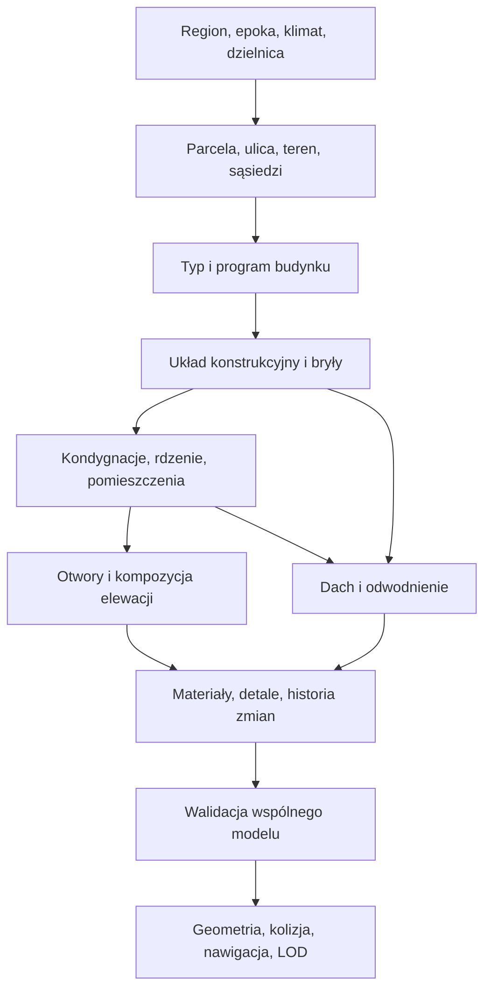

# Building Lab — research proceduralnej architektury

Data: 25 września 2026. Etap: research i hipotezy projektowe, przed zatwierdzeniem docelowej teorii i implementacją.

**Wniosek dla projektu:** największą poprawę da powiązanie rzutu, funkcji, konstrukcji, elewacji i dachu. Dodawanie kolejnych wariantów okien do wspólnego prostopadłościanu zwiększy liczbę kombinacji, ale nie zapewni różnorodności rozpoznawalnych budynków.

Dokumenty towarzyszące:

- [Atlas: 24 rodziny budynków, bryły, materiały, dachy, otwory i detale](31_ATLAS_ARCHITEKTURY_PROCEDURALNEJ.md).
- [Bibliografia: 35 źródeł, zakres dowodów i ograniczenia researchu](32_ZRODLA_BUILDING_LAB.md).
- [Archiwalny opis wcześniejszej implementacji laboratorium](history/PROCEDURAL_BUILDING_LAB_ARCHIVE.txt).

## 1. Zakres i sposób czytania

Research obejmuje architekturę proceduralną dla gry: budynki oglądane z kamery RTS i z bliska, potencjalne wnętrza, przejścia jednostek, uszkodzenia oraz generowanie wielu obiektów. Punktem wyjścia są polskie kamienice i bloki oraz szerzej europejska zabudowa mieszkaniowa, gospodarcza i przemysłowa. Źródła amerykańskie i brytyjskie uzupełniają wiedzę o elementach, ale nie definiują automatycznie polskiej architektury.

Oznaczenia:

- **Ustalenie źródłowe** — wynik lub opis wsparty wskazaną publikacją.
- **Obserwacja kodu** — stan plików w tym repozytorium w dniu analizy.
- **Propozycja / hipoteza** — nasz możliwy sposób wykorzystania wiedzy; wymaga późniejszej decyzji albo sprawdzenia.

To rozbudowany przegląd wybranej literatury i dokumentacji, a nie systematyczny przegląd wszystkich publikacji ani dokumentacja budowlana. Nie określa zgodności z normami, rzeczywistej nośności czy przepisów ewakuacji. Wymiary przykładów służą objaśnieniu modelu gry. Nie wykonywano benchmarków ani pomiarów szybkości.

## 2. Co mamy obecnie

Podstawa analizy: [generator](../js/buildings/proceduralBuildingGenerator.js), [aplikacja labu](../building-lab/app.js), [interfejs](../building-lab/index.html), [test manifestów v6](../tests/building_v6.cjs). Wyszukiwanie symboli wykonano przez CodeGraph; poniższe uwagi wynikają z odczytu implementacji.

### 2.1. Dobre fundamenty

Generator ma seed, pięć nazwanych stylów, jednostki w metrach, kondygnacje, rzeczywiste przerwy w ścianach dla prostokątnych otworów, schody oraz eksport manifestu. Elementy otrzymują kategorie, identyfikatory i stan uszkodzeń. Lab pozwala odsłonić wnętrze, ukryć dach i zobaczyć linię przejścia po schodach. Te mechanizmy warto zachować jako narzędzia inspekcji.

### 2.2. Mapa ograniczeń

| Obszar / symbol | Obserwacja kodu | Znaczenie dla dalszego projektu |
|---|---|---|
| `STYLE_CATALOG` | Pięć stylów dobiera zakresy wymiarów, paletę i warianty detali | Styl nie jest jeszcze osobną gramatyką typu budynku |
| `generate` | Jeden prostokąt, globalny limit 1–3 kondygnacji | Brak oficyn, podwórzy, segmentów bloku, wieży, hali wielonawowej |
| Kondygnacje | Wspólna wysokość wszystkich poziomów | Nie ma wyższego parteru usługowego, mezzaniny, poddasza, uskoku poziomów |
| Materiały | `stucco`, `brick`, `wood` itd. są jednym wyborem dla ścian | Tynk miesza się pojęciowo z konstrukcją, której może być wykończeniem |
| `_windowOpenings` | Rozmieszczenie według długości ściany, niewielki niezależny jitter | Brak relacji z pokojami i wspólnej reguły osi między kondygnacjami |
| Drzwi i okna | Strefa wolna od okien jest liczona względem środka elewacji; drzwi mają losowe przesunięcie | Ryzyko kolizji otworów dla części parametrów; nie potwierdzono go tu testem wizualnym |
| `_wall` | W pasie zawierającym kilka otworów używa `overlap[0]` | Nie jest ogólnym rozwiązaniem sumy nakładających się otworów |
| Ściany | Cztery orientacje, segmenty z `BoxGeometry` | Brak ścian ukośnych, łukowych, połączeń skrzydeł i uogólnionych ościeży |
| Wnętrza | Stropy i schody, brak programu pomieszczeń oraz podziału na mieszkania | Obecna bryła jest makietą wnętrza, nie kompletnym budynkiem użytkowym |
| `_floorAroundOpening` | Otwór w stropie przycinany do obrysu niezależnie od schodów | Docelowo schody, otwór i strop muszą korzystać ze wspólnych danych |
| `_staircase` | Dwa biegi po 9 stopni; dwa osobne fragmenty spocznika z przerwą między pasami | Trzeba sprawdzić ciągłość powierzchni, wysokości dojścia, kolizje i prześwit |
| `_roof` / `GABLE`, `SHED` | Nachylone płyty; brak domknięcia ścian szczytowych i podwyższenia ścian pod pulpit | Obwiednia bryły nie opisuje kompletnego zamknięcia budynku |
| `_roof` / `HIP` | Cztery obrócone prostopadłościany | Brak obliczonych wspólnych krawędzi połaci, naroży i kalenicy |
| `_styleDetails` | Ciągłe pasy na elewacjach nie są przycinane otworami | Detale mogą przebiegać przez okna; cegła nie ma reguły wiązania |
| Komin | Wysokość zależy od liczby kondygnacji, nie od przecięcia z konkretną połacią | Brak pewności poprawnego osadzenia na różnych dachach |
| `damageSphere` | Sprawdza dystans do środka komponentu; ukrywa element po utracie HP | To demonstrator, bez obliczeń podpór, nowej kolizji i aktualizacji przejść |
| `structural` / `MATERIAL_HP` | Flaga i umowne liczby | Nie określają drogi przenoszenia obciążeń ani fizycznej wytrzymałości |
| RNG / ID | Jeden sekwencyjny strumień; ID z seeda i kolejnego numeru | Nowy detal może zmienić dalsze losowania i identyfikatory istniejących części |
| Manifest | Część wymiarów zaokrąglona do 0,001, geometria liczona z pełnych wartości | Należy ustalić jedną reprezentację bazową dla późniejszej kolizji i regeneracji |
| Renderowanie | Osobny mesh i geometria każdego prostopadłościanu; nowe materiały dla budynku | Dużo elementów logicznych nie musi oznaczać równie wielu obiektów renderujących |
| `dispose` | Materiały nakładki nawigacji powstają poza listą `materials` | Ich zwalnianie wymaga przeglądu przed intensywnym regenerowaniem |
| Test | Sprawdza powtarzalność manifestu i podstawowe liczniki na atrapach Three.js | Nie dowodzi poprawności dachów, prześwitów, kolizji ani wyglądu |

Nie wszystkie powyższe braki są błędami pierwszej makiety. Są natomiast granicą, po przekroczeniu której dalsze dokładanie warunków do `generate` utrudni rozwój.

## 3. Co wynika z literatury proceduralnej

### 3.1. Gramatyki: silne narzędzie do hierarchii i elewacji

**Ustalenie źródłowe.** „Instant Architecture” opisuje gramatyki podziału, dobieranie atrybutów i sterowanie doborem reguł. „Procedural Modeling of Buildings” rozwija CGA do modelowania architektonicznego. Wspólną ideą jest opis rodziny obiektów przez reguły przekształcania części. Nie należy z tego wyciągać wniosku, że sama gramatyka elewacji gwarantuje poprawny rzut mieszkania. [Wonka i in., 2003](https://www.cg.tuwien.ac.at/research/publications/2003/Wonka-2003-Ins/), [Müller i in., 2006](https://www.peterwonka.net/Publications/pdfs/2006.SG.Mueller.ProceduralModelingOfBuildings.final.pdf).

Dokumentacja CityEngine pokazuje praktyczny język operacji na kształtach. Operacja `roofHip` ma parametry i warunki wejścia — dach jest wynikiem reguły geometrycznej, a nie etykietą koloru. To referencja koncepcji, nie propozycja uzależnienia naszego runtime od CityEngine. [CGA Reference](https://doc.arcgis.com/en/cityengine/latest/cga/cityengine-cga-introduction.htm), [roofHip](https://esri.github.io/cityengine-sdk/html/cgaref/cgareference/op_roofHip.html).

### 3.2. Rzut potrzebuje programu funkcjonalnego

**Ustalenie źródłowe.** Merrell, Schkufza i Koltun rozdzielają program architektoniczny, generowany z wysokopoziomowych wymagań, od optymalizacji planów kondygnacji i budowy modelu 3D. Ich praca dotyczy układów mieszkalnych; nie dowodzi obsługi wszystkich typów budynków. Dla nas istotne jest samo rozdzielenie problemów. [Computer-Generated Residential Building Layouts, 2010](https://www.cs.princeton.edu/courses/archive/spr11/cos598A/pdfs/Merrell10a.pdf).

**Propozycja.** Najpierw określić relacje: wejście → sień → klatka → mieszkanie → pokoje. Dopiero potem szukać wymiarów tych przestrzeni. Dla hali program może być prostszy: wejście pracowników, hala, strefa załadunku, zaplecze. Mała liczba pomieszczeń nie uzasadnia wspólnej gramatyki dla obu typów.

### 3.3. Sterowalność jest osobnym problemem

**Ustalenie źródłowe.** Lipp, Wonka i Wimmer badają edycję proceduralnej architektury i zachowywanie lokalnych zmian w modelu opartym na gramatyce. Przegląd Smelika i współautorów omawia proceduralne światy, w tym kontrolę nad wynikiem i łączenie metod. [Lipp i in., 2008](https://www.cg.tuwien.ac.at/research/publications/2008/LIPP-2008-IEV/), [Smelik i in., 2014](https://www.cs.purdue.edu/cgvlab/www/publications/Smelik14CGF/).

**Propozycja.** Lab powinien umieć zablokować rzut, klatkę albo dach i zmieniać wyłącznie wskazaną część. Suwak „różnorodność” bez informacji, co wolno mu zmienić, utrudni powtarzalne porównania.

### 3.4. Budynek zależy również od miejsca

Parish i Müller opisują proceduralne modelowanie miasta, łącząc reguły z ograniczeniami wejściowymi. To źródło dotyczące skali urbanistycznej. Nasz wniosek projektowy: budynek powinien znać ulicę, granice parceli i sąsiadów, nawet gdy sam lab początkowo pokazuje pojedynczy obiekt. [Procedural Modeling of Cities, 2001](https://cgl.ethz.ch/Downloads/Publications/Papers/2001/p_Par01.pdf).

## 4. Porównanie metod

Poniższa ocena zastosowania w repozytorium jest **naszą syntezą projektową**, a nie rankingiem zmierzonym w publikacjach.

| Metoda | Gdzie jest użyteczna | Czego sama nie zapewnia | Możliwa rola w Building Lab |
|---|---|---|---|
| Parametryczny szablon | Dom, okno, standardowa klatka, prosty dach | Zróżnicowanej topologii przy samym skalowaniu | Deterministyczne prymitywy i referencyjne archetypy |
| Gramatyka podziału / CGA | Kondygnacje, osie, pasy fasady, rozbudowa bryły | Globalnej dostępności pomieszczeń i nośności | Główne narzędzie organizowania części |
| Graf pomieszczeń + solver ograniczeń | Sąsiedztwo, dostęp, strefy użytkowania | Dobrego wyglądu bez gramatyki architektury | Układ funkcjonalny i jego walidacja |
| Optymalizacja stochastyczna | Dopasowanie planu do parceli i preferencji | Stałego czasu rozwiązania i pewności znalezienia planu | Opcjonalny etap z limitem prób i deterministycznym wyborem |
| BSP / rekurencyjne dzielenie | Proste wnętrza, podziały działek i stref | Naturalnego programu mieszkalnego | Generator kandydatów, nie samodzielny architekt |
| WFC / ograniczenia sąsiedztwa | Zgodne zestawianie lokalnych modułów | Globalnej ścieżki, światła, konstrukcji | Pomocnicze układanie paneli i detali |
| Operacje wielokątowe 2D | Rzuty, dziedzińce, stropy, odsunięcia | Dachów i funkcji bez następnych etapów | Podstawa geometrii semantycznej |
| CSG / operacje bryłowe | Nietypowe wycięcia, łączenia, fragmenty uszkodzeń | Małej siatki i niezawodności przy każdej degeneracji | Wybrane przypadki; nie każde prostokątne okno |
| Straight skeleton | Podział dachu nad wielokątnym obrysem | Wszystkich lukarn, mansard i skrzydeł różnych wysokości | Zaawansowane dachy po stabilizacji prostych |
| Modele uczone | Propozycje planów, wzorce z danych | Gwarantowanych ograniczeń gry i łatwej kontroli | Research pomocniczy, ewentualnie narzędzie offline |

Oryginalne WFC opisuje lokalne wzorce i propagację ograniczeń; może zakończyć się sprzecznością. Wniosek dla nas: przechodniość budynku wymaga dodatkowego sprawdzenia grafu, a nie wiary w lokalne dopasowanie kafli. [Repozytorium autora WFC](https://github.com/mxgmn/WaveFunctionCollapse).

House-GAN i House-GAN++ badają generowanie układów przy ograniczeniach grafowych; GTGAN rozszerza badania nad grafowo uwarunkowaną generacją. ATISS dotyczy aranżacji obiektów wewnątrz pomieszczeń. Są to różne zadania, więc „użyjmy AI do budynków” nie jest jeszcze wyborem metody. [House-GAN](https://arxiv.org/abs/2003.06988), [House-GAN++](https://arxiv.org/abs/2103.02574), [GTGAN](https://openaccess.thecvf.com/content/CVPR2023/papers/Tang_Graph_Transformer_GANs_for_Graph-Constrained_House_Generation_CVPR_2023_paper.pdf), [ATISS](https://research.nvidia.com/labs/toronto-ai/ATISS/).

**Hipoteza do sprawdzenia:** rdzeń złożony z gramatyk, grafów i operacji 2D najlepiej odpowiada obecnym potrzebom deterministycznego JS. Pełny solver i modele uczone warto oceniać dopiero na konkretnym problemie, którego prostszy model nie rozwiązuje.

## 5. Hierarchia budynku i zależności

Proponowany porządek decyzji:

To nie musi być przebieg bez powrotów. Jeśli klatka nie mieści się w skrzydle, trzeba zmienić bryłę albo program, a nie ścisnąć stopnie. Istotne jest ograniczenie cofania: określona liczba prób, czytelna przyczyna odrzucenia i bezpieczny wariant zastępczy.

### 5.1. Trzy grafy, których nie należy utożsamiać

| Graf | Węzły / krawędzie | Przykładowe pytanie |
|---|---|---|
| Przestrzeni | Pokoje, korytarze, podwórze / fizyczne przejścia | Czy piechur dotrze z ulicy do pokoju? |
| Podpór | Fragmenty konstrukcji / relacje podpierania i łączenia | Co traci podparcie po usunięciu filara? |
| Widoczności | Strefy i otwory / możliwe kierunki obserwacji | Czy z okna widać ulicę, a światło trafia do pokoju? |

Zamknięte drzwi zmieniają dostępność, ale nie muszą zmieniać konstrukcji. Zbita szyba zmienia osłonę i widoczność, ale nie usuwa automatycznie parapetu ani bariery przejścia. Otwór w stropie zmienia wszystkie trzy grafy w różny sposób.

### 5.2. Semantyka przed siatką

CityGML jest referencją semantycznego opisu budynków i ich części. IFC rozróżnia element z otworem, samą pustkę i jej wypełnienie. Nie potrzebujemy pełnego BIM, ale to wartościowe rozdzielenie odpowiedzialności. [OGC CityGML](https://www.ogc.org/standards/citygml/), [buildingSMART IfcOpeningElement](https://ifc43-docs.standards.buildingsmart.org/IFC/RELEASE/IFC4x3/HTML/lexical/IfcOpeningElement.htm).

**Propozycja minimalnego modelu:** `Building → Wings → Storeys → Spaces`, osobno `Walls`, `Slabs`, `Openings`, `Doors`, `Windows`, `Stairs`, `RoofFaces`, `SupportLinks`. Każda część ma stabilne ID i odniesienia do właścicieli. Mesh jest wynikiem kompilacji tych danych. Jeden logiczny mur może mieć wiele fragmentów siatki, a jeden bufor renderujący może zawierać wiele murów.

## 6. Genom: skorelowane decyzje

Proceduralność zachowamy również z szablonami modułów, pamięcią podręczną i ograniczeniami. Powtarzalny przekrój ramy nie odbiera proceduralności całemu budynkowi.

### 6.1. Grupy genów

| Grupa | Przykłady | Od czego zależy |
|---|---|---|
| Kontekst | Region, okres budowy, klimat, ulica, klasa zamożności | Profil świata |
| Typologia | Dom, kamienica, blok sekcyjny, hala, obiekt publiczny | Funkcja i kontekst |
| Topologia | Liczba skrzydeł, dziedzińce, liczba rdzeni, rodzaj dostępu | Typologia i parcela |
| Wymiary | Trakty, kondygnacje, głębokość skrzydła, moduł konstrukcji | Topologia, użytkowanie |
| Konstrukcja | Mur nośny, szkielet drewniany, żelbet, rama stalowa | Epoka, funkcja, rozpiętości |
| Elewacja | Osie, otwory, podział parteru, rytm balkonów | Rzut, konstrukcja, styl |
| Dach | Rodzina, kierunek kalenicy, nachylenia, okapy | Bryły, użytkowanie poddasza, kontekst |
| Warstwy i detale | Wykończenie, pokrycie, stolarka, balustrady | Konstrukcja, epoka, zasobność |
| Historia | Dobudowa, remont, wymiana okien, utrzymanie | Wiek, użytkowanie, wcześniejsze zdarzenia |

Relację można zapisać jako `P(dach | typ, obrys, epoka, region)`, zamiast niezależnego losowania dachu i całej reszty. To opis zależności, nie gotowa wytrenowana dystrybucja. Na początku rozkłady mogą być ręcznie opracowanymi profilami referencyjnymi.

### 6.2. Twarde ograniczenia i preferencje

Twarde: brak samoprzecięcia obrysu, otwór mieści się w ścianie, przejście ma miejsce na jednostkę, mieszkanie ma dostęp, identyfikatory są unikalne. Miękkie: regularność osi, proporcje pokoi, ilość dekoracji, podobieństwo do sąsiadów. Ograniczeń konstrukcyjnych nie udajemy samą flagą — wymagają przyjętego modelu uproszczeń.

Kandydat może mieć koszt `E = wA·E_powierzchni + wR·E_proporcji + wD·E_dojscia + wF·E_fasady`. Najpierw odrzucamy naruszenia twarde; dopiero potem porównujemy koszty. Nazwy składników są propozycją. Ich wagi wymagają późniejszej kalibracji i nie są wynikiem researchu.

### 6.3. Determinizm, wersje i lokalna edycja

Proponowane ziarno części: `hash(worldSeed, parcelId, buildingId, generatorVersion, semanticPath)`. Ścieżka może oznaczać `front/storey-2/bay-4/window`, a nie pozycję w tablicy meshów. Osobne strumienie dla topologii, okien, materiałów i starzenia chronią plan przed zmianą po dodaniu losowania klamki.

Trzeba ustalić algorytm hash/RNG, kolejność iteracji, reprezentację liczb i format identyfikatorów. Sam zapis `seed` nie gwarantuje zgodności po zmianie wersji generatora. Przy zapisie świata potrzebne są wersja, genom, lokalne nadpisania oraz stan uszkodzeń. Wynik solvera trzeba zapisać albo zapewnić deterministyczny budżet kroków; limit czasu w milisekundach może dawać różne wyniki na różnych komputerach.

Losowanie wymiarów powinno skupiać się wokół wybranych proporcji i modułów. Rozkład jednostajny szerokości każdego okna produkuje różnorodność pozbawioną wspólnego wykonawcy. Naprawiony budynek może mieć kilka rodzin okien, ale najlepiej przypisać je do mieszkań lub zdarzeń remontowych.

## 7. Geometria rzutu, ścian i otworów

### 7.1. Rzut 2D jako wspólna podstawa

Proponowana reprezentacja: zewnętrzny kontur skrzydła, kontury pustek, role krawędzi, wysokości i identyfikatory połączeń. Krawędź zna stronę świata oraz rolę: uliczna, ogrodowa, podwórzowa, wspólna z sąsiadem, wewnętrzna. Nie każda krawędź dostaje okna.

Potrzebne operacje: suma i różnica obrysów, przecięcia, odsunięcie o grubość, podział odcinka, usuwanie zerowych krawędzi, triangulacja z otworami. Nie wystarczy złożyć skrzydeł z nakładających się pudełek: wewnętrzne ściany i dachy na styku trzeba rozstrzygnąć semantycznie.

Earcut trianguluje wielokąty, także z otworami, ale dokumentacja nie gwarantuje poprawnego wyniku dla wszystkich patologicznych danych. Odporne predykaty Shewchuka dotyczą wiarygodnych testów geometrycznych przy ograniczonej precyzji. Wniosek: poprawność obrysu i polityka tolerancji poprzedzają triangulację; biblioteka triangulacji nie naprawia całego modelu. [Earcut](https://github.com/mapbox/earcut), [Robust Predicates](https://www.cs.cmu.edu/~quake/robust.html).

### 7.2. Rytm elewacji

Przykładowe równanie dla prostego szeregu: `W = mL + mR + Σ(w_i) + Σ(p_j)`, gdzie `w_i` to szerokości otworów, `p_j` to filary pomiędzy nimi, a `mL/mR` skrajne pasy ściany. Generator wybiera liczbę osi i rozwiązanie mieszczące się w ograniczeniach. Resztę szerokości rozdziela świadomie, np. na skrajne pasy, zamiast ściskać wszystkie ramy.

Najpierw rezerwujemy bramę, wejście, klatkę i narożniki, potem osie okien. Kondygnacje mogą dziedziczyć osie z wyjątkami: parter handlowy, klatka z oknem na spoczniku, szczyt bez okien, inne poddasze. W pełnym wnętrzu okno przypisujemy do konkretnej przestrzeni; w powłoce należy przynajmniej zachować wiarygodny moduł sugerowanych pomieszczeń.

### 7.3. Otwór i wypełnienie

Otwór ma obrys, położenie, głębokość muru i przeznaczenie. Okno ma ramę, skrzydła, podziały szklenia i stan otwarcia. Drzwi mają ościeżnicę, skrzydło, stronę zawiasów oraz obszar potrzebny do ruchu. Zamurowane okno jest osobnym zdarzeniem w historii otworu, a nie po prostu usuniętą szybą.

Dla prostokątnych otworów można deterministycznie dzielić ścianę na pasy. Dla łuków potrzebna jest triangulacja obrysu i ościeży. Dla każdego rozwiązania trzeba wykrywać nakładanie otworów oraz zbyt wąskie resztki ściany. Geometria renderująca i kolizja korzystają z tej samej listy otworów.

## 8. Dach jako osobny podsystem

Dach składa się z geometrii połaci, konstrukcji, pokrycia, krawędzi, przebić i odpływu. `GABLE` mówi o formie, `clay_tile` o pokryciu; jedno pole `roofMaterial` nie zastępuje obu decyzji. Pełny katalog znajduje się w atlasie.

### 8.1. Trzy poziomy trudności

1. Analityczne dachy prostego prostokąta: pulpit, dwuspadowy, kopertowy/namiotowy, płaski z attyką. Wspólne wierzchołki i rzeczywiste wielokąty połaci.
2. Złożenie kilku brył: osobne dachy skrzydeł, jawne styki, kosze, ściany ponad dachem sąsiadującej części. Wymaga obsługi różnych wysokości okapów.
3. Dach nad ogólnym obrysem: straight skeleton albo inny solver, a następnie świadome modyfikacje i detale.

CGAL opisuje straight skeleton i jego wersję ważoną dla wielokątów oraz zastosowanie do ekstrudowania dachów. Dane wejściowe mają wymagania topologiczne. To użyteczna referencja algorytmu, ale nie gotowa biblioteka JS ani generator wszystkich dachów historycznych. Dachy mansardowe, lukarny i złożenia poziomów wymagają kolejnych reguł. [CGAL Straight Skeleton](https://doc.cgal.org/latest/Straight_skeleton_2/index.html).

### 8.2. Warunki poprawności

Proponowane sprawdzenia: połacie spotykają się na wspólnych krawędziach; szczyty i wysokie ściany są domknięte; kosze nie kończą się w nieobsługiwanej niecce; rynny i wpusty mają przewidziany odpływ; komin przecina właściwą połać i ma obróbkę; lukarna nie przecina przypadkowo kalenicy ani innej lukarny.

Dla płaskiego dachu detal spadku może być wizualnie uproszczony, ale kierunek odpływu pozostaje w danych. Zielony dach jest pakietem warstw i użytkowania, a nie nową topologią dachu. Dachówka powinna zachowywać kierunek rzędów i skalę względem połaci. Parametry materiału nie zmieniają liczby kondygnacji ani otworów.

## 9. Wnętrza, konstrukcja i piechota

### 9.1. Najpierw rdzeń komunikacji

Przed dzieleniem piętra rezerwujemy klatki, szyby, główne korytarze i wejścia. Potem lokale, a dopiero potem pokoje. W bloku piętra dziedziczą rdzenie i podstawowe piony. W kamienicy oficyna może mieć własną klatkę i inną wysokość kondygnacji — połączenie nie może zakładać wspólnego poziomu tylko dlatego, że numer piętra jest ten sam.

Schody potrzebują pionowego przekroju. Wyznaczamy wysokość między gotowymi posadzkami `H`, liczbę podstopnic `n` i ich wysokość `r = H/n`. Liczbę stopnic oraz długość biegu ustalamy z uwzględnieniem spoczników; nie wolno automatycznie przyjmować, że każdy bieg ma tyle samo stopnic co podstopnic. W labie powinny być widoczne: prześwit nad biegiem, otwór stropu, balustrada, początek i koniec trasy.

### 9.2. Różne umowy dotyczące wnętrz

| Poziom | Co istnieje logicznie | Do czego nadaje się w grze |
|---|---|---|
| Powłoka | Obrys, wysokość, elewacje, dach | Tło i budynki niedostępne |
| Wnętrze sugerowane | Powłoka plus płytkie wnęki za oknami | Bliski widok z zewnątrz |
| Wnętrze taktyczne | Przestrzenie, przejścia, schody, osłony | Ruch jednostek i walka w budynku |
| Wnętrze szczegółowe | Taktyczne plus wyposażenie i drobne elementy | Inspekcja i wybrane ważne obiekty |

To propozycja rozdzielenia funkcji, nie cztery niezależnie losowane budynki. Geometria wnętrza może powstawać później, ale jego logiczny układ musi być zgodny z wcześniej zatwierdzonymi otworami. Stan drzwi, osłona i dostępność nie mogą zmieniać się od odległości kamery.

### 9.3. Przechodniość i destrukcja

Recast/Detour rozdziela budowę nawigacji i wykonywanie zapytań o ruch; to referencja podejścia, nie deklaracja integracji z repozytorium. [Recast Navigation](https://recastnav.com/).

**Propozycja dla jednostek:** sprawdzać szerokość i wysokość przejścia dla profilu kolizji piechura, przestrzeń obrotu, dojścia do schodów, spoczniki i obszar ruchu drzwi. Linia przejścia jest wskazówką, ale potrzebna jest ciągła powierzchnia i wolna objętość nad nią. Widoczne okno nie musi być przejściem; możliwość przeskoczenia wymaga osobnej akcji i warunków.

Destrukcja powinna operować na logicznych segmentach, a renderer aktualizować ich reprezentację. Po wyłomie trzeba rozstrzygnąć kolizję, osłonę, widoczność, podpory i nawigację. Gruz może czasem blokować otwór. Uproszczony graf podpór jest sensowny do gry, lecz nie należy przedstawiać go jako symulacji inżynierskiej. Kolor albo wykończenie nie powinny samodzielnie określać odporności całej ściany.

## 10. Realizm prostych modeli

NPS rozróżnia ogólny charakter budynku, cechy widoczne z bliska i wnętrze. Przeniesienie tej obserwacji do gry daje sensowną kolejność pracy: obrys i sylweta, proporcje i rytm, głębokość otworów, na końcu drobny ornament. [Architectural Character, Brief 17](https://www.nps.gov/orgs/1739/upload/preservation-brief-17-architectural-character.pdf).

**Nasza hipoteza estetyczna:** wiarygodne ościeże i poprawny dach przyniosą więcej niż losowe szprosy na wadliwej bryle. Trzeba ją później sprawdzić na porównaniach przy stałym świetle i kamerze.

### 10.1. Warstwy materiałów

Oddzielamy konstrukcję, wypełnienie, izolację, wykończenie i stan powierzchni. Cegła może być murem albo okładziną. Tynk może pokrywać kilka różnych konstrukcji. Dokumentacja historycznych tynków pokazuje różne podłoża i odmiany powierzchni; nie należy traktować `STUCCO` jako kompletnej informacji o ścianie. [NPS Brief 22](https://www.nps.gov/orgs/1739/upload/preservation-brief-22-stucco.pdf).

### 10.2. Niedoskonałość wynika z przyczyn

Proponowane skale zmienności: wspólna technologia dzielnicy → charakter budynku → partia materiału → remont mieszkania → drobne odchylenie elementu. Podstawowy rytm pozostaje czytelny. Skrzywienia konstrukcyjne wymagają zdarzenia lub profilu stanu; losowe przesunięcia wierzchołków całego budynku nie są dobrym zamiennikiem wieku.

NPS opisuje lokalne źródła zawilgocenia, m.in. nieszczelne dachy, połączenia i odpływ wody. Inspiruje to model masek przyczynowych: zaciek pod awarią rynny, zabrudzenie pod parapetem, wilgoć przy gruncie. To nasza propozycja shaderów i danych, a nie symulacja opisana w tym poradniku. [NPS Brief 39](https://www.nps.gov/orgs/1739/upload/preservation-brief-39-controlling-moisture.pdf).

### 10.3. Światło i sezon

Zasłony, światło i otwarte okna grupujemy według pomieszczeń lub mieszkań. Śnieg zależy od ekspozycji połaci i osłony, mokry materiał od pogody i zadaszenia, roślinność od dostępnych powierzchni. Sezon zmienia stan prezentacji, a nie bazowy genom konstrukcji. Lokalny ślad po remoncie może pozostać mimo zmiany pory roku.

## 11. Proceduralność a koszt runtime

To propozycje organizacji pracy, bez deklarowanych przyspieszeń:

1. Kompilować genom do modelu logicznego, a następnie osobno do siatek, kolizji i danych przejść.
2. Buforować powtarzalne profile ram, stopni i modułów; łączyć statyczne powierzchnie według materiału i obszaru.
3. Zachować mapowanie `logicalElementId → zakres bufora / instancja`, żeby scalanie nie niszczyło możliwości wyłomu.
4. Tworzyć geometrię w workerze jako tablice danych; obiekty Three.js i zasoby GPU tworzyć w odpowiednim kontekście renderera.
5. Stosować LOD reprezentacji: od sylwety do detalu, przy niezmiennej geometrii rozgrywki i stanach interakcji.
6. Przewidzieć właściciela zasobów i limity pamięci; zwolnić zasób współdzielony dopiero po odłączeniu ostatniego użytkownika.

Klucz cache powinien zawierać wersję generatora, archetyp, parametry wpływające na daną geometrię i LOD. Ślady użytkowania oraz stan drzwi mogą być parametrami instancji. Zmiana koloru nie musi unieważniać planu kondygnacji. Zmiana otworu powinna unieważnić zależne fragmenty ściany, kolizję i przejścia, nie całą dzielnicę.

Istotny szczegół istniejącego stacku: w źródle `InstancedMesh` z Three.js **r128** ustawione jest `frustumCulled = false`. Grupowanie instancji wymaga więc świadomej strategii odrzucania obszarów; nie wolno zakładać zachowania najnowszej wersji silnika. [Źródło r128](https://github.com/mrdoob/three.js/blob/r128/src/objects/InstancedMesh.js).

## 12. Jak przeprowadzić przyszłe porównanie

Nie potrzeba benchmarku, żeby sprawdzić poprawność architektury. Proponowany zestaw to stabilne seedy i widoki referencyjne dla domu, kamienicy, bloku i hali.

| Próba | Co porównujemy | Warunek oceny |
|---|---|---|
| Sylweta | Szare bryły bez materiałów | Typ rozpoznawalny przez proporcje i dach |
| Elewacja | Widok prostopadły i ukośny | Osie, skrajne filary, narożniki, rola parteru |
| Dach | Widok z góry i przekroje styków | Ciągłość połaci, kosze, domknięcia, przebicia |
| Wnętrze | Rzut każdej kondygnacji | Dostęp, sąsiedztwo, brak nakładania przestrzeni |
| Piechota | Sylwetka i objętość kolizji na trasie | Miejsce przy drzwiach, schodach i stropie |
| Materiały | Ta sama bryła i światło | Skala, kierunek, rozdział konstrukcji i wykończenia |
| Lokalna zmiana | Zablokowany rzut, zmienione okna | Nie zmieniają się niezależne części genomu |
| Uszkodzenie | Przed i po, z kolizją oraz przejściami | Spójny stan wszystkich reprezentacji |
| Sąsiedztwo | Kilka parceli i wariant narożny | Wejścia przy ulicy, brak okien w wspólnej ścianie |
| Skrajne wejścia | Wąska działka, wklęsły obrys, mały dziedziniec | Czytelne odrzucenie albo deterministyczny wariant zastępczy |

Przyszłe automatyczne inwarianty: brak samoprzecięć konturów, poprawne pola powierzchni, otwory we właściwych hostach, unikalne ID, zgodne poziomy posadzek, brak niezamierzonych odłączonych pomieszczeń, brak samoprzecięć dachów, stabilność niezmienianych części przy lokalnej edycji. Ocenę wizualną należy zachować — test licznika okien nie wykryje nieudanej kompozycji.

## 13. Kolejność rozwinięcia teorii po researchu

| Etap | Przedmiot decyzji | Konkretny materiał do oceny |
|---|---|---|
| A | Profil świata i głębokość wnętrz | Jedna karta regionu/epoki, umowa działania piechoty |
| B | Słownik i model semantyczny | Schemat budynku, grafy, identyfikatory, przykładowy manifest |
| C | Cztery różne archetypy | Dom, kamienica z oficyną, blok sekcyjny, hala — rzuty i przekroje |
| D | Podstawy geometrii | Poprawne otwory, stropy, klatka, cztery proste dachy |
| E | Gramatyki elewacji i materiałów | Zestaw zależności oraz dopuszczalnych odstępstw |
| F | Lokalne zmiany i optymalizacja reprezentacji | Przewidywalna regeneracja, cache, LOD, uszkodzenia |
| G | Rozbudowa katalogu | Kolejne rodziny atlasu, każda z własnymi przykładami |

Nie zaczynałbym od implementacji wszystkich 24 rodzin. Cztery różne układy szybciej pokażą, czy teoria opisuje architekturę, czy tylko warianty jednego klocka. To rekomendacja kolejności prac, a nie ograniczenie docelowego katalogu.

## 14. Co pozostaje do ustalenia

- Jaki region i przedział historyczny są domyślne? Na razie centralna Europa jest roboczym punktem odniesienia, nie zamkniętym wyborem świata.
- Które budynki piechota będzie faktycznie zajmować, i czy potrzebujemy wszystkich mieszkań, piwnic oraz poddaszy?
- Czy destrukcja ma obejmować same wyłomy, czy również zawalanie części kondygnacji?
- Jak blisko kamera podchodzi do okien, klatek i detali? To wpływa na reprezentację, nie na poprawność logiczną.
- Jakie historyczne systemy bloków oraz odmiany kamienic chcemy odtwarzać konkretnie? Obecny research rozróżnia rodziny, ale nie jest rekonstrukcją W-70, OWT czy konkretnej kamienicy.
- Jak silna ma być kontrola użytkownika: gotowy archetyp, blokowane grupy genów czy ręczna edycja rzutu?

Research wystarcza do opracowania pierwszej teorii generatora i wyboru reprezentatywnych archetypów. Dokładne regionalne proporcje, katalogi paneli, profile stolarki i parametry użytkowe trzeba następnie oprzeć na wybranych referencjach. Pełny wykaz źródeł oraz jawne luki znajdują się w [bibliografii](32_ZRODLA_BUILDING_LAB.md).
